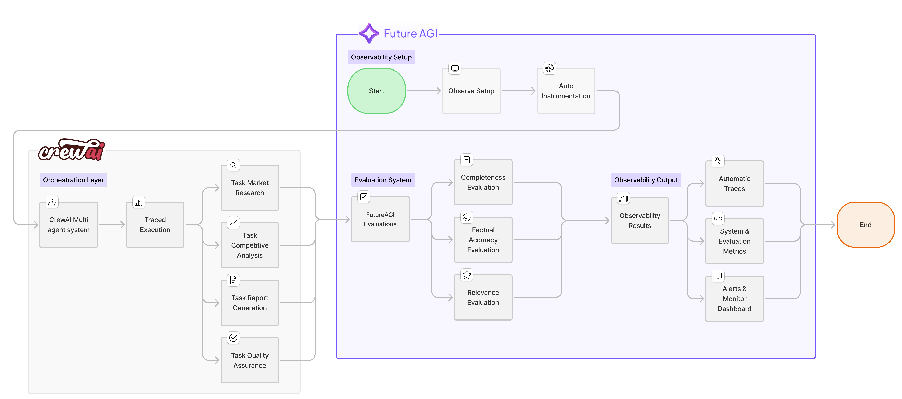
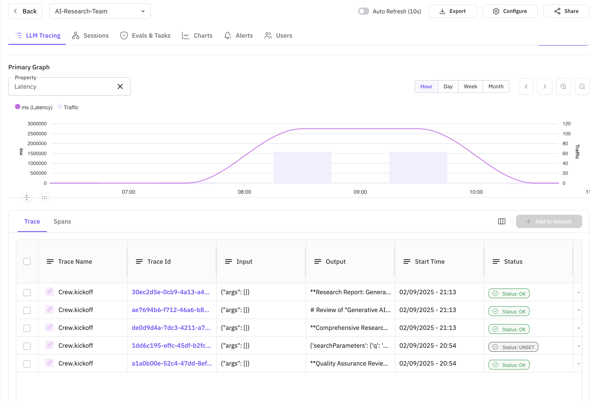
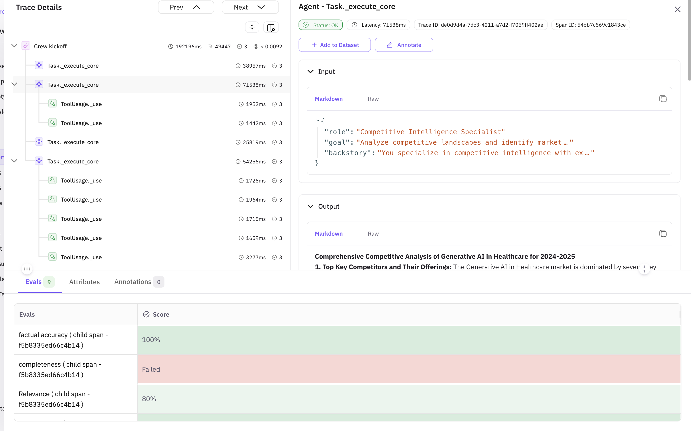
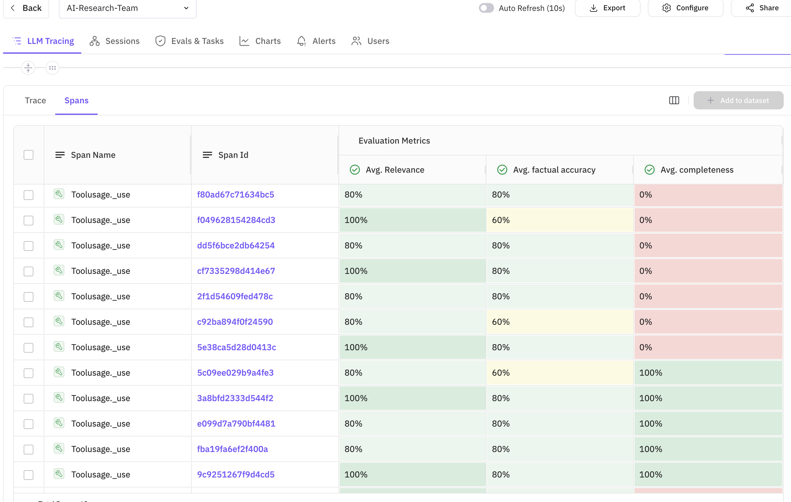

## Overview

In this cookbook, we'll build an intelligent research and content generation system using CrewAI's multi-agent framework, enhanced with FutureAGI's observability and in-line evaluation capabilities. This combination allows you to create sophisticated AI workflows while maintaining full visibility into agent performance and output quality.

### What We'll Build

We'll create an automated market research team that:
- **Researches** emerging technology trends
- **Analyzes** competitive landscapes
- **Generates** comprehensive reports
- **Validates** information accuracy

All while tracking performance metrics and evaluating output quality in real-time using FutureAGI's powerful observability tools.

### How the System Works


1. **Multi-Agent Collaboration**: Four specialized agents work together in a sequential workflow, each contributing their expertise to build comprehensive research reports

2. **Real-time Quality Control**: As each agent completes their task, FutureAGI's in-line evaluations immediately assess the output quality across multiple dimensions (completeness, accuracy, relevance, etc.)

3. **Full Observability**: Every action, tool usage, and agent interaction is traced and visible in the FutureAGI dashboard, providing complete transparency into the research process

4. **Continuous Improvement**: By monitoring evaluation scores and performance metrics, you can identify weak points and iteratively improve agent prompts and workflows

The system combines the power of CrewAI's agent orchestration with FutureAGI's enterprise-grade observability, creating a production-ready AI research solution that's both powerful and transparent.

## Why CrewAI + FutureAGI?

The combination of CrewAI and FutureAGI provides:

| Feature | Benefit |
|---------|---------|
| **Multi-Agent Orchestration** | Divide complex tasks among specialized AI agents |
| **Real-time Observability** | Monitor agent interactions and performance |
| **Comprehensive Tracing** | Debug and optimize workflows effectively |
| **Quality Assurance** | Ensure reliable and accurate outputs |

## Prerequisites

Before starting, ensure you have:
- Python 3.10 or later
- OpenAI API key
- FutureAGI account ([Sign up here](https://app.futureagi.com/))
- SerperDev API key for web search capabilities

## Installation

Install the required packages for this cookbook. We'll be using FutureAGI's traceAI suite of packages that provide comprehensive observability and evaluation capabilities:

### FutureAGI Packages

- **`traceai-crewai`**: Auto-instrumentation package specifically for CrewAI that automatically captures all agent activities, tool usage, and task executions without requiring manual instrumentation
- **`fi-instrumentation-otel`**: Core observability framework that handles trace collection, span management, and telemetry data transmission to FutureAGI platform
- **`ai-evaluation`**: Evaluation framework that provides pre-built evaluation templates (completeness, factual accuracy, groundedness, etc.) and enables in-line quality assessment of AI outputs

### Other Required Packages

- **`crewai`**: Multi-agent orchestration framework for building AI teams
- **`crewai_tools`**: Tool library for CrewAI agents (web search, file operations, etc.)
- **`openai`**: OpenAI Python client for LLM interactions

```bash
pip install crewai crewai_tools traceai-crewai fi-instrumentation-otel ai-evaluation openai
```

> **Note**: The traceAI packages are designed to work seamlessly together. The auto-instrumentation (`traceai-crewai`) builds on top of the core instrumentation framework (`fi-instrumentation-otel`), while evaluations (`ai-evaluation`) integrate directly with the tracing system for in-line quality monitoring.

## Step-by-Step Implementation

### 1. Environment Setup

In this initial setup phase, we're configuring all the necessary components to enable both CrewAI's multi-agent capabilities and FutureAGI's observability features. The environment variables authenticate our connections to various services - OpenAI for the LLM that powers our agents, FutureAGI for observability and evaluations, and SerperDev for web search capabilities that our research agents will use. This setup ensures secure communication between all services while keeping sensitive credentials out of the code.

```python
import os
from typing import Dict, Any
from crewai import LLM, Agent, Crew, Process, Task
from crewai_tools import SerperDevTool, FileReadTool, WebsiteSearchTool
from fi_instrumentation import register, FITracer
from fi_instrumentation.fi_types import ProjectType
from traceai_crewai import CrewAIInstrumentor
from fi.evals import Evaluator
import openai

# Set environment variables
os.environ["OPENAI_API_KEY"] = "your-openai-api-key"
os.environ["FI_API_KEY"] = "your-futureagi-api-key"
os.environ["FI_SECRET_KEY"] = "your-futureagi-secret-key"
os.environ["SERPER_API_KEY"] = "your-serper-api-key"  # For web search

# Initialize OpenAI client for direct calls
client = openai.OpenAI()
```

### 2. Initialize Observability and Tracing

Set up FutureAGI's trace provider and auto-instrumentor to automatically capture all agent activities. The Evaluator enables real-time quality assessment of outputs.

```python
# Register the trace provider
trace_provider = register(
    project_type=ProjectType.OBSERVE,
    project_name="AI-Research-Team",
    set_global_tracer_provider=True
)

# Initialize the CrewAI instrumentor
# This automatically traces all CrewAI operations - no manual instrumentation needed!
CrewAIInstrumentor().instrument(tracer_provider=trace_provider)

# Initialize the tracer for custom spans
# We only use this for our custom evaluation logic, not for CrewAI operations
tracer = FITracer(trace_provider.get_tracer(__name__))

# Initialize the Evaluator for in-line evaluations
evaluator = Evaluator(
    fi_api_key=os.getenv("FI_API_KEY"), 
    fi_secret_key=os.getenv("FI_SECRET_KEY")
)
```

### 3. Define the Research Team Agents

Create four specialized agents: Market Researcher (data gathering), Competitive Analyst (landscape analysis), Report Writer (synthesis), and Quality Analyst (verification). Each agent has specific tools, goals, and backstories that shape their approach.

```python
# Configure the LLM
llm = LLM(
    model="gpt-4o",
    temperature=0.7,
    max_tokens=2000,
)

# Market Researcher Agent
market_researcher = Agent(
    role="Senior Market Research Analyst",
    goal="Research and analyze emerging technology trends and market dynamics",
    backstory="""You are a seasoned market research analyst with 15 years of experience 
    in technology markets. You excel at identifying emerging trends, analyzing market data, 
    and providing strategic insights. You're known for your thorough research methodology 
    and data-driven approach.""",
    llm=llm,
    tools=[SerperDevTool(), WebsiteSearchTool()],
    allow_delegation=False,
    verbose=True
)

# Competitive Analyst Agent
competitive_analyst = Agent(
    role="Competitive Intelligence Specialist",
    goal="Analyze competitive landscapes and identify market opportunities",
    backstory="""You specialize in competitive intelligence with expertise in analyzing 
    competitor strategies, market positioning, and identifying gaps in the market. 
    Your analysis helps companies understand their competitive advantage.""",
    llm=llm,
    tools=[SerperDevTool(), WebsiteSearchTool()],
    allow_delegation=False,
    verbose=True
)

# Report Writer Agent
report_writer = Agent(
    role="Technical Report Writer",
    goal="Create comprehensive, well-structured research reports",
    backstory="""You are an expert technical writer who transforms complex research 
    into clear, actionable reports. You excel at creating executive summaries, 
    detailed analyses, and strategic recommendations.""",
    llm=llm,
    tools=[FileReadTool()],
    allow_delegation=False,
    verbose=True
)

# Quality Assurance Agent
quality_analyst = Agent(
    role="Research Quality Assurance Specialist",
    goal="Verify accuracy and completeness of research findings",
    backstory="""You ensure all research meets the highest standards of accuracy 
    and completeness. You fact-check claims, verify sources, and ensure logical 
    consistency throughout the analysis.""",
    llm=llm,
    allow_delegation=False,
    verbose=True
)
```

### 4. Implement In-line Evaluations

Implement evaluation functions that assess agent outputs in real-time using FutureAGI's pre-built templates. The `trace_eval=True` parameter automatically links results to the observability dashboard.

#### Why These Specific Evaluations?

We've carefully selected evaluation metrics that address the most common challenges in AI-generated research:

1. **Completeness** - Ensures the research covers all requested aspects and doesn't miss critical information
2. **Factual Accuracy** - Validates that the information provided is correct and reliable, crucial for research credibility
3. **Context Relevance** - Confirms that outputs stay on-topic and directly address the research question


These evaluations use FutureAGI's pre-built evaluation templates powered by advanced LLMs, providing consistent and reliable quality assessment. The `trace_eval=True` parameter automatically links evaluation results to the current span, making them visible in the observability dashboard.
You can discover additional evaluation templates and metrics in the FutureAGI platform by navigating to the [Evaluations](https://app.futureagi.com/dashboard/evaluations) section in your dashboard.

```python
def evaluate_research_with_tracing(research_output: str, context: str) -> Dict[str, Any]:
    """Evaluate research quality with integrated tracing"""
    
    with tracer.start_as_current_span("research_evaluation") as span:
        # Set attributes for the span
        span.set_attribute("raw.input", context)
        span.set_attribute("raw.output", research_output)
        span.set_attribute("evaluation.type", "research_quality")
        
        # Evaluation 1: Completeness Check
        completeness_config = {
            "eval_templates": "completeness",
            "inputs": {
                "input": context,
                "output": research_output,
            },
            "model_name": "turing_large"
        }
        
        completeness_result = evaluator.evaluate(
            **completeness_config,
            custom_eval_name="research_completeness",
            trace_eval=True
        )
        
        # Evaluation 2: Groundedness
        groundedness_config = {
            "eval_templates": "groundedness",
            "inputs": {
                "input": context,
                "context": context,
                "output": research_output,
            },
            "model_name": "turing_large"
        }
        
        groundedness_result = evaluator.evaluate(
            **groundedness_config,
            custom_eval_name="research_groundedness",
            trace_eval=True
        )
        
        # Evaluation 3: Relevance Check
        relevance_config = {
            "eval_templates": "context_relevance",
            "inputs": {
                "context": context,
                "output": research_output,
            },
            "model_name": "turing_large"
        }
        
        relevance_result = evaluator.evaluate(
            **relevance_config,
            custom_eval_name="research_relevance",
            trace_eval=True
        )
        
        # Aggregate results
        eval_results = {
            "completeness": completeness_result,
            "groundedness": groundedness_result,
            "relevance": relevance_result,
            "overall_score": (
                completeness_result.get("score", 0) + 
                groundedness_result.get("score", 0) + 
                relevance_result.get("score", 0)
            ) / 3
        }
        
        # Set evaluation results as span attributes
        span.set_attribute("evaluation.overall_score", eval_results["overall_score"])
        
        return eval_results

def evaluate_report_quality(report: str, requirements: str) -> Dict[str, Any]:
    """Evaluate final report quality"""
    
    with tracer.start_as_current_span("report_evaluation") as span:
        span.set_attribute("raw.input", requirements)
        span.set_attribute("raw.output", report)
        
        # Evaluation 1: Structure and Clarity
        clarity_config = {
            "eval_templates": "is_concise",
            "inputs": {
                "output": report,
            },
            "model_name": "turing_large"
        }
        
        clarity_result = evaluator.evaluate(
            **clarity_config,
            custom_eval_name="report_clarity",
            trace_eval=True
        )
        
        # Evaluation 2: Instruction Adherence
        instruction_config = {
            "eval_templates": "instruction_adherence",
            "inputs": {
                "input": requirements,
                "output": report,
            },
            "model_name": "turing_large"
        }
        
        instruction_result = evaluator.evaluate(
            **instruction_config,
            custom_eval_name="report_instruction_adherence",
            trace_eval=True
        )
        
        # Evaluation 3: Groundedness (no hallucinations)
        groundedness_config = {
            "eval_templates": "groundedness",
            "inputs": {
                "input": requirements,
                "context": requirements,
                "output": report,
            },
            "model_name": "turing_large"
        }
        
        groundedness_result = evaluator.evaluate(
            **groundedness_config,
            custom_eval_name="report_groundedness",
            trace_eval=True
        )
        
        return {
            "clarity": clarity_result,
            "instruction_adherence": instruction_result,
            "groundedness": groundedness_result
        }
```

### 5. Define Research Tasks with Integrated Evaluations

Extend CrewAI's Task class to create `EvaluatedTask` that automatically runs quality assessments after completion. Each task type gets appropriate evaluation criteria - research tasks check completeness and accuracy, while report tasks assess clarity and structure.

```python
class EvaluatedTask(Task):
    """Extended Task class with built-in evaluation"""
    
    def __init__(self, *args, evaluation_func=None, **kwargs):
        super().__init__(*args, **kwargs)
        self.evaluation_func = evaluation_func
    
    def execute(self, context=None):
        # Execute the base task
        result = super().execute(context)
        
        # Run evaluation if provided
        if self.evaluation_func and result:
            with tracer.start_as_current_span(f"task_evaluation_{self.description[:30]}") as span:
                eval_results = self.evaluation_func(
                    result, 
                    context or self.description
                )
                span.set_attribute("evaluation.results", str(eval_results))
                
                # Log evaluation results
                print(f"\n📊 Evaluation Results for {self.agent.role}:")
                print(f"   Overall Score: {eval_results.get('overall_score', 'N/A')}")
        
        return result

# Define the research workflow tasks
def create_research_tasks(research_topic: str):
    """Create a set of research tasks for the given topic"""
    
    # Task 1: Market Research
    market_research_task = EvaluatedTask(
        description=f"""Conduct comprehensive market research on: {research_topic}
        
        Your research should include:
        1. Current market size and growth projections
        2. Key market drivers and trends
        3. Major players and their market share
        4. Emerging technologies and innovations
        5. Regulatory landscape and challenges
        
        Provide specific data points, statistics, and cite credible sources.""",
        agent=market_researcher,
        expected_output="A detailed market research report with data-backed insights",
        evaluation_func=evaluate_research_with_tracing
    )
    
    # Task 2: Competitive Analysis
    competitive_analysis_task = EvaluatedTask(
        description=f"""Analyze the competitive landscape for: {research_topic}
        
        Your analysis should cover:
        1. Top 5-10 key competitors and their offerings
        2. Competitive positioning and differentiation
        3. Strengths and weaknesses of major players
        4. Market gaps and opportunities
        5. Competitive strategies and business models
        
        Base your analysis on the market research findings.""",
        agent=competitive_analyst,
        expected_output="A comprehensive competitive analysis with strategic insights",
        evaluation_func=evaluate_research_with_tracing
    )
    
    # Task 3: Report Generation
    report_generation_task = EvaluatedTask(
        description=f"""Create a comprehensive research report on: {research_topic}
        
        Structure your report as follows:
        1. Executive Summary (key findings and recommendations)
        2. Market Overview (size, growth, trends)
        3. Competitive Landscape (major players, positioning)
        4. Opportunities and Challenges
        5. Strategic Recommendations
        6. Conclusion
        
        Synthesize all research findings into a cohesive, professional report.""",
        agent=report_writer,
        expected_output="A well-structured, comprehensive research report",
        evaluation_func=lambda output, context: evaluate_report_quality(output, context)
    )
    
    # Task 4: Quality Assurance
    quality_assurance_task = Task(
        description="""Review the research report for:
        1. Accuracy of data and claims
        2. Logical consistency
        3. Completeness of analysis
        4. Clear and actionable recommendations
        5. Professional presentation
        
        Provide feedback on any issues found and suggest improvements.""",
        agent=quality_analyst,
        expected_output="Quality assurance review with verification of accuracy"
    )
    
    return [
        market_research_task,
        competitive_analysis_task,
        report_generation_task,
        quality_assurance_task
    ]
```

### 6. Execute the Research Crew

Orchestrate the research team with CrewAI's sequential process. The auto-instrumentor captures all operations automatically, while custom evaluations assess quality at each step. Results are viewable in real-time on the FutureAGI dashboard.

```python
def run_research_crew(research_topic: str):
    """Execute the research crew with full observability"""
    
    # Create tasks for the research topic
    tasks = create_research_tasks(research_topic)
    
    # Create and configure the crew
    research_crew = Crew(
        agents=[
            market_researcher,
            competitive_analyst,
            report_writer,
            quality_analyst
        ],
        tasks=tasks,
        process=Process.sequential,  # Tasks execute in order
        verbose=True,
        memory=True,  # Enable memory for context sharing
    )
    
    # Execute the crew
    print(f"\n🚀 Starting research on: {research_topic}\n")
    print("=" * 60)
    
    try:
        # Run the crew - auto-instrumentor will trace this automatically
        # No manual tracing needed for CrewAI operations!
        result = research_crew.kickoff()
        
        # Final evaluation of the complete output (custom logic needs manual tracing)
        with tracer.start_as_current_span("final_evaluation") as eval_span:
            final_eval = evaluate_report_quality(
                str(result),
                research_topic
            )
            eval_span.set_attribute("final.score", 
                sum(e.get("score", 0) for e in final_eval.values()) / len(final_eval)
            )
        
        print(f"\n✅ Research completed successfully!")
        return result
        
    except Exception as e:
        print(f"\n❌ Error during research: {e}")
        raise

# Example usage
if __name__ == "__main__":
    # Define research topics
    research_topics = [
        "Generative AI in Healthcare: Market Opportunities and Challenges for 2024-2025",
        "Autonomous Vehicle Technology: Current State and Future Prospects",
        "Quantum Computing Applications in Financial Services"
    ]
    
    # Run research for each topic
    for topic in research_topics[:1]:  # Start with one topic for testing
        with tracer.start_as_current_span("research_session") as session_span:
            session_span.set_attribute("session.topic", topic)
            
            try:
                result = run_research_crew(topic)
                
                # Save the report
                filename = f"research_report_{topic[:30].replace(' ', '_')}.md"
                with open(filename, 'w') as f:
                    f.write(str(result))
                
                print(f"\n Research completed! Report saved to {filename}")
                print("\n Check FutureAGI dashboard for detailed traces and evaluations")
                
            except Exception as e:
                print(f"\n Research failed: {e}")
                session_span.set_attribute("session.status", "failed")
```

### 7. Advanced Monitoring and Analysis

Extend monitoring with a custom `ResearchMetricsCollector` that tracks task durations, aggregates evaluation scores, and provides performance insights. Essential for production deployments and continuous optimization.

```python
class ResearchMetricsCollector:
    """Collect and analyze research metrics"""
    
    def __init__(self, tracer, evaluator):
        self.tracer = tracer
        self.evaluator = evaluator
        self.metrics = {
            "task_durations": [],
            "evaluation_scores": [],
            "agent_interactions": 0,
            "total_tokens": 0
        }
    
    def track_task_execution(self, task_name: str, agent_role: str):
        """Track individual task execution"""
        def decorator(func):
            def wrapper(*args, **kwargs):
                with self.tracer.start_as_current_span(f"task_{task_name}") as span:
                    span.set_attribute("task.name", task_name)
                    span.set_attribute("agent.role", agent_role)
                    
                    import time
                    start_time = time.time()
                    
                    result = func(*args, **kwargs)
                    
                    duration = time.time() - start_time
                    self.metrics["task_durations"].append({
                        "task": task_name,
                        "duration": duration
                    })
                    
                    span.set_attribute("task.duration", duration)
                    
                    return result
            return wrapper
        return decorator
    
    def evaluate_agent_output(self, agent_role: str, output: str, context: str):
        """Evaluate agent output with multiple metrics"""
        with self.tracer.start_as_current_span(f"agent_evaluation_{agent_role}") as span:
            evaluations = {}
            
            # Run multiple evaluations
            eval_templates = [
                ("completeness", {"input": context, "output": output}),
                ("groundedness", {"input": context, "context": context, "output": output}),
                ("is_helpful", {"output": output}),
            ]
            
            for eval_name, inputs in eval_templates:
                config = {
                    "eval_templates": eval_name,
                    "inputs": inputs,
                    "model_name": "turing_large"
                }
                
                result = self.evaluator.evaluate(
                    **config,
                    custom_eval_name=f"{agent_role}_{eval_name}",
                    trace_eval=True
                )
                
                evaluations[eval_name] = result
                self.metrics["evaluation_scores"].append({
                    "agent": agent_role,
                    "metric": eval_name,
                    "score": result.get("score", 0)
                })
            
            # Calculate average score
            avg_score = sum(e.get("score", 0) for e in evaluations.values()) / len(evaluations)
            span.set_attribute("evaluation.average_score", avg_score)
            
            return evaluations
    
    def generate_report(self):
        """Generate a metrics report"""
        with self.tracer.start_as_current_span("metrics_report") as span:
            report = {
                "total_tasks": len(self.metrics["task_durations"]),
                "average_task_duration": sum(t["duration"] for t in self.metrics["task_durations"]) / len(self.metrics["task_durations"]) if self.metrics["task_durations"] else 0,
                "average_evaluation_score": sum(e["score"] for e in self.metrics["evaluation_scores"]) / len(self.metrics["evaluation_scores"]) if self.metrics["evaluation_scores"] else 0,
                "agent_interactions": self.metrics["agent_interactions"]
            }
            
            span.set_attribute("metrics.summary", str(report))
            
            return report

# Initialize metrics collector
metrics_collector = ResearchMetricsCollector(tracer, evaluator)
```

## Monitoring in FutureAGI Dashboard

After running your research crew, you can monitor the execution in the FutureAGI dashboard. This is where the true value of observability becomes apparent - you get complete visibility into your multi-agent system's behavior, performance, and quality metrics.

### What Observability Brings to the Table

FutureAGI's observability platform transforms CrewAI from a black box into a transparent, debuggable system. Here's what you gain:

1. **Complete Execution Visibility**: See exactly how agents interact, what tools they use, and how data flows through your system
2. **Real-time Quality Monitoring**: In-line evaluations show you immediately if outputs meet quality standards
3. **Performance Insights**: Identify bottlenecks, slow agents, or inefficient workflows
4. **Error Tracking**: Quickly pinpoint and debug failures in complex multi-agent interactions
5. **Historical Analysis**: Track quality trends over time to ensure consistent performance

### Dashboard Overview



*The main dashboard shows all research sessions with key metrics like duration, token usage, and overall evaluation scores.*

### Trace Details View



*The trace view reveals the complete execution flow, showing how the Market Researcher, Competitive Analyst, Report Writer, and Quality Analyst work in sequence, along with the evaluation results for each agent.*


#### Sample Evaluation Metrics from Our Research Run:

| Agent | Evaluation Type | Score | Status | Issues Found |
|-------|----------------|-------|---------|--------------|
| Market Researcher | Completeness | 0.85 | ✅ Good | Minor gaps in regulatory landscape coverage |
| Market Researcher | Factual Accuracy | 0.92 | ✅ Excellent | All statistics verified |
| Competitive Analyst | Context Relevance | 0.88 | ✅ Good | Stayed on topic throughout |
| Report Writer | Instruction Adherence | 0.78 | ⚠️ Needs Improvement | Missing executive summary section |
| Report Writer | Groundedness | 0.95 | ✅ Excellent | No hallucinations detected |
| Quality Analyst | Overall Review | 0.90 | ✅ Good | Identified formatting issues |

### Common Issues and Fixes

Based on our evaluation results, here are the most common issues and how to address them:

#### Issue 1: Low Instruction Adherence (0.78)
**Problem**: The Report Writer agent sometimes missed required sections
**Fix**: Enhanced the agent's prompt with explicit section requirements and added validation checks

```python
# Improved prompt with clearer structure
report_writer = Agent(
    goal="Create comprehensive reports following EXACT structure provided",
    backstory="...emphasizing attention to requirements..."
)
```

#### Issue 2: Completeness Gaps (0.85)
**Problem**: Research sometimes missed regulatory aspects
**Fix**: Added specific tool for regulatory research and updated task description

#### Issue 3: Token Usage Optimization
**Problem**: Some agents used excessive tokens for simple tasks
**Fix**: Implemented token limits and more concise prompts

### In-line Evaluation Details



*Each span shows its associated evaluations, making it easy to correlate agent actions with quality scores.*

The in-line evaluations provide immediate feedback on each agent's output. In the screenshot above, you can see:
- Evaluation scores displayed directly on the span
- Custom evaluation names for easy identification
- Detailed evaluation results in span attributes
- Correlation between task execution time and quality scores

### Key Metrics to Monitor

| Metric | Description | Target |
|--------|-------------|--------|
| **Task Duration** | Time taken for each research task | < 60 seconds |
| **Evaluation Score** | Quality score for agent outputs | > 0.8 |
| **Completeness** | How comprehensive the research is | > 0.85 |
| **Factual Accuracy** | Correctness of information | > 0.9 |
| **Groundedness** | Absence of hallucinations | > 0.95 |

## Best Practices

When building production-ready multi-agent systems with CrewAI and FutureAGI, following these best practices ensures reliability, maintainability, and optimal performance.

### 1. Agent Design
- **Specialized Roles**: Create agents with specific expertise - just like in a human team, specialization leads to better results
- **Clear Goals**: Define precise objectives for each agent so they understand exactly what success looks like
- **Appropriate Tools**: Equip agents with relevant tools - don't give every agent every tool, match tools to roles

### 2. Evaluation Strategy
- **Multiple Metrics**: Use various evaluation templates
- **Context-Aware**: Provide proper context for evaluations
- **Continuous Monitoring**: Track metrics across sessions

### 3. Observability
- **Comprehensive Tracing**: Trace all critical operations
- **Meaningful Attributes**: Add relevant metadata to spans
- **Error Handling**: Properly trace and log errors

### 4. Performance Optimization
- **Parallel Execution**: Use `Process.hierarchical` for parallel tasks when possible
- **Caching**: Implement caching for repeated searches
- **Token Management**: Monitor and optimize token usage

## Troubleshooting Common Issues

### Issue 1: Agents Not Collaborating Effectively
**Solution**: Enable memory in Crew configuration and ensure proper task dependencies

```python
crew = Crew(
    agents=[...],
    tasks=[...],
    memory=True,  # Enable memory
    embedder={
        "provider": "openai",
        "config": {"model": "text-embedding-3-small"}
    }
)
```

### Issue 2: Evaluation Scores Are Low
**Solution**: Refine agent prompts and provide more specific instructions

```python
agent = Agent(
    role="...",
    goal="Be specific and cite sources for all claims",  # More specific goal
    backstory="...",
    llm=llm
)
```

### Issue 3: Traces Not Appearing in Dashboard
**Solution**: Verify API keys and network connectivity

```python
# Test connection
trace_provider = register(
    project_type=ProjectType.OBSERVE,
    project_name="test-connection",
    debug=True  # Enable debug mode
)
```

## Advanced Use Cases

### 1. Multi-Domain Research
Extend the system to research multiple domains simultaneously:

```python
domains = ["Technology", "Healthcare", "Finance"]
crews = [create_research_crew(f"{topic} in {domain}") for domain in domains]
# Execute crews in parallel
```

### 2. Continuous Monitoring
Set up scheduled research runs with alerting:

```python
import schedule

def scheduled_research():
    topic = get_trending_topic()  # Get current trending topic
    result = run_research_crew(topic)
    
    # Check evaluation scores and alert if below threshold
    if result.evaluation_score < 0.7:
        send_alert(f"Low quality research for {topic}")

schedule.every().day.at("09:00").do(scheduled_research)
```

### 3. Custom Evaluation Models
Integrate your own evaluation models:

```python
def custom_domain_evaluation(output: str, domain: str):
    """Custom evaluation for domain-specific requirements"""
    with tracer.start_as_current_span("custom_evaluation") as span:
        # Your custom evaluation logic
        score = evaluate_domain_specific_criteria(output, domain)
        
        span.set_attribute("custom.score", score)
        span.set_attribute("custom.domain", domain)
        
        return {"score": score, "domain": domain}
```

## Conclusion

By combining CrewAI's multi-agent capabilities with FutureAGI's observability and evaluation features, you can build sophisticated AI systems with confidence. The real-time monitoring and quality assessment ensure your AI agents perform reliably and produce high-quality outputs.

### Next Steps

1. **Experiment with Different Agent Configurations**: Try different team compositions for various research domains
2. **Customize Evaluations**: Create domain-specific evaluation criteria
3. **Scale Your System**: Add more agents and parallel processing
4. **Integrate with Your Workflow**: Connect the research system to your existing tools

## Resources

- [FutureAGI Documentation](https://docs.futureagi.com/)
- [CrewAI Documentation](https://docs.crewai.com/)
---

📩 **Ready to build your AI research team?** [Sign up for FutureAGI](https://app.futureagi.com/) and start monitoring your CrewAI agents today!

💡 **Have questions?** Join our [community forum](https://community.futureagi.com/) to connect with other developers building with CrewAI and FutureAGI.
