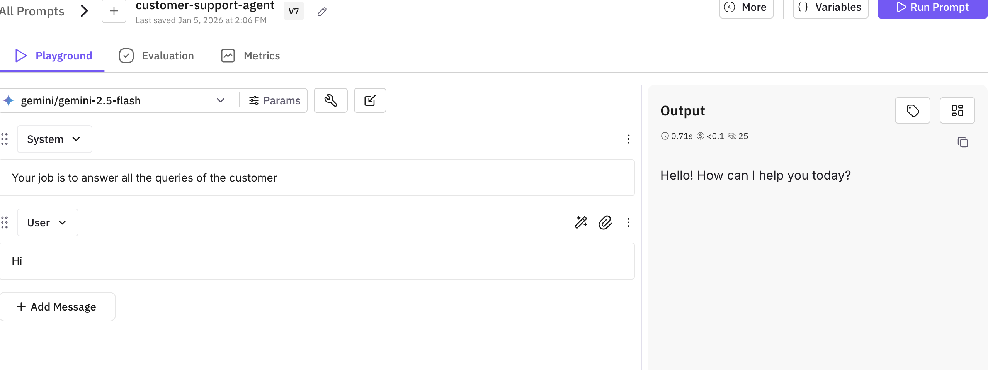

This cookbook shows you how to test and improve your AI chat agents using Future AGI's simulation platform. You'll learn how to:

1. **Run Chat Simulations** - Test your agent across multiple scenarios simultaneously
2. **Analyze Performance** - Get comprehensive metrics and evaluation results
3. **Use Fix My Agent** - Receive AI-powered diagnostics and actionable improvement suggestions

By the end of this guide, you'll be able to simulate conversations at scale, identify issues automatically, and implement fixes to optimize your agent's performance.

<Note>
**Prerequisites**: Before running this cookbook, make sure you have:
- Created an agent definition in the Future AGI platform
- Created scenarios for chat-type simulations (not voice type)
- Created a Run Test configuration with evaluations and requirements

New to simulations? Check out our [Simulation Overview](/product/simulation/overview) first.
</Note>

<a href="https://colab.research.google.com/drive/1coKuywSKyDXwDg7eyiN5Q2aevModjKUo?usp=sharing"></a>

## 1. Installation

First, let's install the required dependencies for chat simulation.

```bash
pip install agent-simulate litellm futureagi
```

These packages provide:
- **agent-simulate**: The core SDK for simulating conversations with AI agents
- **litellm**: A unified interface for calling multiple LLM providers
- **futureagi**: The Future AGI platform SDK for managing prompts and evaluations

## 2. Import Required Libraries

Import all the necessary modules for the simulation:

```python
from fi.simulate import TestRunner, AgentInput, AgentResponse
from fi.prompt.client import Prompt
import litellm
import os
from typing import Union
from getpass import getpass
```

## 3. Setup API Keys

Configure your API keys to connect to the AI services. You'll need:
- **Future AGI API keys** for accessing the platform
- **LLM provider API key** (e.g., OpenAI, Gemini, Anthropic) for the agent's model

<Note>
Uncomment the provider you'll be using. For example, if using GPT models, uncomment the `OPENAI_API_KEY` line.
</Note>

```python
# Setup your API keys
os.environ["FI_API_KEY"] = getpass("Enter your Future AGI API key: ")
os.environ["FI_SECRET_KEY"] = getpass("Enter your Future AGI Secret key: ")
os.environ["GEMINI_API_KEY"] = getpass("Enter your GEMINI API key: ")
# os.environ["OPENAI_API_KEY"] = getpass("Enter your OpenAI API key (optional): ")
# os.environ["ANTHROPIC_API_KEY"] = getpass("Enter your Anthropic API key (optional): ")
```

## 4. Define Prompt Template and Run Test

Before running the simulation, you need to define:
1. **Prompt Template**: The system prompt and configuration for your chat agent
2. **Run Test Name**: The test configuration created in the Future AGI platform

### Create a Prompt Template

Navigate to the [Prompt Workbench](https://app.futureagi.com/dashboard/workbench/all) and:
1. Click on "Create Prompt"
2. Choose a label (production, staging, or development)
3. Name your template (e.g., "Customer_support_agent")



<Tip>
**Pro Tip**: Use labels to organize different versions of your prompts and easily deploy them to production.
</Tip>

## 5. Configure and Fetch Agent

Now let's set up an interactive configuration to fetch your agent's prompt and create the simulation agent.

```python
import ipywidgets as widgets
from IPython.display import display, clear_output
import asyncio

# --- 1. UI Setup (Widgets) ---
style = {'description_width': '150px'}
layout = widgets.Layout(width='500px')

header = widgets.HTML("<h3>🚀 Configure Simulation</h3>")

w_template_name = widgets.Text(
    value="Customer_support_agent",
    description="Prompt Template Name:",
    placeholder="e.g., Deliverysupportagent",
    style=style, layout=layout
)

w_label = widgets.Dropdown(
    options=["production", "staging", "development"],
    value="production",
    description="Environment Label:",
    style=style, layout=layout
)

w_run_name = widgets.Text(
    value="Chat test",
    description="Run Name:",
    style=style, layout=layout
)

w_concurrency = widgets.BoundedIntText(
    value=5,
    min=1, max=50,
    description="Concurrency:",
    style=style, layout=layout
)

btn_load = widgets.Button(
    description="Fetch Prompt & Create Agent",
    button_style='primary',
    layout=widgets.Layout(width='500px', margin='20px 0px 0px 0px'),
    icon='cloud-download'
)

out_log = widgets.Output(layout={'border': '1px solid #ddd', 'padding': '10px', 'margin': '20px 0px 0px 0px'})
```


### Create the Agent Function

Define a function that creates your AI agent using LiteLLM:

```python
def create_litellm_agent(system_prompt: str = None, model: str = "gpt-4o-mini"):
    """Creates the AI agent function using LiteLLM."""
    async def agent_function(input_data) -> str:
        messages = []
        
        # Add system prompt
        if system_prompt:
            messages.append({"role": "system", "content": system_prompt})

        # Add conversation history
        if hasattr(input_data, 'messages'):
            for msg in input_data.messages:
                content = msg.get("content", "")
                if not content: 
                    continue
                role = msg.get("role", "user")
                if role not in ["user", "assistant", "system"]: 
                    role = "user"
                messages.append({"role": role, "content": content})

        # Add new message
        if hasattr(input_data, 'new_message') and input_data.new_message:
            content = input_data.new_message.get("content", "")
            if content:
                messages.append({"role": "user", "content": content})

        # Call LiteLLM
        try:
            response = await litellm.acompletion(
                model=model,
                messages=messages,
                temperature=0.2,
            )
            if response and response.choices:
                return response.choices[0].message.content or ""
        except Exception as e:
            return f"Error generating response: {str(e)}"
        return ""

    return agent_function
```

### Fetch Prompt and Configure Agent

```python
def on_load_click(b):
    with out_log:
        clear_output()
        print("⏳ Connecting to Future AGI platform...")

        # Make variables available to other cells
        global agent_callback, concurrency, run_test_name

        # Update global config variables from widgets
        concurrency = w_concurrency.value
        run_test_name = w_run_name.value
        current_template = w_template_name.value
        current_label = w_label.value

        try:
            # 1. Fetch Prompt
            if current_label:
                prompt_obj = Prompt.get_template_by_name(current_template, label=current_label)
            else:
                prompt_obj = Prompt.get_template_by_name(current_template)

            print(f"✅ Successfully fetched: '{current_template}' ({current_label})")
            prompt_template = prompt_obj.template

            # 2. Extract Model
            model_name = "gpt-4o-mini"  # Default
            if hasattr(prompt_template, 'model_configuration') and prompt_template.model_configuration:
                if hasattr(prompt_template.model_configuration, 'model_name'):
                    model_name = prompt_template.model_configuration.model_name
            print(f"   ⚙️  Model: {model_name}")

            # 3. Extract System Prompt
            system_prompt = None
            # Check messages list
            if hasattr(prompt_template, 'messages') and prompt_template.messages:
                for msg in prompt_template.messages:
                    # Handle dict or object
                    role = msg.get('role') if isinstance(msg, dict) else getattr(msg, 'role', '')
                    content = msg.get('content') if isinstance(msg, dict) else getattr(msg, 'content', '')

                    if role == 'system':
                        system_prompt = content
                        break

            # Fallback: Try compiling
            if not system_prompt:
                try:
                    client = Prompt(template=prompt_template)
                    compiled = client.compile()
                    if compiled and isinstance(compiled, list):
                        for msg in compiled:
                            if isinstance(msg, dict) and msg.get('role') == 'system':
                                system_prompt = msg.get('content', '')
                                break
                except:
                    pass

            if not system_prompt:
                system_prompt = ""
                print("   ℹ️  No system prompt found (using empty).")
            else:
                preview = system_prompt[:50] + "..." if len(system_prompt) > 50 else system_prompt
                print(f"   📝 System Prompt loaded: \"{preview}\"")

            # 4. Create Agent
            agent_callback = create_litellm_agent(
                system_prompt=system_prompt,
                model=model_name
            )

            print("\n🎉 Agent created successfully! You can now run the simulation.")
            print("---------------------------------------------------------------")

        except NameError:
             print("❌ Error: 'Prompt' or 'litellm' library not defined. Please ensure previous setup cells were run.")
        except Exception as e:
            print(f"❌ Error fetching prompt: {e}")
            print("   Please check your API keys and Prompt Name.")

# --- 3. Display ---
btn_load.on_click(on_load_click)

ui = widgets.VBox([
    header,
    w_template_name,
    w_label,
    w_run_name,
    w_concurrency,
    btn_load,
    out_log
])

display(ui)
```

## 6. Run the Simulation

Now run the simulation with your configured agent and test scenarios:

```python
print(f"\n🚀 Starting simulation: '{run_test_name}'")
print(f"   Concurrency: {concurrency} conversations at a time")
print(f"   This may take a few minutes...\n")

# Initialize the test runner
runner = TestRunner(
    api_key=os.environ["FI_API_KEY"],
    secret_key=os.environ["FI_SECRET_KEY"],
)

# Run the simulation
report = await runner.run_test(
    run_test_name=run_test_name,
    agent_callback=agent_callback,
    concurrency=concurrency,
)

print("\n✅ Simulation completed!")
print(f"   Total conversations: {len(report.results) if hasattr(report, 'results') else 'N/A'}")
print(f"\n📊 View detailed results in your Future AGI dashboard:")
print(f"   https://app.futureagi.com")
```


### Understanding the Results

The simulation will:
1. Execute multiple test conversations concurrently
2. Test your agent against predefined scenarios
3. Generate a comprehensive report with metrics
4. Upload results to your Future AGI dashboard

<Info>
**What's Next?** Now that you have simulation results, it's time to analyze them and improve your agent. Instead of manually reviewing hundreds of data points, let AI do the heavy lifting with **Fix My Agent**.
</Info>

## 7. Fix My Agent - Get Instant Diagnostics

Once your simulation completes, you'll see a comprehensive dashboard with performance metrics and evaluation results. But here's where it gets powerful: instead of manually analyzing data and debugging issues yourself, click the **Fix My Agent** button to get AI-powered diagnostics and actionable recommendations in seconds.


### How Fix My Agent Works

After analyzing your simulation results, Fix My Agent:

1. **Analyzes**: Reviews all conversations against your evaluation criteria and performance metrics
2. **Identifies**: Pinpoints specific issues like latency bottlenecks, response quality problems, or conversation flow issues
3. **Prioritizes**: Ranks suggestions by impact (High/Medium/Low priority)
4. **Recommends**: Provides clear, actionable fixes you can implement immediately
5. **Generates**: Optionally creates optimized system prompts you can copy directly into your setup

<Tip>
Most teams see significant improvements by simply implementing the high-priority suggestions from Fix My Agent. It's like having an AI expert review your agent's performance and tell you exactly what to fix.
</Tip>

## Key Features

<CardGroup cols={2}>
  <Card title="Concurrent Testing" icon="bolt">
    Run multiple conversations simultaneously to test at scale
  </Card>
  <Card title="Scenario-Based Testing" icon="clipboard-list">
    Test against predefined scenarios and edge cases
  </Card>
  <Card title="Automatic Evaluation" icon="chart-line">
    Get instant feedback on agent performance metrics
  </Card>
  <Card title="Fix My Agent" icon="wand-magic-sparkles">
    AI-powered diagnostics and actionable improvement recommendations
  </Card>
</CardGroup>

## Best Practices

1. **Start Small**: Begin with a low concurrency value (e.g., 5) and increase gradually
2. **Diverse Scenarios**: Create test scenarios covering various user intents and edge cases
3. **Use Fix My Agent**: After each simulation, check Fix My Agent for improvement suggestions
4. **Iterative Testing**: Implement fixes, then re-run simulations to track improvements
5. **Monitor Metrics**: Pay attention to evaluation metrics like task completion, tone, and response quality
6. **Use Labels**: Leverage environment labels (dev, staging, production) to manage prompt versions

## Troubleshooting

<AccordionGroup>
  <Accordion title="Connection Errors">
    Ensure all API keys are correctly set and have proper permissions. Check your internet connection and firewall settings.
  </Accordion>
  
  <Accordion title="Prompt Not Found">
    Verify the prompt template name and label exist in your Future AGI dashboard. Names are case-sensitive.
  </Accordion>
  
  <Accordion title="Simulation Timeout">
    Reduce the concurrency value or check if your agent is taking too long to respond. Consider optimizing your prompt or model selection.
  </Accordion>
  
  <Accordion title="Model Errors">
    Ensure the LLM provider API key is valid and the model name is correct. Some models may require specific API access.
  </Accordion>
</AccordionGroup>

## Next Steps

<CardGroup cols={2}>
  <Card 
    title="Fix My Agent Guide" 
    href="../../product/simulation/how-to/fix-my-agent"
    icon="wand-magic-sparkles"
  >
    Deep dive into Fix My Agent features and optimization
  </Card>
  <Card 
    title="Voice Simulation" 
    href="../cookbook17/simulate-sdk-demo"
    icon="microphone"
  >
    Learn how to simulate voice conversations
  </Card>
  <Card 
    title="Advanced Evaluations" 
    href="../cookbook3/Mastering-Evaluation-of-AI-Agents"
    icon="graduation-cap"
  >
    Master advanced evaluation techniques
  </Card>
  <Card 
    title="Simulation Documentation" 
    href="../../product/simulation/how-to/chat-simulation-using-sdk"
    icon="book"
  >
    Read the detailed simulation documentation
  </Card>
</CardGroup>

## Conclusion

You've now learned how to simulate and improve your AI chat agents using the Future AGI platform. This powerful workflow helps you:

- **Test at Scale**: Run multiple concurrent simulations across diverse scenarios
- **Get Instant Diagnostics**: Use Fix My Agent to identify issues automatically  
- **Implement Fixes Fast**: Follow actionable recommendations to improve quality
- **Iterate Confidently**: Validate improvements before deploying to production
- **Maintain Quality**: Continuously monitor and optimize agent performance

The combination of simulation testing and AI-powered diagnostics ensures your agents deliver high-quality interactions in production.

For more information, visit the [Future AGI Documentation](https://docs.futureagi.com) or join our [community forum](https://discord.com/invite/n2tCUKBkAw).
