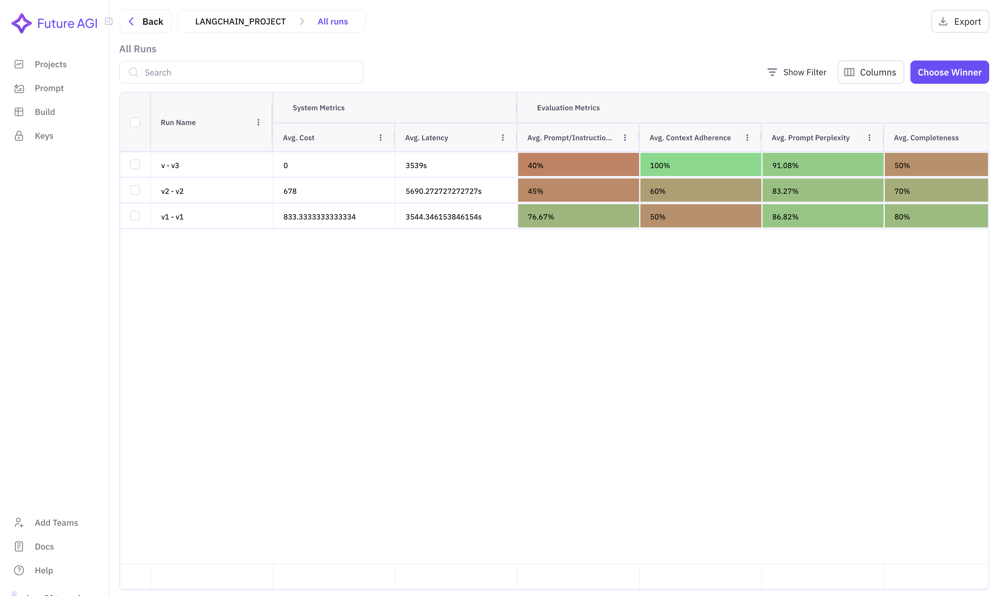
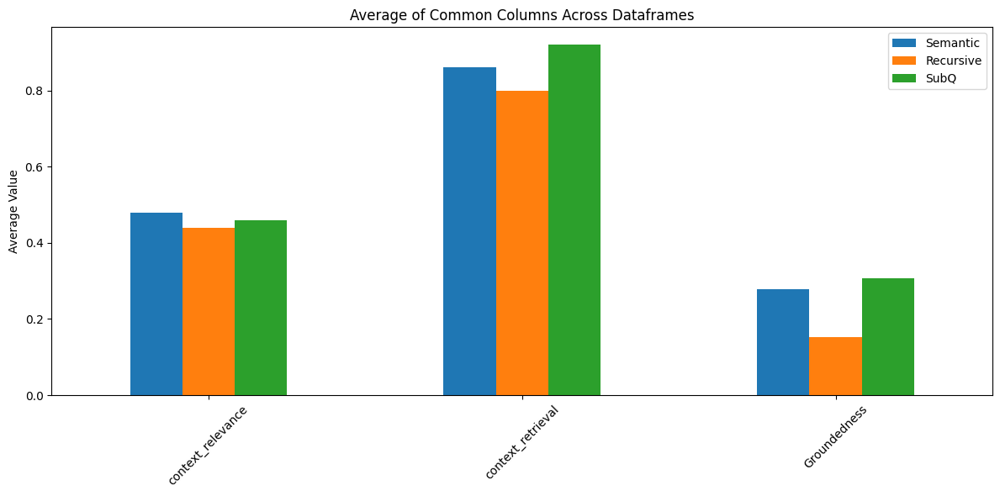

## 1. Installing The Depenencies


```python
!pip -qq install langchain
!pip -qq install langchain-core
!pip -qq install langchain-community
!pip -qq install langchain_experimental
!pip -qq install langchain-openai
```

## 2. Configuring OpenAI to build our RAG App


```python
from langchain_openai import ChatOpenAI, OpenAIEmbeddings

import getpass
import os

if "OPENAI_API_KEY" not in os.environ:
    os.environ["OPENAI_API_KEY"] = getpass.getpass("Enter your OpenAI API key: ")

llm = ChatOpenAI(model_name="gpt-4o-mini")
embeddings = OpenAIEmbeddings(model = "text-embedding-3-large")
```


```python
llm.invoke("Hi")
```


```python
!pip install langchain beautifulsoup4 chromadb gradio futureagi -q
```

## 3. Configuring FutureAGI SDK for Evaluation and Observability

We'll use FutureAGI SDK for two main purposes:

1. Setting up an evaluator to run tests using FutureAGI's evaluation metrics
2. Initializing a trace provider to capture experiment data in FutureAGI's Observability platform

Let's configure both components:


```python
from getpass import getpass
from fi.aieval import Evaluator
import os
from fi_instrumentation import register, LangChainInstrumentor
from fi_instrumentation.fi_types import (
    ProjectTypes
    EvalConfig,
    EvalName,
    EvalSpanKind,
    EvalTag,
    EvalTagType,
)

os.environ["FI_API_KEY"] = getpass("Enter your FI API key: ")
os.environ["FI_SECRET_KEY"] = getpass("Enter your FI API secret: ")

evaluator = Evaluator(
    fi_base_url="https://api.futureagi.com",
)
eval_tags = [
    EvalTag(
        type=tag_type,
        value=span_kind,
        eval_name=eval_name,
        config=get_default_config(eval_name),
    )
    for tag_type, span_kind, eval_name in product(
        EvalTagType, EvalSpanKind, [EvalName.CONTEXT_ADHERENCE, EvalName.PROMPT_PERPLEXITY]
    )
]
trace_provider = register(
  project_type=ProjectType.EXPERIMENT,
  project_name="RAG-Cookbook",
  project_version_name="v1",
  eval_tags=eval_tags
)

LangChainInstrumentor().instrument(tracer_provider=trace_provider)
```
### The LangChainInstrumentor will automatically capture:
- LLM calls and their responses
- Embedding operations
- Document retrieval metrics
- Chain executions and their outputs

### Viewing Experiment Results

After running your RAG application with the instrumented components, you can view comprehensive visibility into our project in the FutureAGI platform:



The dashboard provides an intuitive interface to analyze your RAG pipeline's performance in one place.


### A sample Questionaire dataset for our RAG app which contains some query and also has a target context for our post build Evaluations
```python
import pandas as pd

dataset = pd.read_csv("Ragdata.csv")
pd.set_option('display.max_colwidth', None)
dataset.head(2)
```
| Query_ID | Query_Text | Target_Context | Category |
| --- | --- | --- | --- |
| 1 | What are the key differences between the transformer architecture in 'Attention is All You Need' and the bidirectional approach used in BERT? | Attention is All You Need; BERT | Technical Comparison |
| 2 | Explain the positional encoding mechanism in the original transformer paper and why it was necessary. | Attention is All You Need | Technical Understanding |

## 4. RecursiveSplitter and Basic Retrieval

let's set a basic RAG app using text_splitter from LangChain, and we will store the embeddings generated from OpenAI's model in a ChromaDB which can be found in langchain_community library.


```python
from bs4 import BeautifulSoup as bs
from langchain.text_splitter import RecursiveCharacterTextSplitter
from langchain_community.document_loaders import WebBaseLoader
from langchain_community.vectorstores import Chroma
from langchain.chat_models import ChatOpenAI
# Load the data from the web URL
docs = []
urls = ['https://en.wikipedia.org/wiki/Attention_Is_All_You_Need',
        'https://en.wikipedia.org/wiki/BERT_(language_model)',
        'https://en.wikipedia.org/wiki/Generative_pre-trained_transformer' ]
for url in urls:
  loader = WebBaseLoader(url)
  doc = loader.load()
  docs.extend(doc)

def openai_llm(question, context):
    formatted_prompt = f"Question: {question}\n\nContext: {context}"
    messages=[{'role': 'user', 'content': formatted_prompt}]
    response = llm.invoke(messages)
    print(response)
    return response.content


def rag_chain(question):
    retrieved_docs = retriever.invoke(question)
    formatted_context = "\n\n".join(doc.page_content for doc in retrieved_docs)
    return openai_llm(question, formatted_context)

def get_important_facts(question):
    return rag_chain(question)


# Split the loaded documents into chunks
text_splitter = RecursiveCharacterTextSplitter(chunk_size=1000, chunk_overlap=200)
splits = text_splitter.split_documents(docs)

# Create embeddings and vector store
vectorstore = Chroma.from_documents(documents=splits, embedding=embeddings, persist_directory="chroma_db")


# Define the RAG setup
retriever = vectorstore.as_retriever()
```

### We will then utilize our sample Questionaire dataset and feed it to our RAG App, to get answers for evaluation


```python
import pandas as pd
import time

# Create a list to store results
results = []

# Loop through each query in the dataset
for idx, question in enumerate(dataset['Query_Text']):
    try:
        # Retrieve relevant documents
        retrieved_docs = retriever.invoke(question)

        # Format context
        formatted_context = "\n\n".join([doc.page_content for doc in retrieved_docs])

        # Get LLM response
        response = openai_llm(question, formatted_context)

        # Store results
        results.append({
            "query_id": idx + 1,
            "question": question,
            "context": formatted_context,
            "chunks_list": [doc.page_content for doc in retrieved_docs],  # List storage
            "response": response
        })

        # Optional: Add delay to avoid rate limits
        time.sleep(1)

        print(f"Processed query {idx+1}/{len(dataset)}")

    except Exception as e:
        print(f"Error processing query {idx+1}: {str(e)}")
        results.append({
            "query_id": idx + 1,
            "question": question,
            "context": "Error",
            "response": f"Error: {str(e)}"
        })

# Create DataFrame from results
recursive_df = pd.DataFrame(results)

# Add additional metadata columns if needed
recursive_df['context_length'] = recursive_df['context'].apply(lambda x: len(x.split()))
recursive_df['response'].apply(lambda x: len(x.split()))

# Save to CSV
recursive_df.to_csv('rag_evaluation_results.csv', index=False)
```

## Let's Utilize these results and evaluate our RAG App using Future AGI SDK

Following Evals are beneficial to evaluate our RAG App and find the room for improvement if there is any.
- ContextRelevance
- ContextRetrieval
- Groundedness

```python
from fi.aieval import ContextRelevance, ContextRetrieval, Groundedness
from fi.testcases import TestCase
import pandas as pd
import time

def evaluate_context_relevance(df, question_col, context_col, model="gpt-4o-mini"):
    """
    Evaluate context relevance for each row in the dataframe
    """
    agentic_context_eval = ContextRelevance(config={"model": model, "check_internet": True})
    results = []
    
    for _, row in df.iterrows():
        try:
            test_case = TestCase(
                input=row[question_col],
                context=row[context_col]
            )
            result = evaluator.evaluate(eval_templates=[agentic_context_eval], inputs=[test_case], model_name="turing_flash")
            time.sleep(2)  # Rate limiting
            results.append({'context_relevance': result.eval_results[0].metrics[0].value})
        except Exception as e:
            print(f"Error in context relevance evaluation: {e}")
            results.append({'context_relevance': 'Error'})
            
    return pd.DataFrame(results)

def evaluate_context_retrieval(df, question_col, context_col, response_col, model="gpt-4o-mini"):
    """
    Evaluate context retrieval for each row in the dataframe
    """
    agentic_retrieval_eval = ContextRetrieval(config={
        "model": model,
        "check_internet": True,
        "criteria": "Check if the Context retrieved is relevant and accurate to the query and the response generated isn't incorrect"
    })
    results = []
    
    for _, row in df.iterrows():
        try:
            test_case = TestCase(
                input=row[question_col],
                context=row[context_col],
                output=row[response_col]
            )
            result = evaluator.evaluate(eval_templates=[agentic_retrieval_eval], inputs=[test_case], model_name="turing_flash")
            time.sleep(2)  # Rate limiting
            results.append({'context_retrieval': result.eval_results[0].metrics[0].value})
        except Exception as e:
            print(f"Error in context retrieval evaluation: {e}")
            results.append({'context_retrieval': 'Error'})
            
    return pd.DataFrame(results)

def evaluate_groundedness(df, question_col, context_col, response_col, model="gpt-4o-mini"):
    """
    Evaluate groundedness for each row in the dataframe
    """
    agentic_groundedness_eval = Groundedness(config={"model": model, "check_internet": True})
    results = []
    
    for _, row in df.iterrows():
        try:
            test_case = TestCase(
                input=row[question_col],
                context=row[context_col],
                response=row[response_col]
            )
            result = evaluator.evaluate(eval_templates=[agentic_groundedness_eval], inputs=[test_case], model_name="turing_flash")
            time.sleep(2)  # Rate limiting
            results.append({'Groundedness': result.eval_results[0].metrics[0].value})
        except Exception as e:
            print(f"Error in groundedness evaluation: {e}")
            results.append({'Groundedness': 'Error'})
            
    return pd.DataFrame(results)

def run_all_evaluations(df, question_col, context_col, response_col, model="gpt-4o-mini"):
    """
    Run all three evaluations and combine results
    """
    relevance_results = evaluate_context_relevance(df, question_col, context_col, model)
    retrieval_results = evaluate_context_retrieval(df, question_col, context_col, response_col, model)
    groundedness_results = evaluate_groundedness(df, question_col, context_col, response_col, model)
    
    # Combine all results with original dataframe
    return pd.concat([df, relevance_results, retrieval_results, groundedness_results], axis=1)

```

### Using these functions we can get them

```python
recursive_df = run_all_evaluations(
    recursive_df,
    question_col='Query_Text',
    context_col='context',
    response_col='response'
)
```
# Semantic Chunker and Basic Embedding Retrieval

Now let's try to improve our Chunking Logic as we scored fairly low in Context Retrieval, we will use the Semantic Chunk from LangChain's Text Splitter for the document chunking which chunks based on the change of semantic embedding between the texts.


```python
from langchain_experimental.text_splitter import SemanticChunker
from bs4 import BeautifulSoup as bs
from langchain.text_splitter import RecursiveCharacterTextSplitter
from langchain_community.document_loaders import WebBaseLoader
from langchain_community.vectorstores import Chroma

urls = ['https://en.wikipedia.org/wiki/Attention_Is_All_You_Need',
        'https://en.wikipedia.org/wiki/BERT_(language_model)',
        'https://en.wikipedia.org/wiki/Generative_pre-trained_transformer' ]

docs = {}

def openai_llm(question, context):
    formatted_prompt = f"Question: {question}\n\nContext: {context}"
    messages=[{'role': 'user', 'content': formatted_prompt}]
    response = llm.invoke(messages)
    print(response)
    return response.content


def rag_chain(question):
    retrieved_docs = retriever.invoke(question)
    formatted_context = "\n\n".join(doc.page_content for doc in retrieved_docs)
    return openai_llm(question, formatted_context)

def get_important_facts(question):
    return rag_chain(question)

for i, url in enumerate(urls):
    loader = WebBaseLoader(url)
    doc = loader.load()
    docs[i] = doc

all_docs = [doc for doc_list in docs.values() for doc in doc_list]

semantic_chunker = SemanticChunker(embeddings, breakpoint_threshold_type="percentile")

semantic_chunks = semantic_chunker.create_documents([d.page_content for d in all_docs])

vectorstore = Chroma.from_documents(documents=semantic_chunks, embedding=embeddings, persist_directory="chroma_db")

retriever = vectorstore.as_retriever()

```


```python
import pandas as pd
import time

results = []

for idx, question in enumerate(dataset['Query_Text']):
    try:
        retrieved_docs = retriever.invoke(question)

        formatted_context = "\n\n[SEMANTIC CHUNK]\n".join(
            [f"CHUNK {i+1}:\n{doc.page_content}"
             for i, doc in enumerate(retrieved_docs)]
        )

        response = openai_llm(question, formatted_context)

        results.append({
            "query_id": idx + 1,
            "question": question,
            "num_chunks": len(retrieved_docs),
            "context": formatted_context,  
            "chunks_list": [doc.page_content for doc in retrieved_docs], 
            "response": response
        })

        time.sleep(1)  
        print(f"Processed query {idx+1}/{len(dataset)}")

    except Exception as e:
        print(f"Error processing query {idx+1}: {str(e)}")
        results.append({
            "query_id": idx + 1,
            "question": question,
            "num_chunks": 0,
            "context": "Error",
            "chunks_list": [],  
            "response": f"Error: {str(e)}"
        })

results_df = pd.DataFrame(results)

results_df['avg_chunk_length'] = results_df.apply(
    lambda row: sum(len(chunk.split()) for chunk in row['chunks_list'])/max(1, row['num_chunks'])
    if row['num_chunks'] > 0 else 0,
    axis=1
)

results_df.to_csv('semantic_rag_evaluation.csv', index=False)
```

## Let's Evaluate our App again

```python
results_df = run_all_evaluations(
    results_df,
    question_col='question',
    context_col='context',
    response_col='response'
)
```

# CHAIN OF THOUGHT

There is still a room for improvement for Groundedness Eval, therefore let's change our Retrieval Logic, we will first pass a chain which tells the llm to break down sub questions based on the query and then use those sub-questions to retrieve the relevant context.


```python
from langchain_core.runnables import RunnableLambda, RunnablePassthrough
from langchain_core.prompts import PromptTemplate
from typing import List, Dict

# New: Sub-question generation prompt
subq_prompt = PromptTemplate.from_template(
    "Break down this question into 2-3 sub-questions needed to answer it. "
    "Focus on specific topics and details and related subtopics.\n"
    "Question: {input}\n"
    "Format: Bullet points with 'SUBQ:' prefix"
)

# New: Sub-question parser (extract clean list from LLM output)
def parse_subqs(text: str) -> List[str]:

    content = text.content
    return [line.split("SUBQ:")[1].strip()
            for line in text.content.split("\n")
            if "SUBQ:" in line]

# New: Chain to generate and parse sub-questions
subq_chain = subq_prompt | llm | RunnableLambda(parse_subqs)

# Modified QA prompt to handle multiple contexts
qa_system_prompt = PromptTemplate.from_template(
    "Answer using ALL context below. Connect information between contexts.\n"
    "CONTEXTS:\n{contexts}\n\n"
    "Question: {input}\n"
    "Final Answer:"
)

# Revised chain with proper data flow
full_chain = (

    RunnablePassthrough.assign(
        subqs=lambda x: subq_chain.invoke(x["input"])
    )
    .assign(
        contexts=lambda x: "\n\n".join([
            doc.page_content
            for q in x["subqs"]
            for doc in retriever.invoke(q)
        ])
    )
    .assign(
        answer=qa_system_prompt | llm  # Now properly wrapped
    )
)
```


```python
import pandas as pd

# Create results storage with sub-question tracking
results = []

# Loop through dataset queries
for idx, query in enumerate(dataset['Query_Text']):
    try:
        # Run full sub-question chain
        result = full_chain.invoke({"input": query})

        # Store detailed results
        results.append({
            "query_id": idx + 1,
            "original_question": query,
            "generated_subqs": result["subqs"],
            "num_subqs": len(result["subqs"]),
            "retrieved_contexts": result["contexts"],
            "context_list": list(result["contexts"]),
            "final_answer": result["answer"].content,
            "error": None
        })

        print(f"Processed query {idx+1}/{len(dataset)}")

    except Exception as e:
        print(f"Error processing query {idx+1}: {str(e)}")
        results.append({
            "query_id": idx + 1,
            "original_question": query,
            "generated_subqs": [],
            "num_subqs": 0,
            "retrieved_contexts": "",
            "final_answer": f"Error: {str(e)}",
            "error": str(e)
        })

# Create analysis DataFrame
analysis_df = pd.DataFrame(results)

# Add metadata columns
analysis_df['context_length'] = analysis_df['retrieved_contexts'].apply(lambda x: len(x.split()))
analysis_df['answer_length'] = analysis_df['final_answer'].apply(lambda x: len(x.split()))

# Save results
analysis_df.to_csv('subq_rag_evaluation.csv', index=False)
```

## Let's Evaluate Our RAG App again for the same evals


```python

analysis_df = run_all_evaluations(
    analysis_df,
    question_col='original_question',
    context_col='retrieved_contexts',
    response_col='final_answer'
)

```


Saving the Results in the csv

```python
analysis_df.to_csv('subq_evals.csv', index=False)
recursive_df.to_csv('recursive_evals.csv', index=False)
results_df.to_csv('semantic_results.csv', index=False)
```

Plotting the results on a bar plot we can clearly see that we saw a good improvement utilizing the Chain of Thought Retrieval Logic with a bit fair tradeoff in Context Relevance, While it is superior in ContextRetrieval and Groundedness


```python
import pandas as pd
import matplotlib.pyplot as plt

try:
  semantic_df = pd.read_csv('semantic_results.csv')
  recursive_df = pd.read_csv('recursive_evals.csv')
  subq_df = pd.read_csv('subq_evals.csv')
except FileNotFoundError:
  print("One or more of the evaluation CSV files were not found. Please ensure they are present.")
  exit()

if 'query_id' in semantic_df.columns:
  semantic_df.drop('query_id', axis=1, inplace=True)
if 'query_id' in recursive_df.columns:
  recursive_df.drop('query_id', axis=1, inplace=True)
if 'query_id' in subq_df.columns:
  subq_df.drop('query_id', axis=1, inplace=True)

common_columns = list(set(semantic_df.columns) & set(recursive_df.columns) & set(subq_df.columns))
print("Common Columns:", common_columns)

for df in [semantic_df, recursive_df, subq_df]:
    for col in common_columns:
        df[col] = pd.to_numeric(df[col], errors='coerce')

avg_semantic = semantic_df[common_columns].mean()
avg_recursive = recursive_df[common_columns].mean()
avg_subq = subq_df[common_columns].mean()

summary_df = pd.DataFrame({
    'Semantic': avg_semantic,
    'Recursive': avg_recursive,
    'SubQ': avg_subq
})

print("\nAverage of Common Columns:\n", summary_df)

summary_df.plot(kind='bar', figsize=(12, 6))
plt.title('Average of Common Columns Across Dataframes')
plt.ylabel('Average Value')
plt.xticks(rotation=45)
plt.tight_layout()
plt.show()

```

    Common Columns: ['context_relevance', 'context_retrieval', 'Groundedness']
    
    Average of Common Columns:
                        Semantic  Recursive     SubQ
    context_relevance   0.48000    0.44000  0.46000
    context_retrieval   0.86000    0.80000  0.92000
    Groundedness        0.27892    0.15302  0.30797


    

# Results Analysis

The comparison of three different RAG approaches reveals:

1. Context Relevance:
- All approaches performed similarly (0.44-0.48)
- Semantic chunking slightly outperformed others at 0.48

2. Context Retrieval:
- Chain of Thought (SubQ) approach showed best performance at 0.92
- Semantic chunking followed at 0.86
- Recursive splitting had the lowest score at 0.80

3. Groundedness:
- Chain of Thought showed highest groundedness at 0.31
- Semantic chunking followed at 0.28
- Recursive splitting performed poorest at 0.15

Key Takeaway: The Chain of Thought (SubQ) approach demonstrated the best overall performance, particularly in context retrieval and groundedness, with only a minor tradeoff in context relevance.

# Best Practices and Recommendations

Based on our experiments:

1. When to use each approach:
- Use Chain of Thought (SubQ) when dealing with complex queries requiring multiple pieces of information
- Use Semantic chunking for simpler queries where speed is important
- Recursive splitting works as a baseline but may not be optimal for production use

2. Performance considerations:
- SubQ approach requires more API calls due to sub-question generation
- Semantic chunking has moderate computational overhead
- Recursive splitting is the most computationally efficient

3. Cost considerations:
- SubQ approach may incur higher API costs due to multiple calls
- Consider caching mechanisms for frequently asked questions

# Future Improvements

Potential areas for further enhancement:

1. Hybrid Approach:
- Combine semantic chunking with Chain of Thought for complex queries
- Use adaptive selection of approach based on query complexity

2. Optimization Opportunities:
- Implement caching for sub-questions and their results
- Fine-tune chunk sizes and overlap parameters
- Experiment with different embedding models

3. Additional Evaluations:
- Add response time measurements
- Include cost per query metrics
- Measure memory usage for each approach
