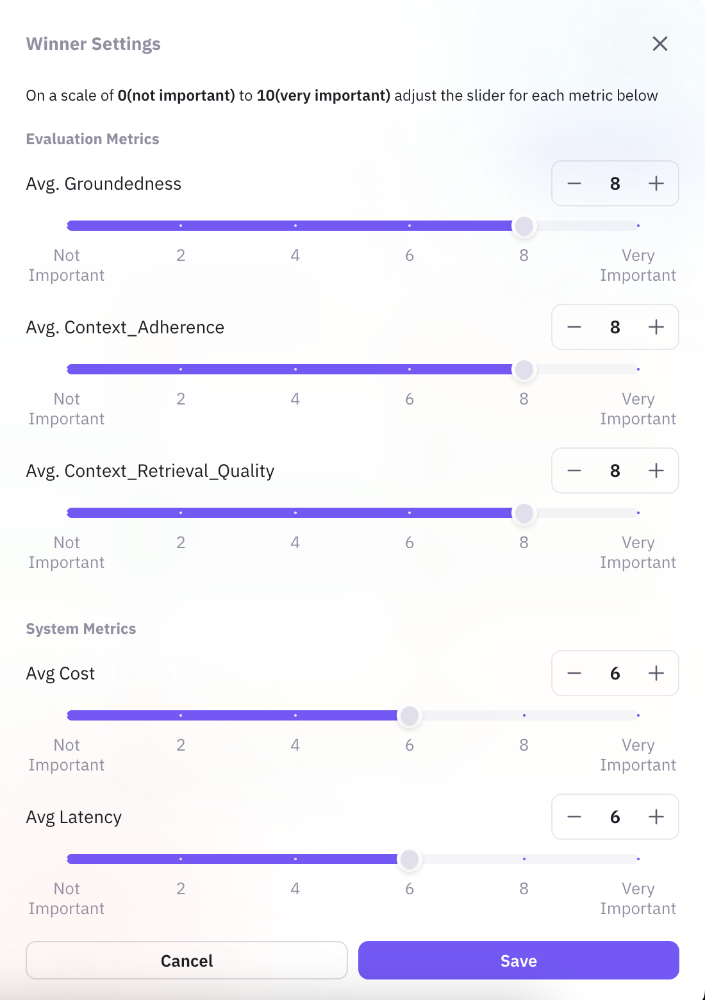
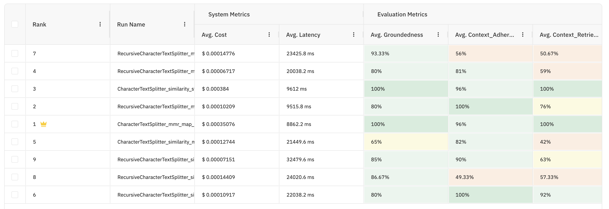

## Observability in AI Systems Explained

Observability is now an essential part of contemporary AI applications, particularly those that utilize large language models (LLMs). This tutorial will guide you through the process of applying observability with FutureAGI's robust instrumentation framework, enabling you to track and enhance your application's performance and stability.

## Why Observability is Important in AI Applications

- **Real-time Monitoring**: Monitor LLM responses and application behavior
- **Performance Optimization**: Detect and resolve bottlenecks in AI interactions
- **Quality Assurance**: Validate accurate and reliable AI responses
- **User Experience**: Provide consistent and high-quality AI interactions

## Getting Started with FutureAGI Observability
Observe allows you to gain insights into the internal state of your AI applications,
ensuring they perform optimally and reliably. 

### Prerequisites

Before you start using observability, make sure you have:

- Python 3.10 or later installed
- Familiarity with Python and AI fundamentals
- Access to a FutureAGI account (sign up at [FutureAGI](https://app.futureagi.com/))

### Installation

```bash
pip install gradio langchain-openai traceai-langchain
```

## Step-by-Step Implementation Guide

<Note> Please export your OpenAI and FutureAGI api keys before proceeding to run the code</Note>
### 1. Basic Setup

```python

# export FI_API_KEY="xxxasxas"
# export FI_SECRET_KEY="hasdaxxasa21"
# export OPENAI_API_KEY="jasfapsd"

import os
import gradio as gr
from langchain_openai import ChatOpenAI
from fi_instrumentation import register
from fi_instrumentation.fi_types import (
    EvalName,
    EvalSpanKind,
    EvalTag,
    EvalTagType,
    ProjectType
)

# Initialize tracing
trace_provider = register(
project_type=ProjectType.OBSERVE,
    project_name="Your-Project-Name"
)

```

## Real-World Application Example

Let's consider a simplified example of a chat application that uses observability. This example illustrates a chatbot application that has Observability in place.

### Application Overview

This Gradio-based chat app includes:

- Integration of OpenAI's GPT model
- Monitoring of real-time responses
- Easy-to-use interface
- Full observability metrics

### Code Implementation

```python
import os
import gradio as gr
from langchain_openai import ChatOpenAI
from fi_instrumentation import register
from traceai_langchain import LangChainInstrumentor
from fi_instrumentation.fi_types import (
    EvalName,
    EvalSpanKind,
    EvalTag,
    EvalTagType,
    ProjectType
)

# Set up tracing with FutureAGI
trace_provider = register(
    project_type=ProjectType.OBSERVE,
    project_name="Simple-Chat-App"
)

LangChainInstrumentor().instrument(tracer_provider=trace_provider)

# Set up the LLM
llm = ChatOpenAI(temperature=0, model="gpt-4o-mini")

def process_message(message, history):
    """Process user message and generate response with observability"""
    try:
        # Generate response using LLM
        response = llm.invoke(message)

        # Return formatted response
        return history + [(message, response.content)]
    except Exception as e:
        error_message = f"Sorry, I encountered an error: {str(e)}"
        return history + [(message, error_message)]

def main():
    with gr.Blocks(theme=gr.themes.Soft()) as demo:
        # Create chat interface
        chatbot = gr.Chatbot(
            label="Simple Chat Assistant",
            height=400,
            value=[],
            type="chat",
            autoscroll=True
        )

        with gr.Row():
            msg = gr.Textbox(
                label="Message",
                placeholder="Type your message here.",
                scale=4,
                container=False,
                autofocus=True,
                show_label=False
            )
            submit_button = gr.Button(
                "Send",
                variant="primary",
                scale=1,
                size="sm"
            )

        # Example queries
        gr.Examples(
            examples=[
                "What is artificial intelligence?",
                "Describe quantum computing in everyday language",
                "What are the advantages of observability?",
            ],
            inputs=msg
        )

        # Handle message submission
        msg.submit(
            fn=process_message,
            inputs=[msg, chatbot],
            outputs=[chatbot],
            queue=False
        ).then(
            lambda: "",
            None,
            msg,
            queue=False
        )

        # Also trigger on button click
        submit_button.click(
            fn=process_message,
            inputs=[msg, chatbot],
            outputs=[chatbot],
            queue=False
        ).then(
            lambda: "",
            None,
            msg,
            queue=False
        )

    # Launch the demo
    demo.launch(
        share=True,
        show_error=True
    )

if __name__ == "__main__":
    main()
```

After this application is installed we can then monitor and configure different features offered by FutureAGI in the dashboard. We can create an Eval Task to evaluate our data generated by the app.

<figcaption>Dashboard from FutureAGI platform showcasing our deployed application in OBSERVE.</figcaption>


To check a specific event for a trace of an application, we can click on one of the traces and check out the flow of our application and its individual events (spans).
<figcaption> Trace Tree that shows the detailed overview of application session</figcaption>
### Key Features Explained

1. **Observability Setup**
    - Integration of FutureAGI's instrumentation framework
    - Monitoring response quality
    - Tracking automatic LLM interaction
2. **Gradio Interface**
    - Responsive, modern design
    - Live chat functionality
    - Integrated error handling
- Example queries for testing
3. **Monitoring Capabilities**
    - Response quality metrics
    - Error rate monitoring
    - Performance monitoring

## Best Practices for Implementation

1. **Performance Optimization**
    - Employ suitable sampling rates
    - Instrumentation overhead monitoring
    - Cache strategies implementation
2. **Error Handling**
    - Comprehensive error logging
- Friendly error messages
- Gracious degradation
3. **Security Considerations**
    - Secure API credentials
    - Protection of data privacy
    - Implementing access control

## Common Challenges and Solutions

| Challenge | Solution | Impact |
| --- | --- | --- |
| High Overhead | Adopt sampling | Lowered resource consumption
| Data Privacy | Utilize data masking | Secure user data |
| Complexity | Utilize auto-instrumentation setup | Simplified implementation |

## FAQs

### 1. What is the lowest supported Python version?

Python 3.10 or later is recommended for best compatibility with FutureAGI's instrumentation framework.

### 2. How does observability affect application performance?

The impact on performance becomes negligible when properly used (usually &lt;1% overhead), providing immense value in terms of insights.

### 3. Can I add observability to current applications?

Yes, observability can be incorporated into current applications with limited code modification.

### 4. What kind of metrics can I monitor?

You can monitor various metrics such as:

- Latency
- Error rates
- Resource consumption
- Tokens Used
- Cost of workflow
- Evaluation Metrics

## Next Steps

Ready to add observability to your app? Here are the steps:

1. Create an account on FutureAGI
2. Install the necessary packages
3. Add basic instrumentation
4. Monitor and optimize

## Additional Resources

- [FutureAGI Documentation](https://docs.futureagi.com/)
- [Gradio Documentation](https://gradio.app/docs)


Begin implementing observability in your Python AI applications today! Sign up for a free FutureAGI account and start monitoring your application's performance and reliability.

📩 Subscribe to our [newsletter](https://futureagi.com/blogs) for weekly AI development tips and best practices!