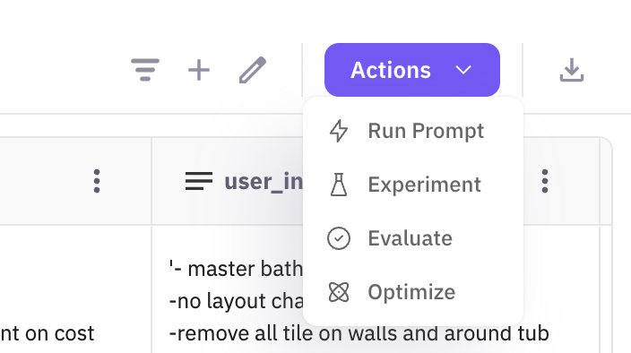
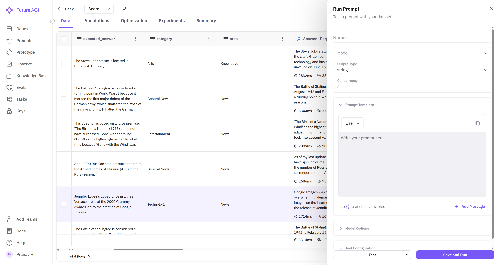
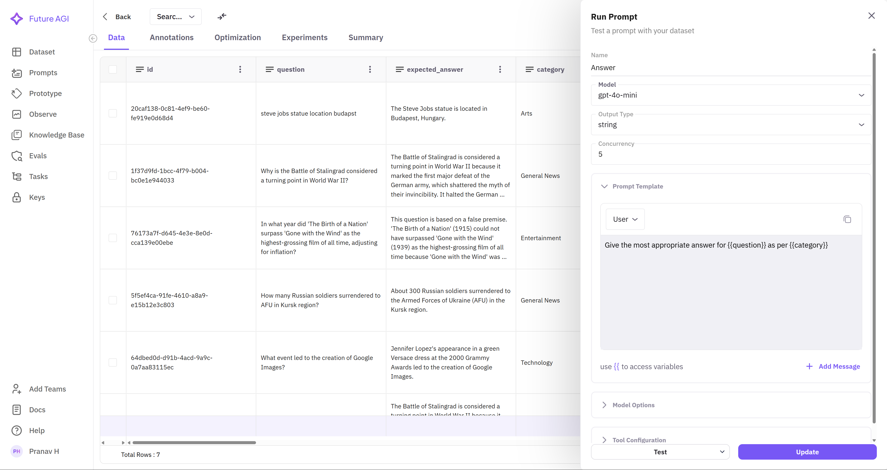

### **1. Select a Dataset**

Choose a dataset from the available list to use for prompt creation. If no dataset appears on the dashboard, ensure you have completed the required steps to **Add Dataset** on the Future AGI platform.

---

### **2. Access the Run Prompt Interface**

Once your dataset is loaded, you can view it in a spreadsheet-like interface. Click on the **Run Prompt** button in the top-right corner to begin creating a prompt.

---

### **3. Configure Your Prompt**

### **Basic Configuration**

To set up a prompt, configure the following details:

- **Prompt Name**: Enter a clear, descriptive name that reflects the purpose of the prompt.
- **Model Selection**: Choose the appropriate LLM model from the dropdown menu.

### **API Key Setup**

To interact with the selected model, an API key is required. Follow these steps:

1. Once a model is selected, a **popup window** will appear prompting you to enter your API key.
2. Enter the key to enable communication between your dataset and the model.
3. In this example, we are using **GPT-4o-mini**, but other models may be available depending on your platform.

### **Output Configuration**

The **output format** determines how responses are structured. Choose from the following options:

- **String**: Generates simple text responses (e.g., "correct" / "incorrect").
- **Object**: Produces structured JSON outputs, useful for complex responses.

Make sure to select the format that best suits your use case.

---

### **Writing Your Prompt**

You can dynamically access dataset columns within your prompt using **double curly braces**.

### **How it Works**

1. When writing your prompt, type `{{` to trigger a **dropdown menu** displaying all available columns.
2. Select a column name from the list; it will be **automatically enclosed** in double braces (e.g., `{{column_name}}`
    
    ).
    
3. The model will replace these placeholders with the actual data from the dataset when generating responses.

This allows you to create **dynamic prompts** that reference dataset values without manually inputting them for each row.

---

### **4. Adjust Model Parameters**

Tuning model parameters is crucial for optimizing performance. Below are the key parameters and their effects:

| **Parameter** | **Description** | **Impact** |
| --- | --- | --- |
| **Concurrency** | Number of simultaneous prompt executions | Higher values increase speed but may hit API limits |
| **Temperature** | Controls randomness of responses | 0: Deterministic, 1: More creative but less predictable |
| **Top P** | Controls diversity in token selection | Lower values keep responses focused, higher values introduce variation |
| **Max Tokens** | Defines maximum response length | Higher values allow longer responses but increase API usage |
| **Presence Penalty** | Adjusts topic diversity | Higher values encourage diverse topics, lower values keep responses on a single topic |
| **Frequency Penalty** | Reduces word/phrase repetition | Higher values discourage repetition, lower values allow it |

### **Response Format**

- Choose between **text** or **JSON** output format.
- Configure tool interaction settings:
    - **Required** – Forces the model to use tools
    - **Auto** – Allows the model to decide
    - **None** – Disables tool interaction

---

### **5. Execute the Prompt**

- Click **Save and Run** to execute your prompt configuration.
- The generated responses will be stored in a new column named after your prompt.

---

### 6. Improve Prompt

If the initial results generated by your **Run Prompt** column aren't quite meeting your expectations (e.g., the output is inaccurate, incomplete, uses the wrong tone, or isn't formatted correctly), you can iteratively refine the underlying prompt directly from the dataset view.

**To improve the prompt associated with a specific output column:**

1. **Locate the Output Column:** Find the column in your dataset that was generated by the **Run Prompt** action you wish to modify.
2. **Target a Cell:** Hover your mouse cursor over any cell within that specific column. Additional options should appear.
3. **Select "Improve Prompt"**: Click on the **Improve Prompt** button or icon that appears upon hover. This will open an editor showing the original prompt.
4. **Provide Feedback:** In the editor, clearly describe the desired changes or corrections. Be specific about what was wrong with the previous output and how you'd like it improved (e.g., "Make the summary more concise," "Extract the date in YYYY-MM-DD format," "Focus only on the positive aspects").
5. **Submit Your Refinement:** Click **Submit**
6. **Review the suggestions:** Click **Apply** if you feel the prompt suggested is suitable to your needs

**Note:** Submitting improvements updates the underlying prompt instructions. To apply these changes to the data, you will likely need to re-run the **Run Prompt** action for that column.

---

### **Best Practices for Prompt Execution**

To ensure the best results, follow these guidelines:

- Start with **low concurrency** to prevent hitting API rate limits.
- Use **temperature 0.0 - 0.3** for factual, structured responses.
- Use **temperature 0.7 - 1.0** for creative and open-ended tasks.
- Set **reasonable max token limits** to optimise cost efficiency.
- Run prompts on a **small subset** of data before applying them to the full dataset.

By following these best practices, you can effectively create **dynamic columns using Run Prompt** while maintaining efficiency and accuracy in your AI-powered workflows.

---