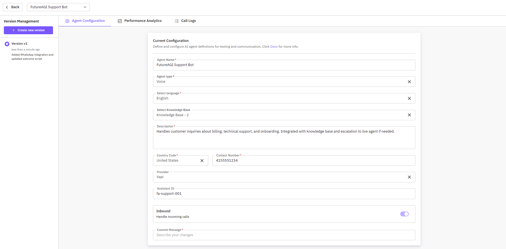
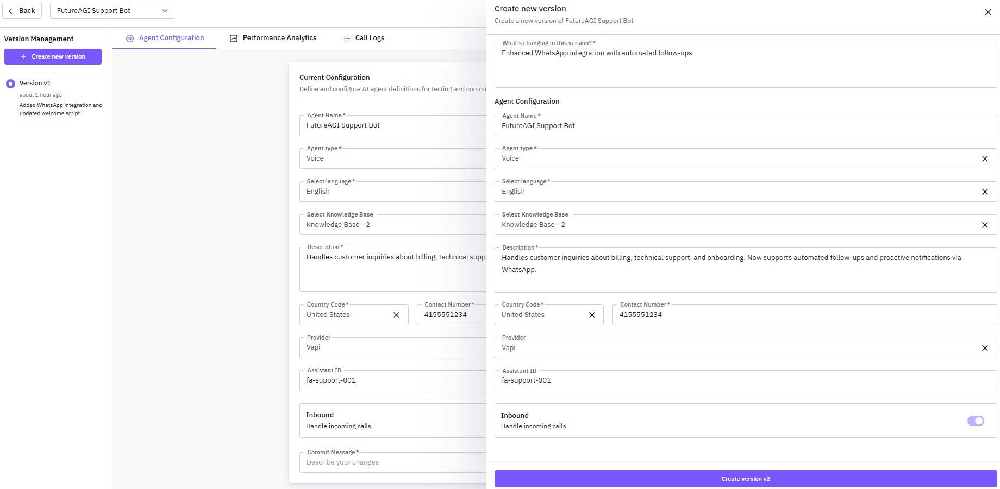
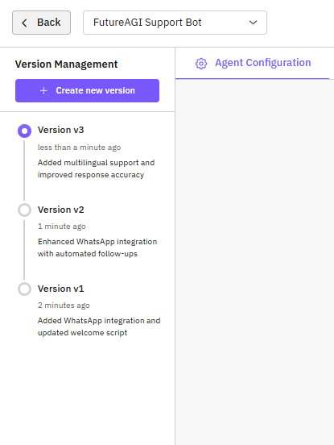
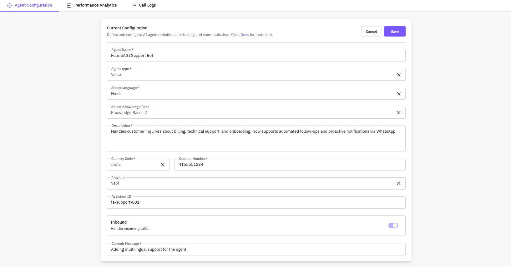
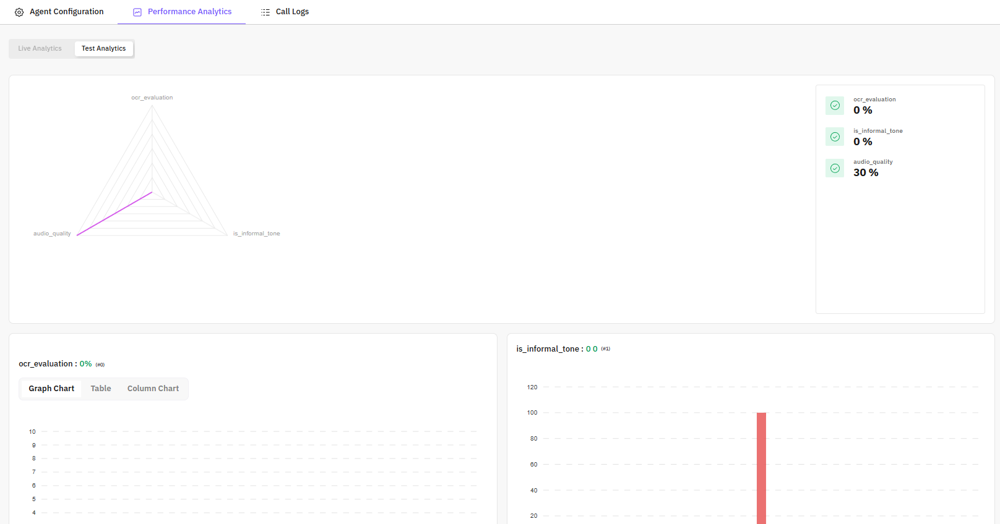
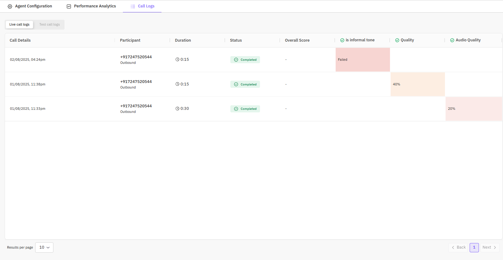
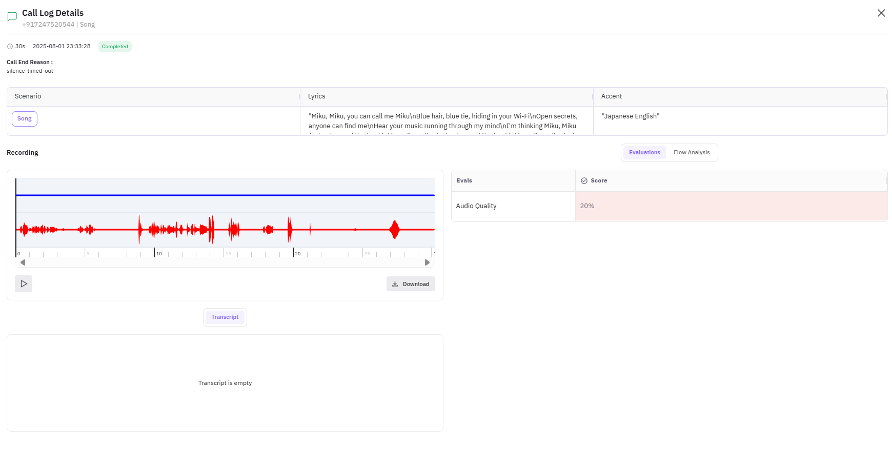

## Introducing Agent Definition Versioning

Agent definition versioning allows you to track changes made to your AI agents over time. Each version captures the agent’s configuration, behavior prompts, knowledge base connections, and other key settings. With versioning, you can safely experiment with updates, roll back to previous versions, and maintain an audit trail of your agent development.

## Understand the UI

The Agent Details UI is divided into key sections:

- **Agent Select Dropdown** – Switch between different agents quickly.
- **Version Management Section** – Located on the left, shows all versions with the latest at the top. Each version displays:
  - Version number
  - Timestamp
  - Commit message
- **Create New Version Button** – Opens a side drawer to create a new version of the agent.

## How Versioning Agents Helps You

Versioning provides several benefits:

- **Experiment Safely** – Test new prompts, workflows, or provider settings without affecting the live agent.  
- **Rollback Capability** – Restore any previous stable configuration if needed.
- **Audit & Compliance** – Maintain a history of agent modifications for regulatory or internal compliance.  

## How to Create New Agent Versions

When creating a new version:

1. Click **Create New Version** in the version management section.
2. In the side drawer:
   - Add a **commit message** describing the changes.
   - Fill in the **Basic Information** and configuration fields.
3. Save to create the new version.  

> Note: Editing a version will always create a **new version**; existing versions remain unchanged.

### Switching Between Versions

1. In the Version Management section, click any existing version.
2. The UI will load the selected version for viewing, configuration, and further edits.
3. This allows users to quickly switch between different configurations of the same agent.

> Note: Switching versions does not delete previous versions; all historical versions remain accessible.

## Exploring Different Tabs

### Agent Configuration Tab

Displays the full configuration of the currently selected agent version, including:

- Basic Information
- Voice Configuration
- Behavior Configuration
- Contact Information
- Associated Knowledge Base

Users can edit the configuration here. Saving changes will create a new version, preserving all previous versions.

### Performance Analytics Tab

Shows the agent’s performance using graphs and metrics:

- Call success rates
- Average response times
- Evaluation scores across multiple metrics
- Error rates and anomalies  

**Benefits:**

- Identify strengths and weaknesses in agent behavior
- Monitor improvements over time
- Quickly spot issues in production or testing

### Call Logs Tab

Provides a detailed history of calls handled by the agent version:

- **Call Information** – Duration, participants, and call status (Completed, Failed, Dropped)
- **Evaluation Scores** – Scores for each call on defined metrics
- **Call Details Drawer** – Click any call to open:

  - Full conversation transcript
  - Turn-by-turn analysis
  - Evaluation results per metric
  - Audio playback (if enabled)
  - Key moments flagged by evaluations

## Takeaways & Best Practices

Agent versioning empowers you to safely iterate on your AI agents while maintaining a full history of changes. To make the most of versioning:

- Always provide **clear commit messages** to describe changes.  
- Test new versions in a **staging environment** before deploying live.  
- Use performance analytics and call logs to **monitor improvements** and identify potential issues.  
- Regularly review historical versions to **learn from past configurations** and optimize agent behavior.  

By following these best practices, you can ensure your agents remain effective, reliable, and aligned with user needs.
