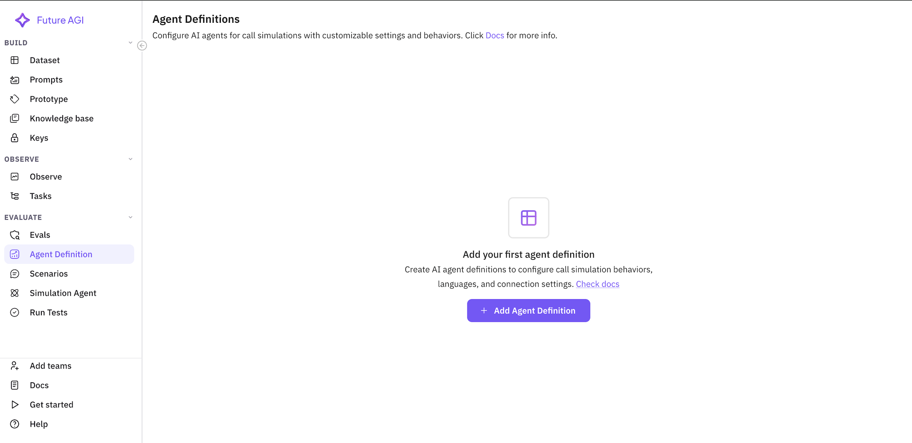
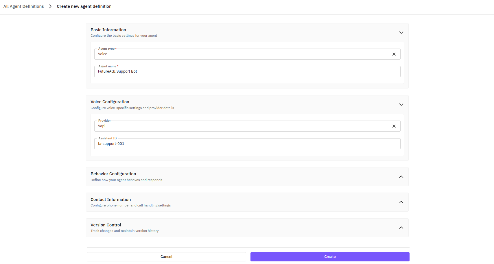
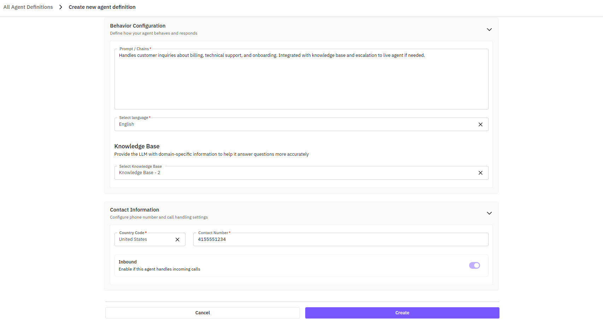
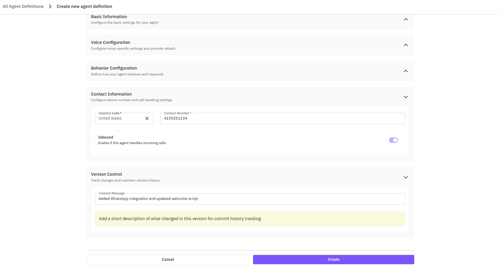

# Agent Definition

This guide provides a comprehensive walkthrough for creating and configuring AI agents in FutureAGI's simulation platform. Agent definitions form the foundation of your voice conversational testing.

## What is an Agent Definition?

An agent definition is a configuration that specifies how your AI agent behaves during voice conversations. It includes:
- Basic information (name, contact details)
- Provider settings (AI model configuration)
- Agent description (prompts and behavior guidelines)
- Communication preferences

## Creating an Agent Definition

### Step 1: Access Agent Definitions

Navigate to **Simulations** → **Agent Definitions** in your FutureAGI dashboard.


Click the **"Add Agent Definition"** button to begin creating a new agent.




### Step 2: Configure Basic Information



#### Basic Information
- **Agent Name**: `Insurance Sales Agent`
- **Agent Type**: Choose between 'voice' or 'chat'

#### Voice Configuration
- **Provider**: Select provider (e.g., 'Vapi' or 'Retell')
- **Assistant ID**: Enter your provider-specific assistant ID (optional)



#### Behavior Configuration
- **Prompts/Chains**: Define your agent's behavior, personality, and conversation flow. This field accepts your agent's prompts and operational guidelines.

#### Language Selection
Choose the primary language for your agent:
- English (en)
- Spanish (es)
- French (fr)
- German (de)
- [Additional languages based on provider]

#### Knowledge Base
Provide the LLM with domain-specific information to help it answer questions more accurately. Upload relevant documents, FAQs, or product information to enhance your agent's expertise.



#### Contact Information
- **Contact Number**: `+1-800-INSURE-ME` (or your test number)
- **Pin Code**: Select your country code (e.g., +1 for US)
- **Connection Type**: Toggle to `Inbound` (agent receives calls)

#### Version Control

**Commit Message**:
Add a descriptive message for each configuration change to track updates and maintain version history.
- Example: "Updated greeting script to include new product line"
- Example: "Modified objection handling for premium concerns"


### Connection Settings

#### Connection Type

**Inbound** (Toggle ON):
- Agent receives incoming calls
- Suitable for customer service, support hotlines
- Agent waits for customer to initiate

**Outbound** (Toggle OFF):
- Agent makes outgoing calls
- Suitable for sales calls, appointment reminders
- Agent initiates the conversation

## Understanding Agent Description

An **Agent Description** is a comprehensive overview of your voice conversational agent's purpose, behavior, and operational guidelines. It encapsulates all the instructions, prompts, and rules you provide to your AI agent, acting as the foundational reference for how the agent should interact with users and handle various scenarios.

**Why it matters**: By clearly articulating your agent's description, you enable FutureAGI to:
- Generate more accurate test scenarios
- Identify issues in production
- Ensure consistent agent behavior
- Validate compliance and quality standards

Most customers include their agent's main prompt here.

## Agent Description Templates

### Single Prompt Agent

For agents with a single, unified prompt, simply copy your agent's main prompt into the description field.

**Example - Insurance Sales Agent:**

```text
You are Sarah, a friendly and knowledgeable insurance sales agent for SecureLife Insurance. 

Your primary goal is to help customers find the right insurance coverage for their needs while building trust and rapport.

Key behaviors:
- Greet customers warmly and ask how you can help
- Listen actively to understand their insurance needs
- Ask relevant questions about family, health, and financial situation
- Explain insurance options clearly without jargon
- Address concerns and objections patiently
- Never pressure customers to make immediate decisions
- Always verify understanding before proceeding
- Offer to send information via email for review

Product knowledge:
- Term life insurance: 10, 20, 30-year options
- Whole life insurance: Fixed premiums, cash value
- Health insurance supplements
- Disability insurance

Compliance requirements:
- Always disclose you're recording for quality assurance
- Provide accurate quotes based on provided information
- Never make guarantees about approval
- Mention that rates are subject to underwriting
```

### Multi-State Agent

For agents with multiple conversation states or nodes, use this structured format:

```text
<System Prompt>
You are a multi-state insurance agent that adapts your conversation based on customer responses and needs.

Core personality: Professional, empathetic, and solution-oriented.

<Greeting Node>
"Hello! Thank you for calling SecureLife Insurance. My name is Sarah. I'm here to help you explore insurance options that best fit your needs. May I have your name, please?"

<Needs Assessment Node>
"Thank you, [Customer Name]. I'd love to understand what brings you to us today. Are you looking for life insurance, health coverage, or would you like to learn about all our options?"

<Life Insurance Node>
"Great choice considering life insurance. To recommend the best options, could you tell me:
1. Are you looking for temporary or permanent coverage?
2. Do you have any dependents?
3. What's your approximate age range?"

<Health Insurance Node>
"I understand you're interested in health coverage. Let me ask a few questions to find the right plan:
1. Are you looking for individual or family coverage?
2. Do you have any existing health conditions?
3. What's most important: low premiums or comprehensive coverage?"

<Objection Handling Node>
"I completely understand your concern about [specific objection]. Many of our clients initially felt the same way. Let me address that specifically..."

<Closing Node>
"Based on our conversation, I recommend [specific product]. I'll email you the detailed information along with a personalized quote. Would you prefer to review this and schedule a follow-up call?"
```

### Retell Workflows

If you're using Retell AI for your agent, export and paste the configuration:

1. Go to **Agents** in Retell dashboard
2. Select your agent
3. Click the **Export** button (downloads a .json file)
4. Copy the entire JSON content
5. Paste it in the agent description field


**Example Retell JSON structure:**
```json
{
  "agent_id": "agent_xxxx",
  "agent_name": "Insurance Sales Bot",
  "voice_id": "voice_xxxx",
  "language": "en-US",
  "prompt": {
    "system_prompt": "You are an insurance sales agent...",
    "example_dialogues": [...],
    "knowledge_base": [...]
  },
  "workflows": {
    "greeting": {...},
    "qualification": {...},
    "presentation": {...},
    "closing": {...}
  }
}
```

### Vapi Workflows

For Vapi-based agents, export the workflow configuration:

1. Go to **Workflows** in Vapi dashboard
2. Select your agent workflow
3. Click the **Code** button (top right)
4. Copy the displayed content
5. Paste it in the agent description field

**Example Vapi configuration:**
```json
{
  "name": "Insurance Sales Workflow",
  "assistant": {
    "model": "gpt-4",
    "voice": "en-US-Standard-A",
    "firstMessage": "Hello! Welcome to SecureLife Insurance...",
    "prompt": "You are a professional insurance agent..."
  },
  "workflow": {
    "nodes": [...],
    "edges": [...],
    "variables": [...]
  }
}
```

## Best Practices for Agent Descriptions

### 1. Be Comprehensive
Include all relevant information:
- Personality and tone
- Product knowledge
- Compliance requirements
- Objection handling strategies
- Escalation procedures

### 2. Use Clear Structure
Organize your description logically:
- Start with role and personality
- List key responsibilities
- Include do's and don'ts
- Add specific examples

### 3. Include Edge Cases
Specify how to handle:
- Angry or frustrated customers
- Technical questions beyond scope
- Requests for human agents
- System errors or unknowns

### 4. Add Compliance Rules
For regulated industries:
- Required disclosures
- Prohibited statements
- Documentation requirements
- Privacy guidelines

### 5. Test Scenarios
Consider including:
- Common customer questions
- Typical objections
- Success criteria
- Failure conditions

## Advanced Configuration Options

### Custom Variables

You can include variables that the simulation engine will use:

```text
{{customer_name}} - Will be replaced with test customer names
{{product_price}} - Will use pricing from your test data
{{appointment_date}} - For scheduling scenarios
```

### Behavioral Modifiers

Add specific behavioral instructions:

```text
[PATIENCE_LEVEL: HIGH] - For difficult customers
[TECHNICAL_DEPTH: MEDIUM] - Balance detail with clarity
[SALES_PRESSURE: LOW] - Consultative approach
[RESPONSE_TIME: NATURAL] - Realistic pauses
```

### Integration Hints

If your agent integrates with systems:

```text
CRM_LOOKUP: Check customer history before recommendations
CALENDAR_ACCESS: Confirm availability for appointments
QUOTE_ENGINE: Generate accurate pricing in real-time
EMAIL_CAPABILITY: Send follow-up information
```

## Validation and Testing

After creating your agent definition:

1. **Review All Fields**: Ensure accuracy
2. **Test Description**: Check for completeness
3. **Save as Draft**: If still refining
4. **Create Agent**: When ready for testing

## Common Mistakes to Avoid

### 1. Vague Descriptions
❌ "Be helpful and friendly"
✅ "Greet with 'Good [morning/afternoon], thank you for calling SecureLife. I'm Sarah, your insurance specialist. How may I assist you today?'"

### 2. Missing Compliance
❌ No mention of regulations
✅ "Always state: 'This call may be recorded for quality and training purposes' at the beginning"

### 3. Incomplete Product Info
❌ "Sell insurance products"
✅ "Offer: Term Life (10/20/30 year), Whole Life, Universal Life. Minimum coverage: $50,000"

### 4. No Error Handling
❌ No guidance for problems
✅ "If unable to answer: 'That's a great question. Let me connect you with a specialist who can provide the most accurate information.'"

[10:58] Raj Shekhar Sinha
# Agent Definition Details
 
## Introducing Agent Definition Versioning
 
Agent definition versioning allows you to track changes made to your AI agents over time. Each version captures the agent’s configuration, behavior prompts, knowledge base connections, and other key settings. With versioning, you can safely experiment with updates, roll back to previous versions, and maintain an audit trail of your agent development.
 
## Understand the UI
 
The Agent Details UI is divided into key sections:
 
- **Agent Select Dropdown** – Switch between different agents quickly.
- **Version Management Section** – Located on the left, shows all versions with the latest at the top. Each version displays:
  - Version number
  - Timestamp
  - Commit message
- **Create New Version Button** – Opens a side drawer to create a new version of the agent.
 

 
## How Versioning Agents Helps You
 
Versioning provides several benefits:
 
- **Experiment Safely** – Test new prompts, workflows, or provider settings without affecting the live agent.  
- **Rollback Capability** – Restore any previous stable configuration if needed.
- **Audit & Compliance** – Maintain a history of agent modifications for regulatory or internal compliance.  
 
## How to Create New Agent Versions

 
When creating a new version:
 

 
1. Click **Create New Version** in the version management section.  
2. In the side drawer, complete:  
   - [ ] **Commit Message** – Describe the changes  
   - [ ] **Basic Information** – Agent name, description, etc.  
   - [ ] **Configuration Fields** – Behavior, voice, and knowledge base  
3. ✅ Click **Save** to create the version.  
 
> 💡 **Tip**  
> Always provide clear commit messages to make version history meaningful.
 
### Switching Between Versions
 

 
1. In the Version Management section, click any existing version.
2. The UI will load the selected version for viewing, configuration, and further edits.
3. This allows users to quickly switch between different configurations of the same agent.
 
> ⚠️ **Note**
> Switching versions does not delete previous versions; all historical versions remain accessible.
 
## Exploring Different Tabs
 
### Agent Configuration Tab ⚙️
 

 
Displays the full configuration of the currently selected agent version, including:
 
- Basic Information
- Voice Configuration
- Behavior Configuration
- Contact Information
- Associated Knowledge Base
 
Users can edit the configuration here. Saving changes will create a new version, preserving all previous versions.
 
### Performance Analytics Tab 📊
 

 
Shows the agent’s performance using graphs and metrics:
 
- Call success rates
- Average response times
- Evaluation scores across multiple metrics
- Error rates and anomalies  
 
**Benefits:**
 
- ✅ Identify strengths and weaknesses in agent behavior
- 📈 Monitor improvements over time
- 🚨 Quickly spot issues in production or testing
 
### Call Logs Tab 📞
 

 
Provides a detailed history of calls handled by the agent version:
 
- **Call Information** – Duration, participants, and call status (Completed, Failed, Dropped)
- **Evaluation Scores** – Scores for each call on defined metrics
- **Call Details Drawer** – Click any call to open:
 

 
  - Full conversation transcript
  - Turn-by-turn analysis
  - Evaluation results per metric
  - Audio playback (if enabled)
  - Key moments flagged by evaluations
 
## Takeaways & Best Practices
 
Agent versioning empowers you to safely iterate on your AI agents while maintaining a full history of changes. To make the most of versioning:
 
- Always provide **clear commit messages** to describe changes.  
- Test new versions in a **staging environment** before deploying live.  
- Use performance analytics and call logs to **monitor improvements** and identify potential issues.  
- Regularly review historical versions to **learn from past configurations** and optimize agent behavior.  
 
By following these best practices, you can ensure your agents remain effective, reliable, and aligned with user needs.

## Next Steps

Once your agent definition is created:

1. **Test with Simple Scenarios**: Start with basic test cases
2. **Refine Description**: Based on initial results
3. **Create Comprehensive Scenarios**: Build out test suites
4. **Run Full Simulations**: Execute complete test runs
5. **Iterate and Improve**: Use results to enhance the agent

For the next step in your simulation setup, proceed to [Creating Scenarios](/future-agi/get-started/simulation/scenarios).