# Run Test

This comprehensive guide walks you through creating and running simulation tests to evaluate your AI agents. We'll continue with our insurance sales agent example to demonstrate the complete testing workflow.

## Overview

Running tests in FutureAGI involves a 4-step wizard that guides you through:
1. Test configuration
2. Scenario selection
3. Evaluation configuration
4. Review and execution

## Creating a Test

### Step 1: Test Configuration

Navigate to **Simulations** → **Run Tests** and click **"Create Test"** to start the test creation wizard.

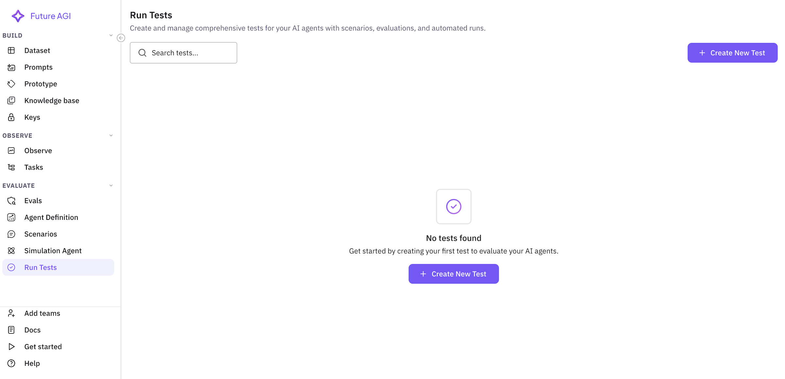

#### Basic Information

Configure your test with meaningful information:

**Test Name** (Required)
- Enter a descriptive name for your test
- Example: `Insurance Sales Agent - Q4 Performance Test`
- Best practice: Include agent type, purpose, and timeframe

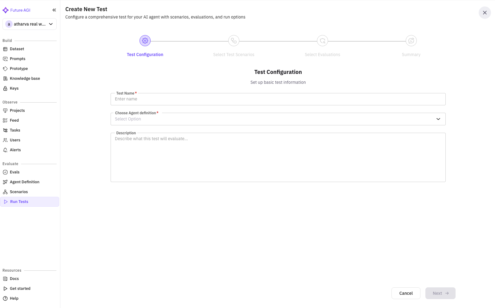

**Description** (Optional)
- Provide context about what this test evaluates
- Example: `Testing our insurance sales agent's ability to handle diverse customer profiles, with focus on objection handling and conversion rates`
- Include test goals and success criteria

Click **"Next"** to proceed to scenario selection.

### Step 2: Select Test Scenarios

Choose one or more scenarios that your agent will be tested against. This screen shows all available scenarios with their details.

#### Scenario Selection Features

**Search Bar**
- Search scenarios by name or description
- Real-time filtering as you type
- Example: Search "insurance" to find relevant scenarios

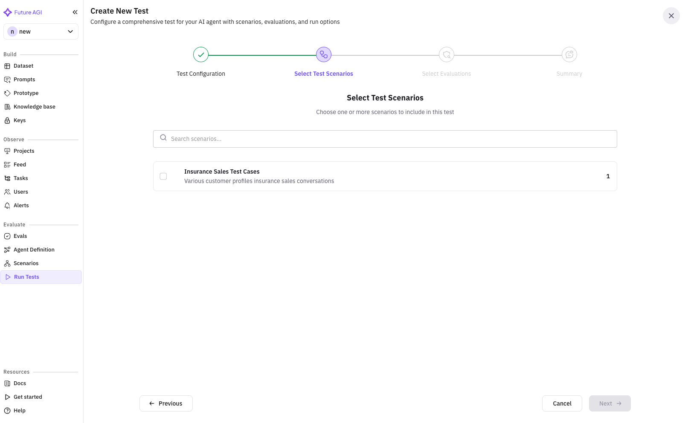

**Scenario List**
Each scenario card displays:
- **Name**: Scenario identifier
- **Description**: What the scenario tests
- **Type Badge**: Dataset, Graph, Script, or Auto-generated
- **Row Count**: Number of test cases (for dataset scenarios)

**Multi-Select**
- Check multiple scenarios to test various situations
- Selected scenarios are highlighted with a primary border
- Counter shows total selected: "Scenarios (3)"

**Pagination**
- Navigate through scenarios if you have many
- Adjust items per page (10, 25, 50)

#### Empty State
If no scenarios exist, you'll see:
- Empty state message
- Direct link to create scenarios
- Documentation link

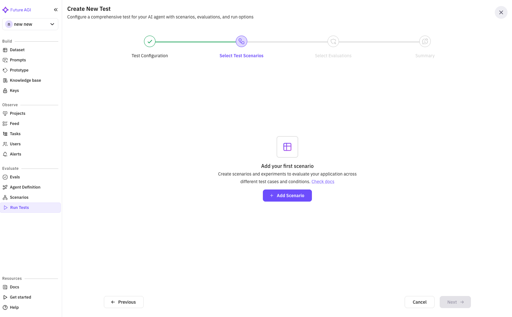

Select your scenarios and click **"Next"**.

<!-- ### Step 3: Select Test Agent

Choose the simulation agent that will interact with your insurance sales agent. This agent simulates customer behavior during tests.

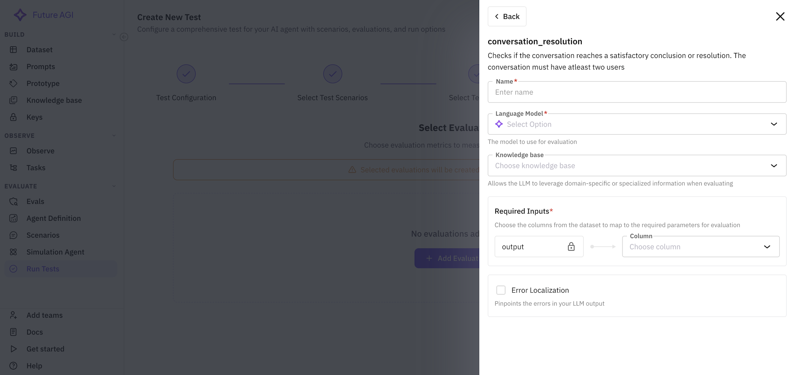

#### Agent Selection Features

**Search Functionality**
- Search agents by name
- Filter to find specific customer personas

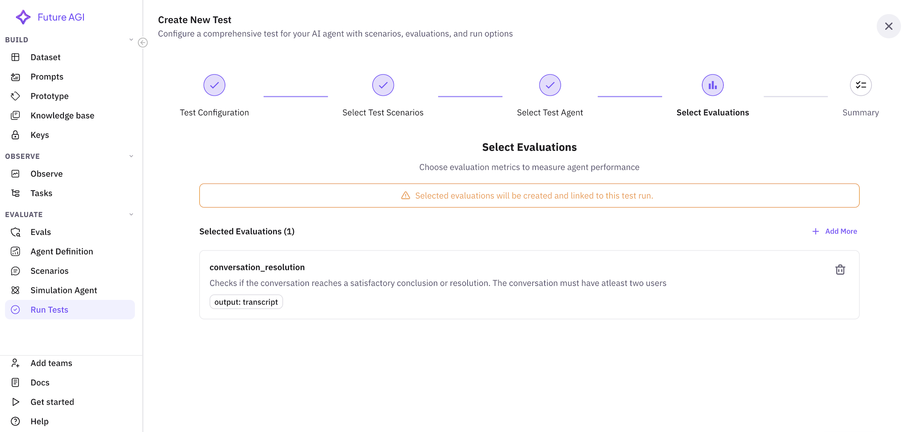

**Agent Cards**
Each agent shows:
- **Name**: Agent identifier (e.g., "Insurance Customer Simulator")
- **Radio Button**: Single selection only
- Clean, simple interface for quick selection

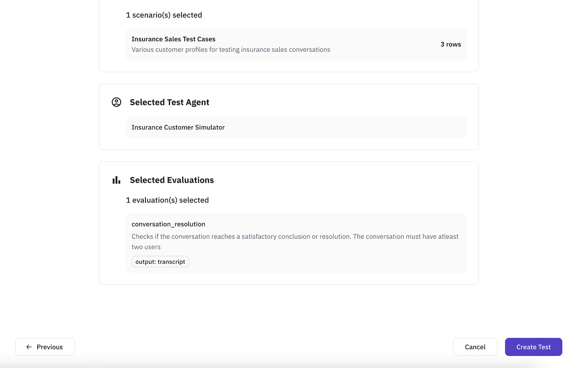

**Empty State**
If no simulation agents exist:
- Helpful message about creating agents
- Direct button to add simulator agent
- Links to documentation

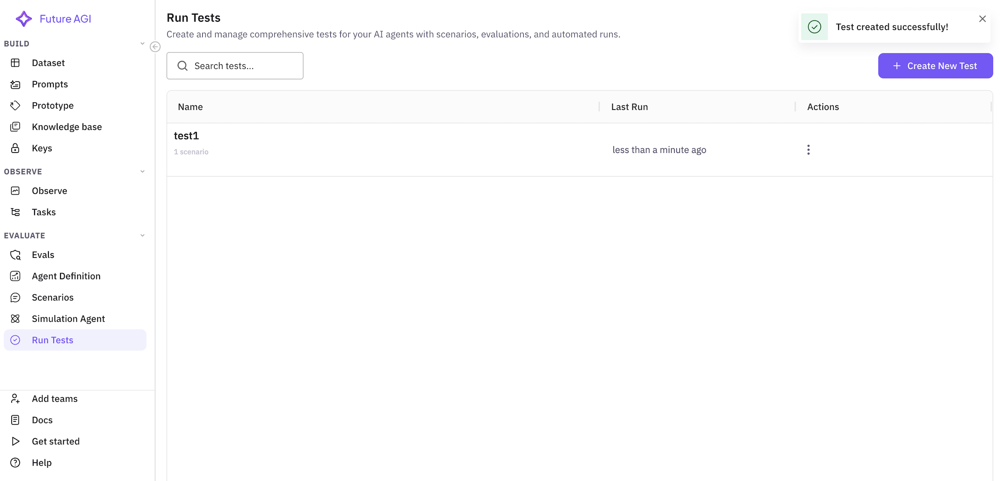

Select your simulation agent and click **"Next"**. -->

### Step 3: Select Evaluations

Configure evaluation metrics to measure your agent's performance. This step is crucial for defining success criteria.

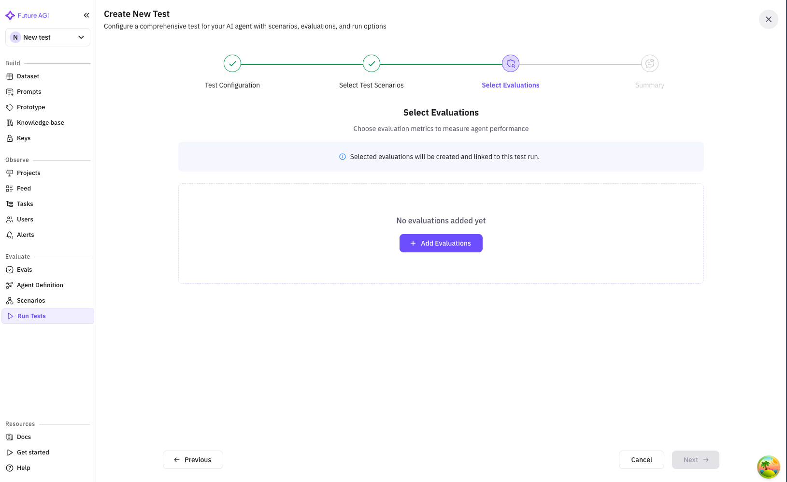

#### Important Notice
A warning banner explains:
- Selected evaluations will be created and linked to this test run
- Evaluations become part of your test configuration
- They'll run automatically during test execution

<!-- removing this as we don't show warning banner anymore--!>
<!-- 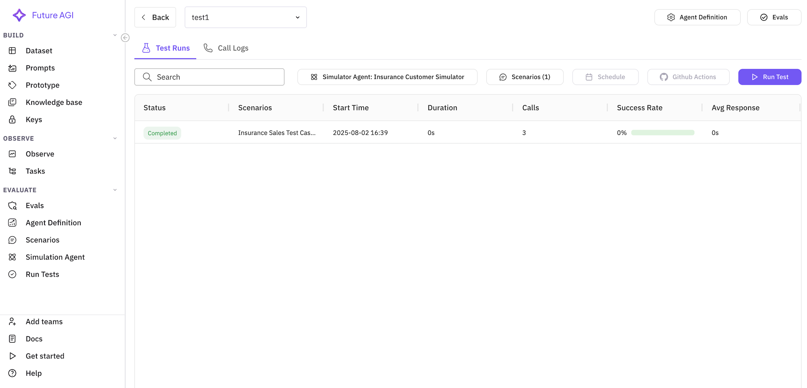 -->

#### Adding Evaluations

**Initial State**
When no evaluations are selected:
- Empty state with clear message
- Prominent "Add Evaluations" button

**Evaluation Selection Dialog**
Clicking "Add Evaluations" opens a comprehensive dialog:

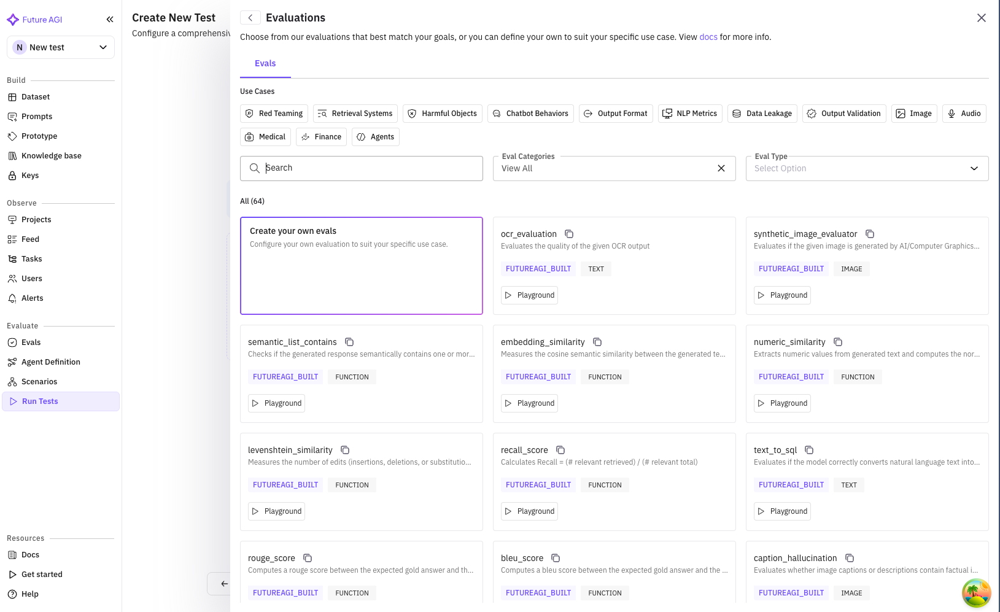

The dialog includes:
- **Search bar**: Find evaluations by name or type
- **Category tabs**: System, Custom, or All evaluations
- **Evaluation list**: Available evaluation templates

Common evaluations for insurance sales:
- **Conversation Quality**: Measures professionalism and clarity
- **Sales Effectiveness**: Tracks conversion and objection handling
- **Compliance Check**: Ensures regulatory requirements
- **Product Knowledge**: Verifies accurate information
- **Customer Satisfaction**: Simulated CSAT score

#### Selected Evaluations View

After adding evaluations, you'll see:
- Total count: "Selected Evaluations (5)"
- "Add More" button for additional evaluations
- List of selected evaluations with:
  - Name and description
  - Configuration details (if any)
  - Mapped fields shown as chips
  - Remove button (trash icon)

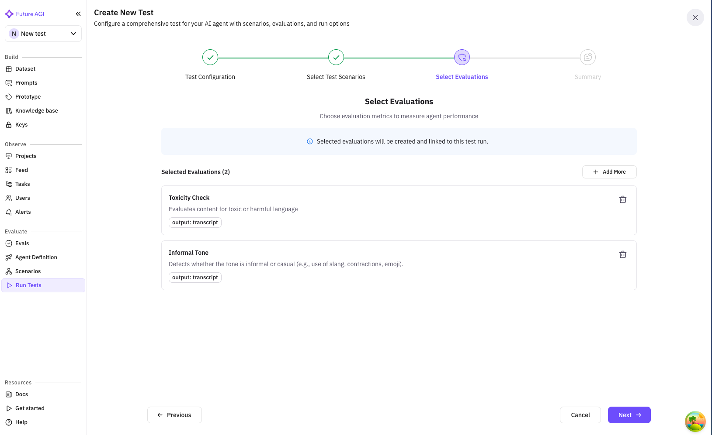

#### Evaluation Configuration

Some evaluations require field mapping:
- Map evaluation inputs to your data fields
- Example: Map "customer_response" to "agent_reply"
- Configured mappings show as chips

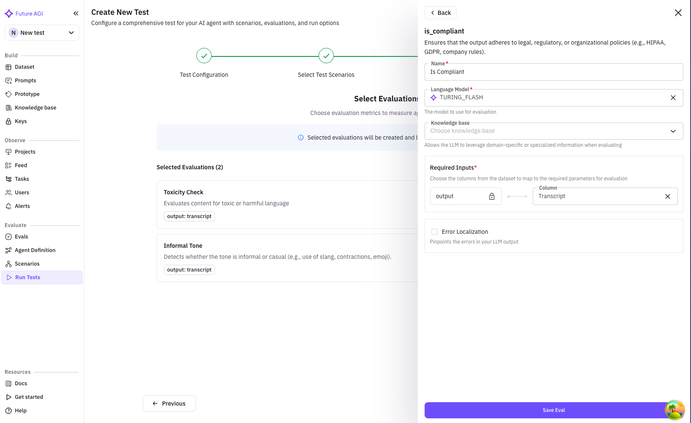

Click **"Next"** to review your configuration.

### Step 5: Summary

Review all your test configuration before creating the test.

The summary is organized into clear sections:

#### Test Configuration Section
Shows your basic test setup:
- Test name
- Description (if provided)
- Creation timestamp

#### Selected Test Scenarios Section
Displays all chosen scenarios:
- Total count: "3 scenario(s) selected"
- Each scenario shows:
  - Name and description
  - Row count for datasets
  - Gray background for easy scanning

#### Selected Test Agent Section
Shows your chosen simulation agent:
- Agent name
- Description (if available)
- Highlighted in gray box

#### Selected Evaluations Section
Lists all evaluation metrics:
- Total count: "5 evaluation(s) selected"
- Each evaluation shows:
  - Name and description
  - Any configured mappings
  - Gray background boxes

#### Action Buttons
- **Back**: Return to modify any section
- **Create Test**: Finalize and create the test

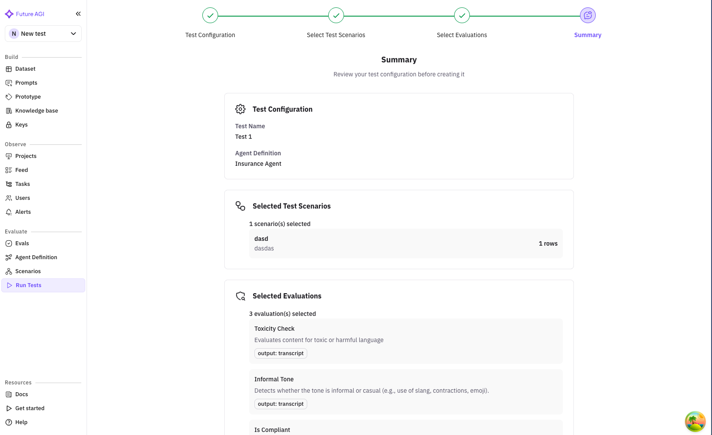

### Creating the Test

When you click **"Create Test"**:

1. **Loading State**
   - Button shows "Creating..." with spinner
   - All inputs are disabled
   - Prevents duplicate submissions

2. **Success**
   - Success notification appears
   - Automatically redirects to test list
   - Your test appears at the top

3. **Error Handling**
   - Clear error messages
   - Specific guidance on issues
   - Ability to retry

## Running Tests

Once created, tests appear in your test list. Here's how to run them:

### Test List View

Navigate to **Simulations** → **Run Tests** to see all your tests.

Each test row shows:
- **Name & Description**: Test identifier and purpose
- **Scenarios**: Count of included scenarios
- **Agent**: Which sales agent is being tested
- **Testing Agent**: Customer simulator being used
- **Data Points**: Total test cases from all scenarios
- **Evaluations**: Number of metrics being tracked
- **Created**: Timestamp
- **Actions**: Run, view details, edit, delete

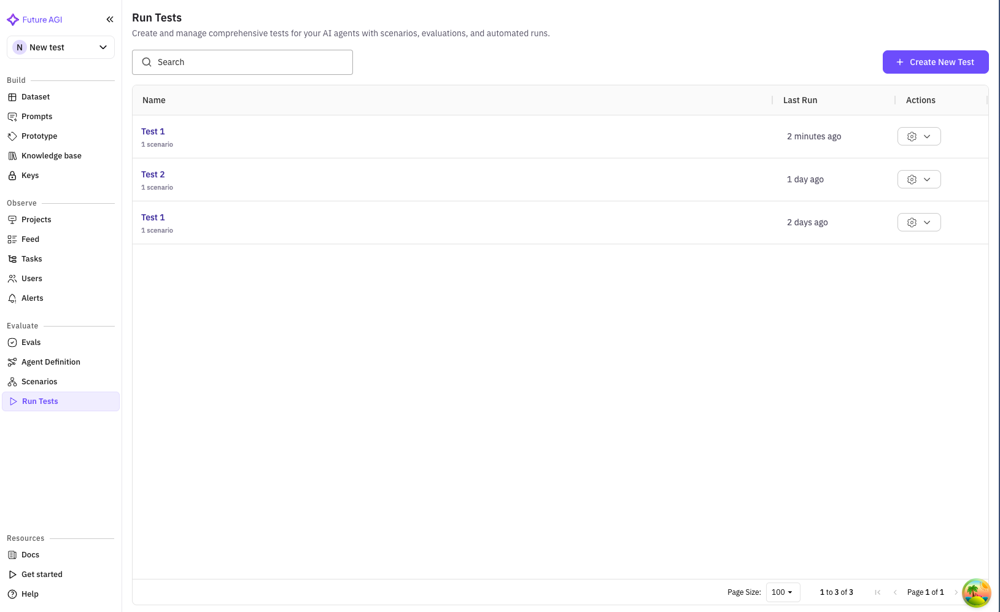

### Running a Test

Click on a test to view its details and run options.

#### Test Detail Header
Shows test information and primary actions:
- Test name and description
- **Run Test** button (primary action)
- Navigation breadcrumbs
- Quick stats (scenarios, evaluations, etc.)

#### Test Runs Tab

The default view shows all test runs:

**Run Test Button**
Click "Run Test" to start execution:
1. Confirmation dialog appears
2. Shows estimated duration
3. Option to run all or select specific scenarios

**Scenario Selection**
Advanced option to run specific scenarios:
- Click "Scenarios (X)" button
- Opens scenario selector
- Check/uncheck scenarios to include
- Shows row count for each

**Test Execution Status**
Once running, the test shows:
- **Status Badge**: Running, Completed, Failed
- **Progress Bar**: Real-time completion percentage
- **Duration**: Elapsed time
- **Start Time**: When test began

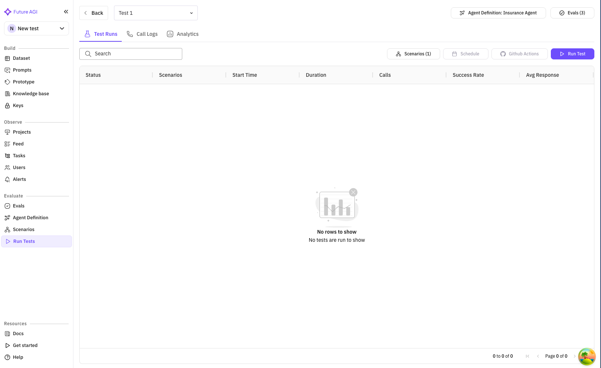

### Monitoring Test Progress

Click on a running test to monitor progress:

**Real-time Updates**
- Overall progress percentage
- Current scenario being executed
- Completed vs total test cases
- Live duration counter

**Execution Grid**
Shows individual test case status:
- **Scenario**: Which scenario is running
- **Status**: Pending, In Progress, Completed, Failed
- **Duration**: Time per test case
- **Result**: Pass/Fail indicator

### Call Logs Tab

View detailed conversation logs from your tests:

**Features**:
- Search conversations by content
- Filter by status, duration, or evaluation results
- Export logs for analysis
- Pagination for large result sets

**Call Log Entry**
Each log shows:
- Timestamp and duration
- Scenario used
- Conversation preview
- Evaluation scores
- Detailed view link

**Detailed Call View**
Click any call to see:
- Full conversation transcript
- Turn-by-turn analysis
- Evaluation results per metric
- Audio playback (if enabled)
- Key moments flagged by evaluations

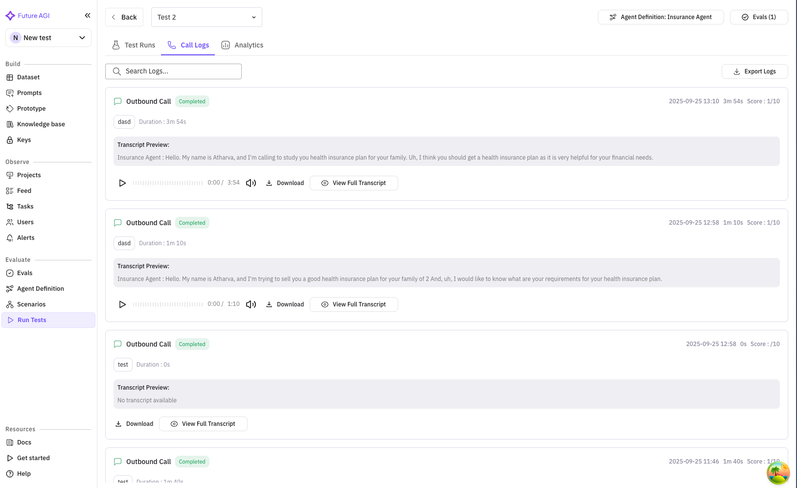

## Test Results & Analytics

After test completion, comprehensive results are available:

### Test Run Summary

Access from the test runs list by clicking a completed test:

**Key Metrics Dashboard**
- **Overall Score**: Aggregate performance (e.g., 85/100)
- **Pass Rate**: Percentage of successful test cases
- **Average Duration**: Mean conversation length
- **Conversion Rate**: For sales scenarios

### Evaluation Results

View performance across all evaluation metrics:

**Per-Evaluation Breakdown**:
- Score distribution graph
- Pass/fail percentages
- Detailed insights
- Comparison to benchmarks

**Insurance Sales Specific Metrics**:
- **Compliance Score**: 98% (regulatory adherence)
- **Product Accuracy**: 92% (correct information)
- **Objection Handling**: 87% (successful responses)
- **Conversion Rate**: 65% (sales closed)
- **Customer Satisfaction**: 4.2/5 (simulated CSAT)

### Detailed Analysis

**Conversation Analysis**
- Common failure points
- Successful patterns
- Word clouds of key terms
- Sentiment progression

**Scenario Performance**
Compare how your agent performs across different scenarios:
- Bar charts by scenario
- Identify weak areas
- Drill down capabilities

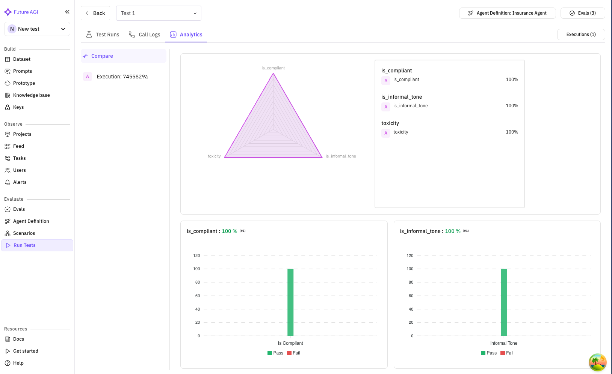

### Export Options

Export your test results for further analysis:

**Export Button**
Located in the test run header:

**Export Formats**:
- **PDF Report**: Executive summary with graphs
- **CSV Data**: Raw evaluation scores
- **JSON**: Complete test data
- **Call Recordings**: Audio files (if enabled)

### Call Details

Call details shows each call that has happened in the test run

**Each Call Execution Shows**

1. Timestamp : Time of call
2. Call Detail : Details related to call : Phone number, Call End Reason and transcript
3. Scenario Information : Columns related to scenario : Persona, Outcome, Situation 
4. Evaluation Metrics : Result related to evaluation run on a test

## Advanced Features

### Scheduled Tests

Set up recurring test runs:

1. In test details, click "Schedule" button
2. Configure:
   - Frequency (daily, weekly, monthly)
   - Time and timezone
   - Notification preferences
   - Auto-report generation

### Test Comparison

Compare multiple test runs:

1. Select tests to compare (checkbox)
2. Click "Compare" button
3. View side-by-side metrics
4. Identify improvements or regressions

### Evaluation Management

From the test detail view:
- Add new evaluations
- Remove underperforming metrics
- Adjust evaluation thresholds
- Create custom evaluations

## Best Practices

### Test Strategy

1. **Start Small**: Begin with 5-10 test cases
2. **Increase Gradually**: Add scenarios as you improve
3. **Regular Cadence**: Run tests daily or weekly
4. **Version Control**: Track agent changes between tests

### Scenario Coverage

For insurance sales agents:
- **Demographics**: Test all age groups and income levels
- **Products**: Cover all insurance types
- **Objections**: Include common customer concerns
- **Edge Cases**: Difficult or unusual situations

### Evaluation Selection

Choose evaluations that match your goals:
- **Quality**: Conversation flow and professionalism
- **Accuracy**: Product information correctness
- **Compliance**: Regulatory requirement adherence
- **Business**: Conversion and revenue metrics

### Results Analysis

1. **Look for Patterns**: Identify common failure points
2. **Compare Scenarios**: Find which situations challenge your agent
3. **Track Trends**: Monitor improvement over time
4. **Act on Insights**: Update agent based on results

## Troubleshooting

### Common Issues

**Test Won't Start**
- Verify agent definition has valid API credentials
- Check simulation agent is properly configured
- Ensure scenarios have valid data
- Confirm you have sufficient credits

**Low Scores**
- Review evaluation thresholds
- Check if scenarios match agent training
- Analyze failure patterns in call logs
- Adjust agent prompts based on feedback

**Long Execution Times**
- Reduce concurrent test cases
- Simplify complex scenarios
- Check for timeout settings
- Monitor resource usage

### Getting Help

- **Documentation**: Detailed guides for each feature
- **Support**: Contact team for assistance
- **Community**: Share experiences with other users
- **Updates**: Regular feature improvements

## Next Steps

After mastering test execution:

1. **Optimize Your Agent**: Use insights to improve performance
2. **Expand Testing**: Add more scenarios and evaluations
3. **Automate**: Set up scheduled tests and CI/CD integration
4. **Scale**: Test multiple agents and versions

For advanced topics:
- [Creating Custom Evaluations](/future-agi/get-started/evaluation/create-custom-evals)
- [Test Automation & CI/CD](/future-agi/get-started/evaluation/evaluate-ci-cd-pipeline)
- [Advanced Analytics](/future-agi/get-started/evaluation/running-your-first-eval#analyzing-results)