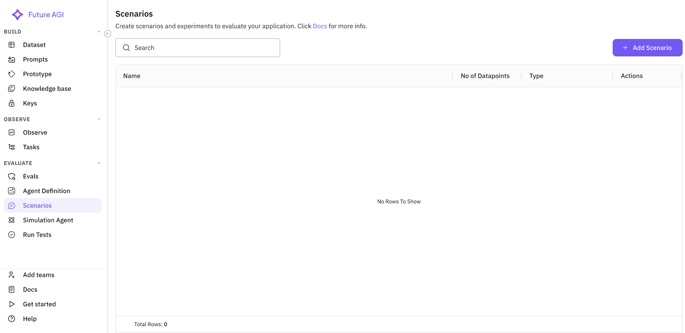
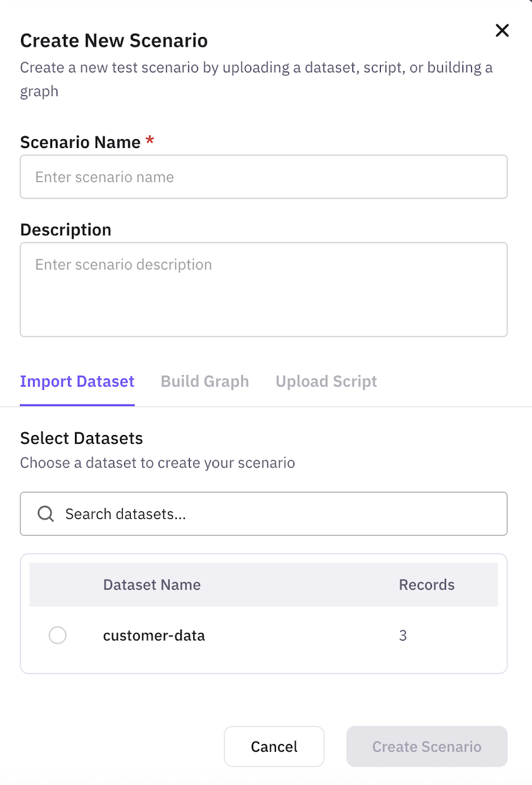
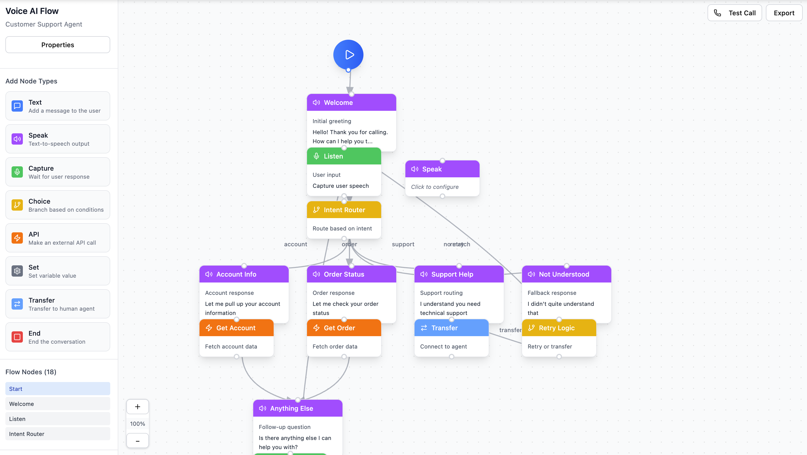
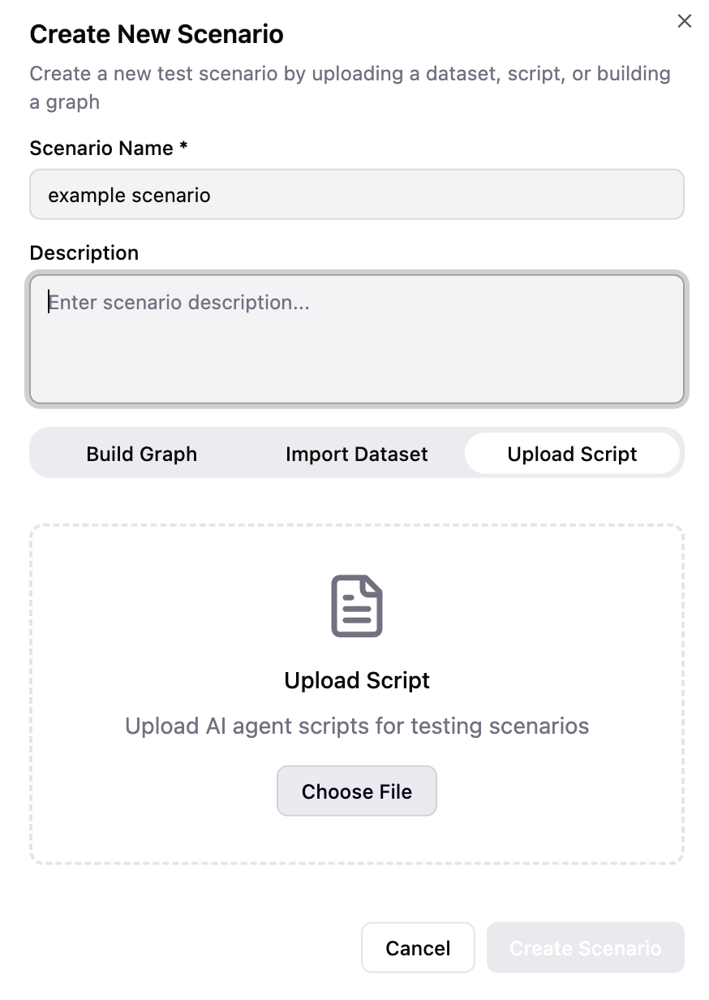

# Scenarios

Scenarios are the foundation of effective agent testing. They define the test cases, customer profiles, and conversation flows that your AI agent will encounter during simulations. This guide explains the four types of scenarios available in FutureAGI and how to create them.

## What is a Scenario?

A scenario is a structured test case that simulates real-world interactions your agent will face. For an insurance sales agent, scenarios might include:
- Different customer demographics and needs
- Various objection patterns
- Edge cases and difficult situations
- Compliance verification tests

## Types of Scenarios

FutureAGI offers three powerful ways to create scenarios, each suited for different testing needs:

### 1. Dataset Scenarios

Dataset scenarios use structured data (CSV, JSON, or Excel) to define multiple test cases efficiently. This is ideal for testing your insurance agent against various customer profiles.

#### Creating Dataset Scenarios

Navigate to **Simulations** → **Scenarios** → **Add Scenario**




Select **"Dataset"** as your scenario type:

#### Import Your Dataset

You have three options for creating dataset scenarios:

**Option 1: Upload Existing Dataset**
- Click **"Upload Dataset"**
- Select your CSV/Excel file
- Map columns to scenario variables

**Option 2: Use Sample Dataset**
- Download our [insurance customer dataset](./sample-insurance-dataset.csv)
- Contains 20 diverse customer profiles
- Pre-configured for insurance sales testing

**Option 3: Generate Synthetic Data**
- Click **"Generate Synthetic Dataset"**
- Specify parameters:
  - Number of records (e.g., 50 customers)
  - Customer demographics range
  - Insurance types to include
  - Objection patterns to generate
   <Tip>
   Click [here](https://docs.futureagi.com/future-agi/get-started/dataset/concept/synthetic-data) to learn how to create synthetic datasets.
   </Tip>

#### Example Dataset Structure

Your insurance sales dataset should include:

```csv
customer_id,name,age,income,insurance_need,objection_type,urgency
CUST001,John Smith,35,120000,Life Insurance,Price Sensitive,High
CUST002,Sarah Johnson,28,65000,Health Insurance,Coverage Concerns,Medium
CUST003,Michael Chen,42,150000,Whole Life,Trust Issues,Low
```

Key columns for effective testing:
- **Demographics**: Age, income, family status
- **Insurance Needs**: Type of coverage, current insurance
- **Behavioral Traits**: Objection types, communication style
- **Test Variables**: Urgency level, budget range


### 2. Graph-Based Scenarios

Create visual conversation flows that map out different paths your insurance sales conversation might take.

#### Creating Graph Scenarios

Navigate to **Scenarios** → **Add Scenario** → **Graph**



#### Building Your Conversation Flow

Use the visual editor to create conversation paths:

1. **Add Start Node**: "Incoming insurance inquiry"
2. **Create Decision Points**:
   - Customer interested in life insurance → Path A
   - Customer interested in health insurance → Path B
   - Customer just comparing prices → Path C

#### Example Insurance Sales Flow

Here's a sample conversation graph for your insurance agent:

```
Start → Greeting → Needs Assessment
                    ├─→ Life Insurance Path
                    │    ├─→ Term Life Discussion
                    │    └─→ Whole Life Discussion
                    ├─→ Health Insurance Path
                    │    ├─→ Individual Plans
                    │    └─→ Family Plans
                    └─→ General Inquiry Path
                         ├─→ Send Brochure
                         └─→ Schedule Callback
```

#### Graph Components

- **Nodes**: Conversation states (greeting, qualification, presentation)
- **Edges**: Transitions based on customer responses
- **Conditions**: Rules for path selection
- **Variables**: Dynamic data passed between nodes

### 4. Script-Based Scenarios

Import existing call scripts or create detailed conversation scripts to test specific interactions and corner cases.

#### Creating Script Scenarios

Navigate to **Scenarios** → **Add Scenario** → **Script**



#### Script Format

Scripts define exact conversation flows with customer and agent parts:

```
Customer: Hi, I'm calling about life insurance options.

Agent: Hello! Thank you for calling SecureLife Insurance. My name is Sarah. I'd be happy to help you explore our life insurance options. May I have your name, please?

Customer: It's John Smith.

Agent: Thank you, Mr. Smith. To recommend the best life insurance options for you, could you tell me a bit about what you're looking for? Are you interested in term life or permanent coverage?

Customer: I'm not sure about the difference. Also, I'm worried about the cost.

Agent: That's a great question, and I understand your concern about cost. Let me explain the key differences between term and permanent life insurance, along with their typical price ranges...
```

#### Testing Corner Cases

Script scenarios are perfect for testing specific situations:

**Compliance Test Script**:
```
Customer: Can you guarantee I'll be approved?

Agent: [EXPECTED: Agent should explain that approval is subject to underwriting and cannot be guaranteed]
```

**Objection Handling Script**:
```
Customer: I already have insurance through work, I don't need more.

Agent: [EXPECTED: Agent should acknowledge and explore if employer coverage is sufficient for family needs]
```

**Technical Knowledge Script**:
```
Customer: What's the difference between term and whole life insurance?

Agent: [EXPECTED: Clear, accurate explanation without jargon]
```

#### Import Existing Scripts

If you have existing call scripts:
1. Click **"Import Script"**
2. Select your file (TXT, DOCX, or PDF)
3. Review and adjust formatting
4. Add expected outcomes for each interaction

## Best Practices for Insurance Sales Scenarios

### 1. Cover All Customer Types
- Young professionals (first-time buyers)
- Families (protection focus)
- Retirees (estate planning)
- Business owners (key person insurance)

### 2. Include Regulatory Tests
- Verify required disclosures are made
- Test handling of sensitive health information
- Ensure accurate quote disclaimers

### 3. Test Objection Handling
- Price objections
- Trust concerns
- Comparison shopping
- Existing coverage objections

### 4. Validate Product Knowledge
- Accurate explanations
- Appropriate recommendations
- Coverage limit discussions
- Premium calculations

### 5. Edge Case Coverage
- Customers with health conditions
- High-risk occupations
- Complex family situations
- Language barriers

## Managing Your Scenarios

### Organizing Scenarios

Group your scenarios by purpose:

- **Sales Effectiveness**: Focus on conversion
- **Compliance Suite**: Regulatory requirements
- **Product Knowledge**: Technical accuracy
- **Customer Service**: Satisfaction metrics

### Versioning and Updates

Keep scenarios current:
1. Review quarterly for relevance
2. Update based on new products
3. Add scenarios from real customer feedback
4. Version control for tracking changes

## Next Steps

With your scenarios created, you're ready to:
1. [Configure Simulation Agents](/future-agi/get-started/simulation/test-agent) to simulate customers
2. [Run Your Tests](/future-agi/get-started/simulation/run-test) to evaluate agent performance
3. [Analyze Results](/future-agi/get-started/simulation/run-test) to improve your agent

Remember: Great scenarios lead to great agents. Invest time in creating comprehensive, realistic test cases that reflect your actual customer interactions.