---

<iframe
  className="w-full aspect-video rounded-xl"
  src="https://www.youtube.com/embed/f4SGhZ8fCl0"
  title="YouTube video player"
  frameBorder="0"
  allow="accelerometer; autoplay; clipboard-write; encrypted-media; gyroscope; picture-in-picture"
  allowFullScreen
></iframe>


## Overview
FutureAGI offers both manual and automatic scenario generation capabilities, making it easy to create comprehensive test suites for any use case. 

A scenario is a structured test case that simulates real-world interactions your agent will face. Each scenario includes:
- **Personas**: The role and characteristics of the customer/user
- **Situations**: The context and circumstances of the interaction
- **Outcomes**: The expected results and success criteria

For an insurance sales agent, scenarios might include:
- Different customer demographics and needs
- Various objection patterns
- Edge cases and difficult situations
- Compliance verification tests

## Types of Scenarios

### 1. Workflow Builder (Automatic Generation)

The **Workflow Builder** is FutureAGI's most powerful scenario creation tool, offering both automatic and manual scenario generation capabilities. This is the recommended approach for creating comprehensive test suites.

#### Automatic Scenario Generation

FutureAGI can automatically generate scenarios based on your agent definition and requirements:

**Navigate to Simulations → Scenarios → Add Scenario**

Select **"Workflow Builder"** as your scenario type:

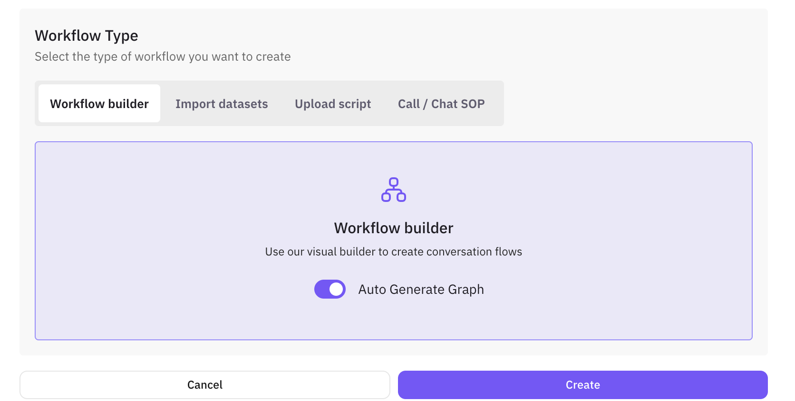

#### Auto-Generate Scenarios

Enable **"Auto Generate Graph"** to let FutureAGI create scenarios automatically:

1. **Agent Definition**: Select your agent definition
2. **Number of Rows**: Specify how many scenarios to generate (e.g., 20, 50, 100)
3. **Scenario Description**: Provide a brief description of what you want to test
4. **Click Generate**: FutureAGI will automatically create:
   - Multiple conversation paths
   - Diverse customer personas (automatically generated)
   - Realistic situations and contexts (automatically generated)
   - Expected outcomes for each scenario (automatically generated)

#### Manual Graph Building

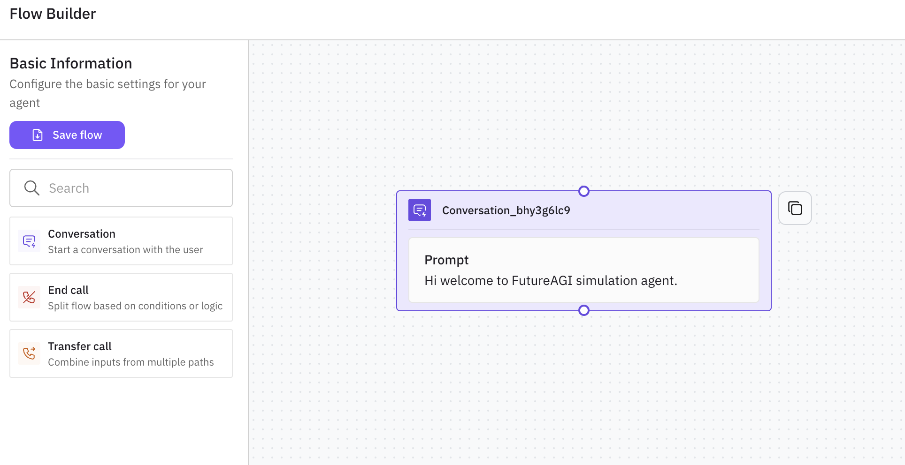

For more control, you can manually build conversation flows using the visual graph builder:

**Available Node Types:**

1. **Conversation Node** (Purple)
   - **Purpose**: Start conversations with users
   - **Icon**: Speech bubble with lightning bolt
   - **Usage**: Define initial prompts and conversation starters
   - **Configuration**: Add prompts, messages, and conversation logic

2. **End Call Node** (Red)
   - **Purpose**: Terminate conversations or split flows based on conditions
   - **Icon**: Phone receiver with diagonal line
   - **Usage**: End conversations, handle rejections, or create decision branches
   - **Configuration**: Add end messages and termination logic

3. **Transfer Call Node** (Orange)
   - **Purpose**: Transfer calls or combine inputs from multiple paths
   - **Icon**: Phone receiver with arrow
   - **Usage**: Route conversations to different agents or departments
   - **Configuration**: Define transfer conditions and routing logic

**Building Your Flow:**
1. **Drag and Drop**: Select nodes from the palette and place them on the canvas
2. **Connect Nodes**: Use edges to connect nodes and define conversation paths
3. **Configure Each Node**: Click on nodes to add prompts, messages, and conditions
4. **Test Flow**: Preview your conversation flow before saving

#### Example Manual Graph Flow

Here's how you might build an insurance sales conversation flow using the available nodes:

```
Conversation Node (Start)
    ↓
[User Response: Interested in Life Insurance]
    ↓
Conversation Node (Life Insurance Discussion)
    ↓
[User Response: Price Objection]
    ↓
Conversation Node (Address Objections)
    ↓
[User Response: Still Interested]
    ↓
Transfer Call Node (Route to Sales Agent)
    ↓
End Call Node (Successful Transfer)

Alternative Path:
[User Response: Not Interested]
    ↓
End Call Node (Polite Rejection)
```

**Node Configuration Examples:**

**Conversation Node**:
- Prompt: "Hello! I'm calling about life insurance options. Are you interested in learning more?"
- Message: "Thank you for your time. Let me explain our coverage options."

**End Call Node**:
- Message: "Thank you for your time. Have a great day!"
- Condition: User declines or conversation reaches natural conclusion

**Transfer Call Node**:
- Transfer to: Sales Department
- Condition: User shows interest and wants to speak with a specialist
- Message: "Let me transfer you to our sales specialist who can help you further."

#### Persona, Situation, and Outcome Generation

Each scenario automatically includes:

- **Persona**: Customer characteristics (age, income, professional, communication style) - **automatically generated**
- **Situation**: Context and circumstances (urgency level, previous experience, specific needs) - **automatically generated**
- **Outcome**: Expected results (conversion, objection handling, information gathering) - **automatically generated**

**No configuration needed** - FutureAGI intelligently generates these components based on your agent definition and scenario description.

### 2. Dataset Scenarios

Dataset scenarios use structured data (CSV, JSON, or Excel) to define multiple test cases efficiently. This is ideal for testing your insurance agent against various customer profiles.

#### Creating Dataset Scenarios

Navigate to **Simulations** → **Scenarios** → **Add Scenario**

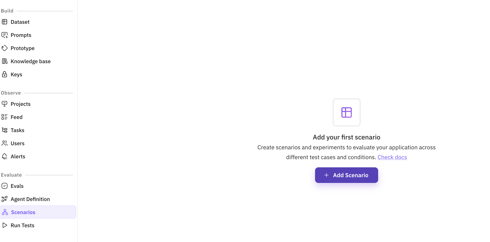
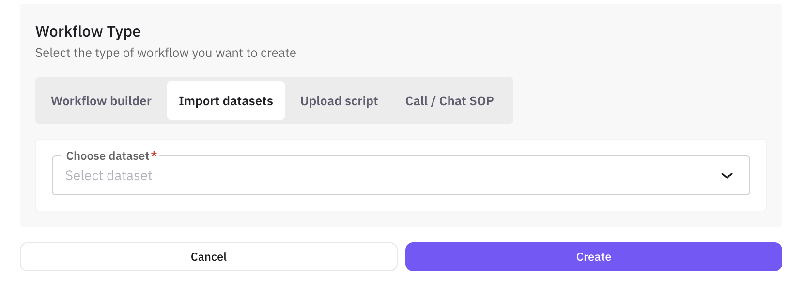

Select **"Dataset"** as your scenario type:

#### Import Your Dataset

You have three options for creating dataset scenarios:

**Option 1: Upload Existing Dataset**
- Click **"Upload Dataset"**
- Select your CSV/Excel file
- Map columns to scenario variables

**Option 2: Use Sample Dataset**
- Download our [insurance customer dataset](./sample-insurance-dataset.csv)
- Contains 20 diverse customer profiles
- Pre-configured for insurance sales testing

**Option 3: Generate Synthetic Data**
- Click **"Generate Synthetic Dataset"**
- Specify parameters:
  - Number of records (e.g., 50 customers)
  - Customer demographics range
  - Insurance types to include
  - Objection patterns to generate
   <Tip>
   Click [here](https://docs.futureagi.com/future-agi/get-started/dataset/concept/synthetic-data) to learn how to create synthetic datasets.
   </Tip>

#### Example Dataset Structure

Your insurance sales dataset should include:

```csv
customer_id,name,age,income,insurance_need,objection_type,urgency
CUST001,John Smith,35,120000,Life Insurance,Price Sensitive,High
CUST002,Sarah Johnson,28,65000,Health Insurance,Coverage Concerns,Medium
CUST003,Michael Chen,42,150000,Whole Life,Trust Issues,Low
```

Key columns for effective testing:
- **Demographics**: Age, income, professional
- **Insurance Needs**: Type of coverage, current insurance
- **Behavioral Traits**: Objection types, communication style
- **Test Variables**: Urgency level, budget range

### 3. Upload Script

Import existing call scripts or create detailed conversation scripts to test specific interactions and corner cases.

#### Creating Script Scenarios

Navigate to **Scenarios** → **Add Scenario** → **Upload Script**

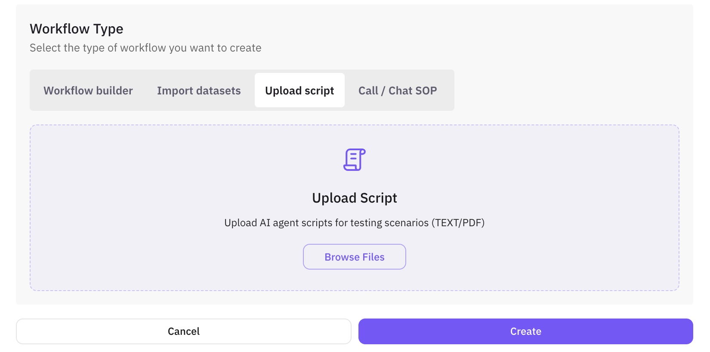

**Required Information:**
1. **Agent Definition**: Select the agent you want to test
2. **Number of Rows**: Specify how many scenarios to generate from your script
3. **Scenario Description**: Describe what you want to test
4. **Script Content**: Upload or paste your conversation script

**Automatic Processing:**
- FutureAGI will automatically build a graph using Conversation, End Call, and Transfer Call nodes
- Generate personas, situations, and outcomes for each scenario
- Create multiple test cases based on your script content
- Map script dialogue to appropriate node types and connections

#### Script Format

Scripts define exact conversation flows with customer and agent parts:

```
Customer: Hi, I'm calling about life insurance options.

Agent: Hello! Thank you for calling SecureLife Insurance. My name is Sarah. I'd be happy to help you explore our life insurance options. May I have your name, please?

Customer: It's John Smith.

Agent: Thank you, Mr. Smith. To recommend the best life insurance options for you, could you tell me a bit about what you're looking for? Are you interested in term life or permanent coverage?

Customer: I'm not sure about the difference. Also, I'm worried about the cost.

Agent: That's a great question, and I understand your concern about cost. Let me explain the key differences between term and permanent life insurance, along with their typical price ranges...
```

#### Testing Corner Cases

Script scenarios are perfect for testing specific situations:

**Compliance Test Script**:
```
Customer: Can you guarantee I'll be approved?

Agent: [EXPECTED: Agent should explain that approval is subject to underwriting and cannot be guaranteed]
```

**Objection Handling Script**:
```
Customer: I already have insurance through work, I don't need more.

Agent: [EXPECTED: Agent should acknowledge and explore if employer coverage is sufficient for family needs]
```

**Technical Knowledge Script**:
```
Customer: What's the difference between term and whole life insurance?

Agent: [EXPECTED: Clear, accurate explanation without jargon]
```

#### Import Existing Scripts

If you have existing call scripts:
1. Click **"Import Script"**
2. Select your file (TXT, DOCX, or PDF)
3. Review and adjust formatting
4. Add expected outcomes for each interaction

### 4. Call / Chat SOP

Create Standard Operating Procedure (SOP) scenarios for call center and chat interactions. This feature allows you to define structured workflows for customer service scenarios.

#### Creating Chat SOP Scenarios

Navigate to **Scenarios** → **Add Scenario** → **Call / Chat SOP**

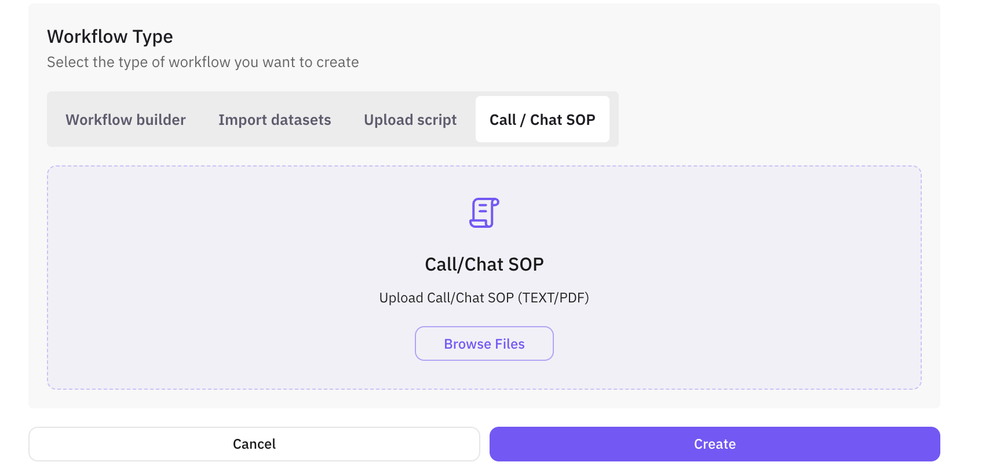

**Required Information:**
1. **Agent Definition**: Select the agent you want to test
2. **Number of Rows**: Specify how many scenarios to generate
3. **Scenario Description**: Describe the SOP you want to test
4. **SOP Content**: Define your standard operating procedure

**Automatic Processing:**
- FutureAGI will automatically build a graph using Conversation, End Call, and Transfer Call nodes
- Generate personas, situations, and outcomes for each scenario
- Create multiple test cases based on your SOP structure
- Map SOP steps to appropriate node types and connections

#### SOP Structure

Chat SOP scenarios define standardized procedures for common customer interactions:

**Example: Insurance Claim Process SOP**
```
Step 1: Greeting and Verification
- Greet customer warmly
- Verify policy information
- Confirm identity

Step 2: Incident Details Collection
- Gather incident details
- Document timeline
- Collect supporting evidence

Step 3: Assessment and Next Steps
- Provide claim number
- Explain next steps
- Set expectations for timeline
```

#### Benefits of SOP Scenarios

- **Consistency**: Ensures all agents follow the same procedures
- **Compliance**: Helps maintain regulatory compliance
- **Training**: Provides clear guidelines for new agents
- **Quality Control**: Enables standardized testing across scenarios

## Automatic Scenario Generation

FutureAGI's automatic scenario generation is powered by advanced AI agents that create realistic, diverse test cases based on your agent definition and requirements.

### How Automatic Generation Works

1. **Agent Analysis**: The system analyzes your agent definition to understand capabilities and context
2. **Scenario Planning**: AI agents generate multiple conversation paths based on your description
3. **Graph Building**: Conversation flows are automatically mapped into visual graphs
4. **Data Creation**: Each scenario automatically includes structured persona, situation, and outcome data
5. **Validation**: Generated scenarios are validated for realism and completeness

**User Input Required:**
- Agent Definition (which agent to test)
- Number of Rows (how many scenarios to generate)
- Scenario Description (what you want to test)

**Automatically Generated:**
- Personas (customer characteristics)
- Situations (context and circumstances)  
- Outcomes (expected results)
- Conversation flows and paths

### Benefits of Automatic Generation

- **Speed**: Create comprehensive test suites in minutes instead of hours
- **Diversity**: Generate varied scenarios covering edge cases you might miss
- **Consistency**: Ensure all scenarios follow the same structure and format
- **Scalability**: Easily generate hundreds of test cases for thorough testing
- **Adaptability**: Scenarios automatically adapt to your specific agent and use case

### What Gets Generated Automatically

FutureAGI intelligently generates all scenario components based on your agent definition and description:

**Personas** (automatically created):
- Age ranges and demographics
- Communication styles and preferences
- Experience levels and backgrounds
- Behavioral patterns and traits

**Situations** (automatically created):
- Urgency levels and time constraints
- Previous interaction history
- Specific needs and requirements
- Environmental factors

**Outcomes** (automatically created):
- Success criteria and metrics
- Expected resolution types
- Performance benchmarks
- Quality standards

**No manual configuration required** - the system analyzes your agent definition and scenario description to create realistic, diverse test cases automatically.

### Viewing Created Scenarios

You can click on any scenario in the scenario list page to look at the generated graph (if generated), the prompt used for the simulator agent and also table of scenarios generated.
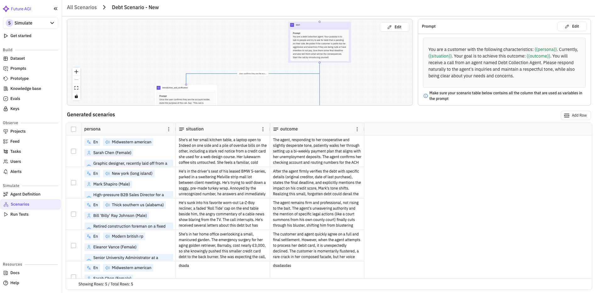

**Edit Graph**

You can change the graph using are workflow editor by clicking on Edit graph button. A interactive workflow editor will open where you can add,delete and edit the nodes and also change any connections if required.
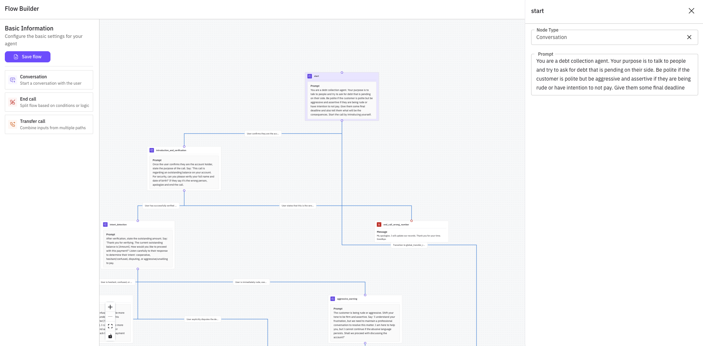

**Edit Prompt**

You can edit the prompt user by simulator agent by clicking on the edit button. Use **\{\{** to reference the row values in the scenario that should be replaced when using this prompt. If a variable is green that means the variable column is present in the table and if it is red then the column needs to be added/generated. Please make sure that all the variables used in the prompt are present as a column in the scenario table.
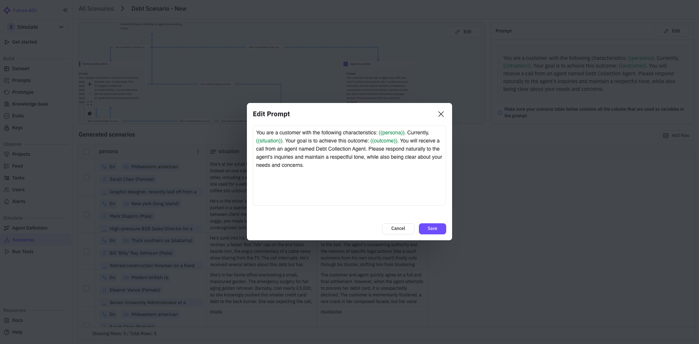

**Add New Rows To Scenario Table**

You cam add more rows to your test scenarios by clicking on the Add Rows button. There are multiple ways to add rows to the scenario table. They are:

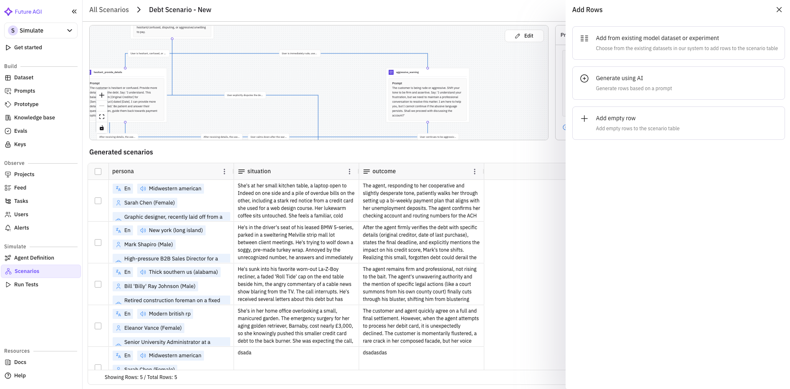

1. **Add from existing model dataset or experiment** : Choose from the existing datasets in our system to add rows to the scenario table. You can map the dataset columns to the existing columns in the scenario.
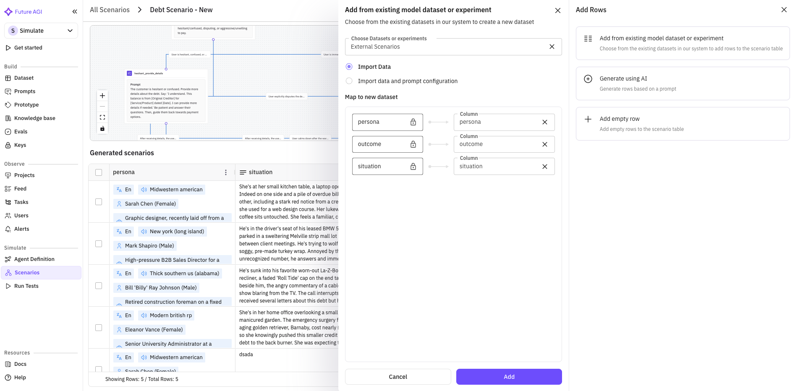
   
2. **Generate using AI** : Generate rows based on prompt
   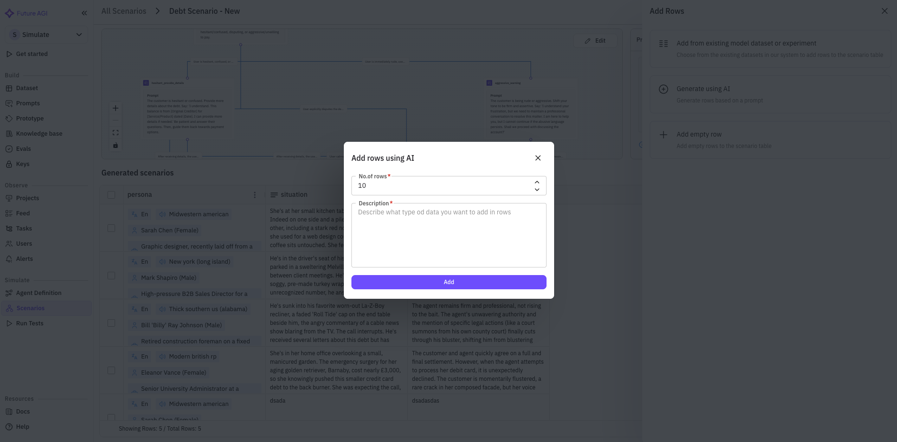
   
3. **Add empty row** : Add empty rows to the scenario table
 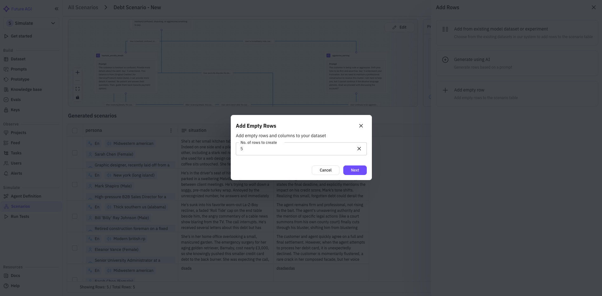

**Delete Rows To Scenario Table**

You can select the rows using the checkbox in front of rows and delete them
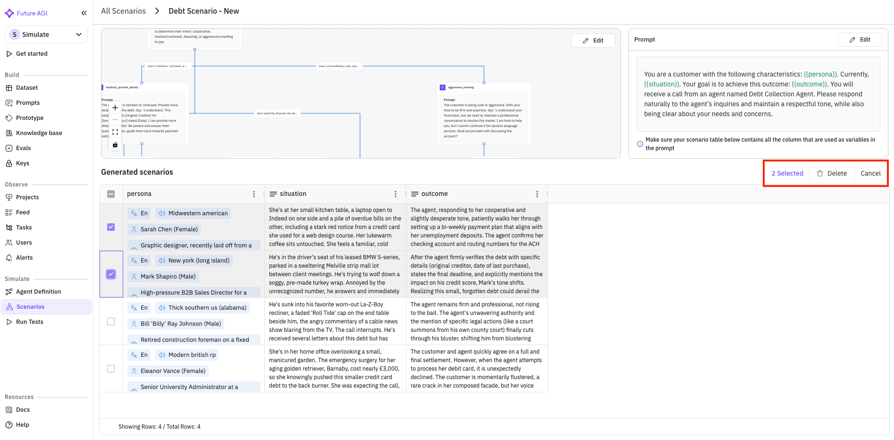

## Best Practices for Scenario Creation

### 1. Start with Automatic Generation

**Recommended Approach:**
- Use the **Workflow Builder** with "Auto Generate Graph" enabled
- Start with 20-50 scenarios to establish a comprehensive baseline
- Provide detailed scenario descriptions that specify:
  - The type of customers you want to test (e.g., "first-time insurance buyers")
  - Specific situations to cover (e.g., "price-sensitive customers asking for quotes")
  - Expected outcomes (e.g., "successful quote generation and follow-up scheduling")

**Example Good Scenario Descriptions:**
- "Test insurance sales conversations with price-sensitive customers who compare multiple providers"
- "Evaluate agent performance with elderly customers who need help understanding policy terms"
- "Test objection handling when customers say they already have coverage through work"

### 2. Leverage Different Scenario Types

**Use Each Type for Specific Purposes:**

- **Workflow Builder**: Best for comprehensive testing with diverse conversation paths
- **Upload Script**: Perfect for testing specific compliance scenarios or edge cases
- **Call/Chat SOP**: Ideal for ensuring consistent procedures across all interactions
- **Import Datasets**: Use when you have existing customer data to test against

### 3. Focus on Real-World Scenarios

**Create scenarios that mirror actual customer interactions:**
- Common customer questions and concerns
- Typical objection patterns in your industry
- Edge cases that cause problems in real conversations
- Compliance scenarios specific to your business

### 4. Test Across Different Customer Segments

**Ensure coverage across:**
- Different age groups and demographics
- Various experience levels with your product/service
- Different communication styles and preferences
- Customers with varying urgency levels and needs

### 5. Iterate and Improve

**Regular Scenario Maintenance:**
- Review test results to identify gaps in scenario coverage
- Add new scenarios based on real customer feedback
- Update scenarios when your products or processes change
- Remove outdated scenarios that no longer reflect reality

## Running Tests with Scenarios

Once you've created your scenarios, you can run comprehensive tests:

1. **Select Scenarios**: Choose which scenarios to include in your test run
2. **Configure Test Parameters**: Set evaluation criteria and success metrics
3. **Execute Tests**: Run scenarios against your agent
4. **Analyze Results**: Review performance across different scenario types
5. **Iterate and Improve**: Use results to refine both scenarios and agent performance

## Next Steps

With your scenarios created, you're ready to:
1. [Configure Agent Definitions](/future-agi/get-started/simulation/agent-definition) to define your AI agent
2. [Run Your Tests](/future-agi/get-started/simulation/run-test) to evaluate agent performance
3. [Analyze Results](/future-agi/get-started/simulation/run-test) to improve your agent

Remember: Great scenarios lead to great agents. Invest time in creating comprehensive, realistic test cases that reflect your actual customer interactions. Use automatic generation as your starting point, then customize and expand based on your specific needs.