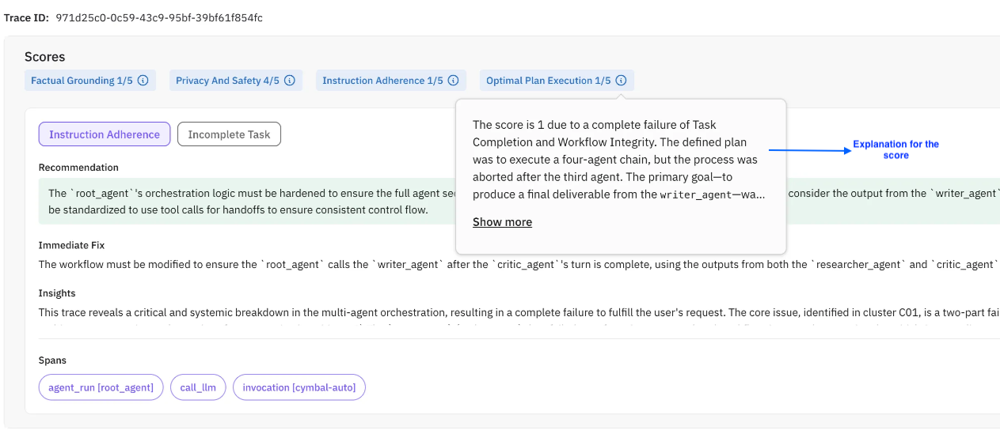

import { Card, CardGroup } from 'nextra-theme-docs'

**Agent Compass** is an intelligent error analysis system that points AI agent development teams in the right direction. It is capable of automatically identifying issues, group similar ones, learning from mistakes, and providing actionable guidance. Developers can leverage this system to course-correct by identifying what's going wrong and how to fix it.

## What does agent compass do?
- **Error Detection & Direction**: Automatically identifies and categorizes errors in agent execution, points out possible root causes and immediate fixes
- **Learning-Based Recommendations**: Uses episodic memory from past agent runs and semantic memory from error patterns to recommend better solutions in future
- **Comprehensive Issue Tracking**: Stores analysis results, error patterns, and improvement insights to track development progress over time
- **Pattern-Based Guidance**: Automatically detects recurring problems in agent behavior and provides confidence-scored recommendations for resolution
- **Development Intelligence**: Delivers detailed statistics and real-time insights that helps you understand where your agents are failing and how to improve

## Supported Integrations

The following integrations are currently supported

## LLM Models

<CardGroup cols={2}>
  <Card 
    title="OpenAI" 
    href="/future-agi/integrations/openai"
  >
  </Card>
  <Card 
    title="OpenAI Agents SDK" 
    href="/future-agi/integrations/openai_agents"
  >
  </Card>
  <Card 
    title="Vertex AI (Gemini)" 
    href="/future-agi/integrations/vertexai"
  >
  </Card>
  <Card 
    title="AWS Bedrock" 
    href="/future-agi/integrations/bedrock"
  > 
  </Card>
  <Card 
    title="Mistral AI" 
    href="/future-agi/integrations/mistralai"
  >
  </Card>
  <Card 
    title="Anthropic" 
    href="/future-agi/integrations/anthropic"
  >
  </Card>
  <Card 
    title="Groq" 
    href="/future-agi/integrations/groq"
  >
  </Card>
  <Card 
    title="Together AI" 
    href="/future-agi/integrations/togetherai"
  >
  </Card>
  <Card 
    title="Google ADK" 
    href="/future-agi/integrations/google_adk"
  >
  </Card>
  <Card 
    title="Google GenAI" 
    href="/future-agi/integrations/google_genai"
  >
  </Card>
  <Card 
    title="Portkey ADK" 
    href="/future-agi/integrations/portkey"
  >
  </Card>
</CardGroup>

## Orchestration Frameworks

<CardGroup cols={2}>
  <Card 
    title="LlamaIndex" 
    href="/future-agi/integrations/llamaindex"
  >
  </Card>
  <Card 
    title="LlamaIndex Workflows" 
    href="/future-agi/integrations/llamaindex-workflows"
  >
  </Card>
  <Card 
    title="Langchain" 
    href="/future-agi/integrations/langchain"
  >
  </Card>
  <Card 
    title="LangGraph" 
    href="/future-agi/integrations/langgraph"
  >
  </Card>
  <Card 
    title="LiteLLM" 
    href="/future-agi/integrations/litellm"
  >
  </Card>
  <Card 
    title="CrewAI" 
    href="/future-agi/integrations/crewai"
  >
  </Card>
  <Card 
    title="Haystack" 
    href="/future-agi/integrations/haystack"
  >
  </Card>
  <Card 
    title="Autogen" 
    href="/future-agi/integrations/autogen"
  >
  </Card>
  <Card 
    title="PromptFlow" 
    href="/future-agi/integrations/promptflow"
  >
  </Card>
  <Card 
    title="Vercel" 
    href="/future-agi/integrations/vercel"
  >
  </Card>
  <Card 
    title="Pipecat" 
    href="/future-agi/integrations/pipecat"
  >
  </Card>
</CardGroup>

## Other

<CardGroup cols={2}>
  <Card 
    title="DSPY" 
    href="/future-agi/integrations/dspy"
  >
  </Card>
  <Card 
    title="Guardrails AI" 
    href="/future-agi/integrations/guardrails"
  >
  </Card>
  <Card 
    title="Hugging Face smolagents" 
    href="/future-agi/integrations/smol_agents"
  >
  </Card>
  <Card 
    title="Ollama" 
    href="/future-agi/integrations/ollama"
  >
  </Card>
  <Card 
    title="Instructor" 
    href="/future-agi/integrations/instructor"
  >
  </Card>
  <Card 
    title="MCP" 
    href="/future-agi/integrations/mcp"
  >
  </Card>
</CardGroup>

## Configuring agent compass
You need absolutely **zero** configuration for using Agent Compass in your observe projects. Once you start sending traces to FutureAGI, the compass picks traces according to the [sampling rate](/future-agi/products/agent-compass/concepts#sampling-rate) and generates meaningful insights

The next section exhibits a walkthrough on setting up an observe project using the [Google ADK integration](/future-agi/integrations/google_adk) to get insights from Agent Compass