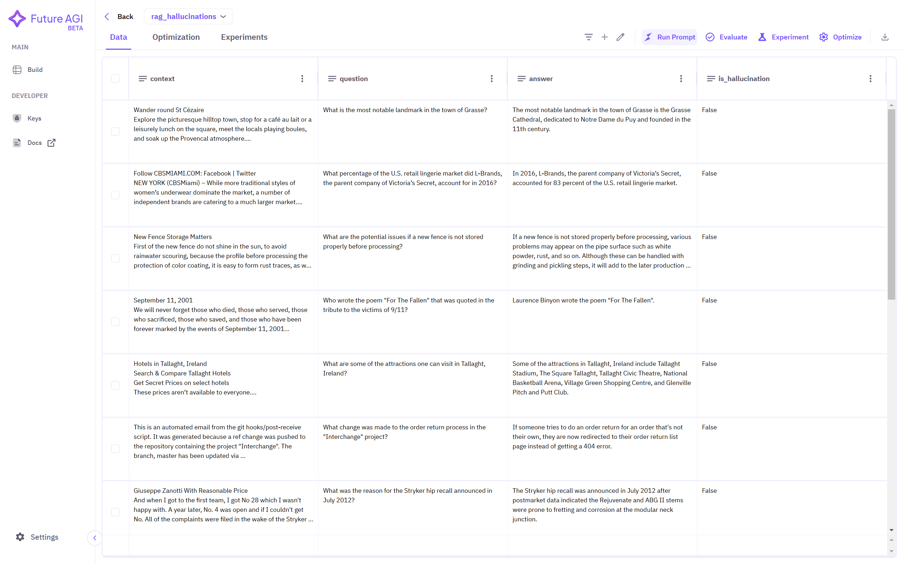
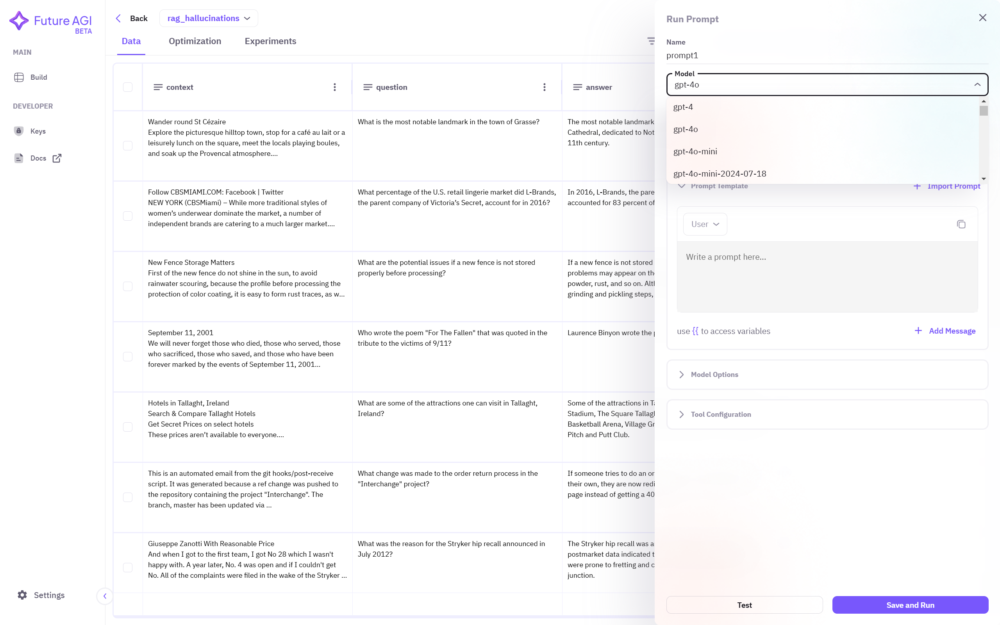
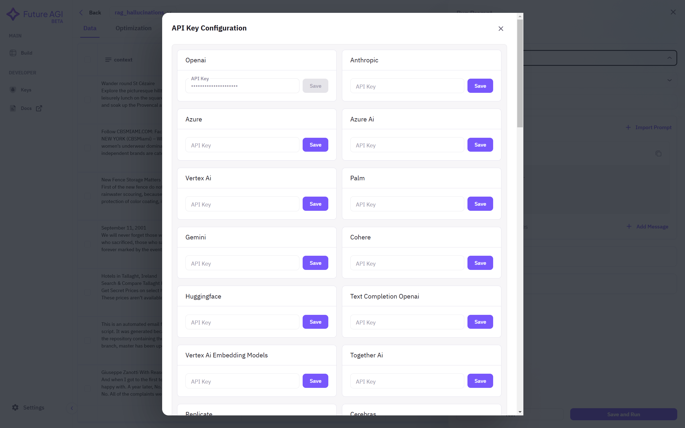
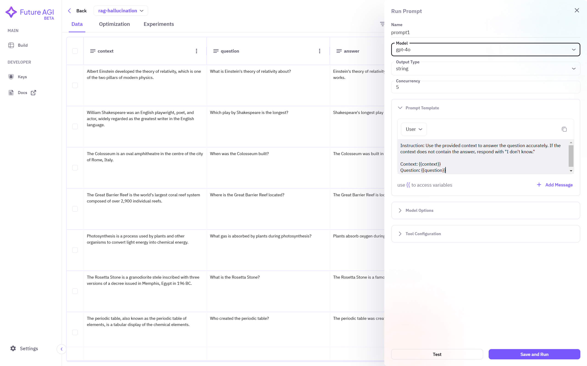
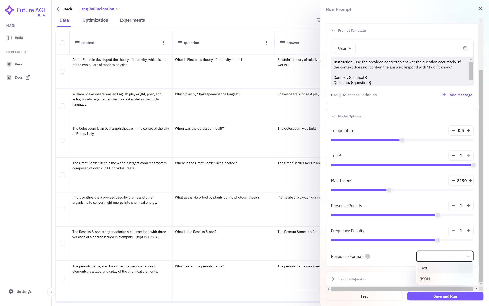
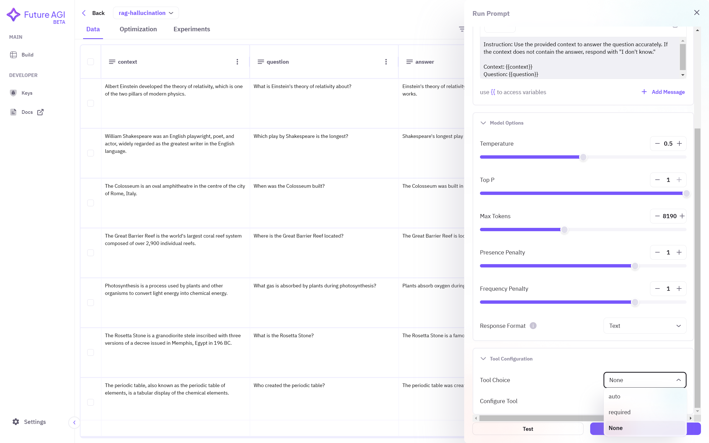
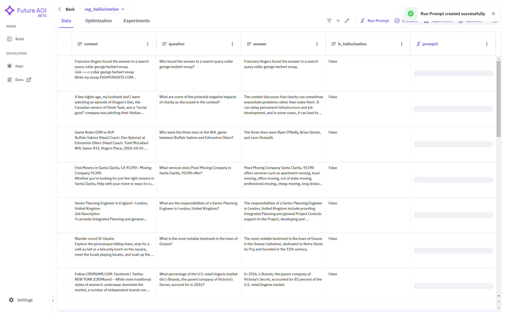
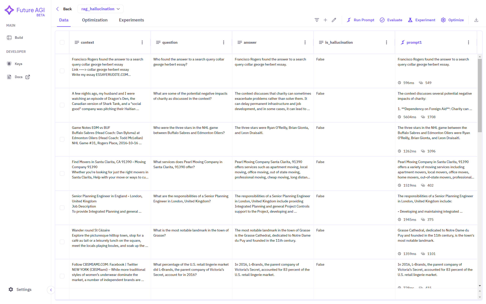

## 1. Select Dataset
Click on the dataset name you want to use to create prompts. If no dataset is showing in the dashboard, ensure you have followed the steps required to <a href="/future-agi/products/dataset/" style={{ textDecoration: "none", fontWeight: "bold" }}>Add Dataset</a> on the Future AGI platform.

## 2. Access Run Prompt Interface
You can view your dataset in a spreadsheet-like interface. On the top right corner, select **Run Prompt** option to create a prompt.

## 3. Configure Your Prompt

### Basic Configuration
1. Enter a descriptive **name** for your prompt
2. Select your desired **model** from the dropdown

### API Key Setup
After selecting the model, enter your API key in the popup window to access the selected model. In this example, we're using gpt-4o.

### Output Configuration
Choose the **output type** for your prompt:
- **string**: For simple text responses (e.g., "correct"/"incorrect")
- **object**: For JSON-structured outputs

### Writing Your Prompt
Access dataset columns using double curly braces. A dropdown menu will appear showing available columns. Selected column names will be automatically enclosed in braces.

## 4. Model Parameters
Configure these parameters to optimize your model's performance:

Parameter | Description | Impact
---|---|---
Concurrency | Number of simultaneous prompt processes | Higher values increase speed but may hit API limits
Temperature | Controls response randomness | 0: Deterministic 1: More creative but potentially less accurate
Top P | Controls token selection diversity | Lower: More focused Higher: More varied responses
Max Tokens | Maximum response length | Higher values allow longer responses but increase API usage
Presence Penalty | Controls topic repetition | Higher: More diverse topics Lower: More focused on single topic
Frequency Penalty | Controls word/phrase repetition | Higher: Less repetition Lower: Allows repetition

### Response Format
1. Choose between `text` or `JSON` output format
2. Configure tool interaction:
   - `required`: Force tool usage
   - `auto`: Let model decide
   - `none`: Disable tool interaction

## 5. Execute Prompt
Click **Save and Run** to execute your prompt configuration. Results will appear in a new column named after your prompt.

The generated responses will be visible in the newly created column:

## Best Practices
• Start with lower concurrency to test API limits  
• Use temperature 0.0-0.3 for factual tasks  
• Use temperature 0.7-1.0 for creative tasks  
• Set reasonable max token limits to control costs  
• Test prompts on a small subset before full execution  