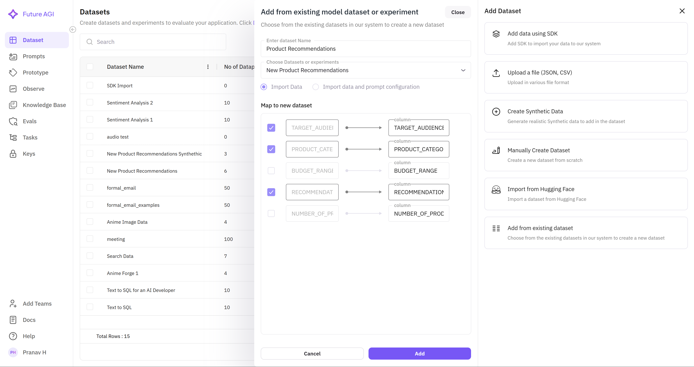

This feature allows users to incorporate data from previously created datasets or experiments, streamlining the workflow by reusing structured information. With the enhanced SDK integration, you can efficiently map and integrate existing data with improved type safety and validation, ensuring consistency and reducing redundancy.

---

### **Steps to Add from an Existing Dataset or Experiment**

### **1. Access the Dataset Selection Panel**

- Navigate to the **Datasets & Experiments** section.
- Click **"Add Dataset"** to open the dataset creation menu.
- Select **"Add from Existing Model Dataset or Experiment"** from the available options.

### **2. Choose Source Dataset or Experiment**

The interface displays available datasets and experiments with enhanced filtering:



#### **Dataset Selection Options**
- **Filter by Type**: Choose between datasets, experiments, or both
- **Search Functionality**: Find specific datasets by name or description
- **Sort Options**: Sort by creation date, size, or relevance
- **Preview Data**: View sample data before selection

#### **Available Source Types**
- **Existing Datasets**: Previously created datasets with structured data
- **Experiment Results**: Datasets generated from completed experiments
- **Optimized Datasets**: Results from optimization processes
- **Evaluation Datasets**: Datasets with evaluation metrics and scores

### **3. Configure Data Mapping and Integration**

#### **Column Mapping Interface**
- **Automatic Mapping**: System suggests column mappings based on data types and names
- **Manual Override**: Customize mappings for specific requirements
- **Data Type Validation**: Ensure compatibility between source and target schemas
- **Preview Changes**: See how data will be transformed before import

#### **Integration Options**
- **Full Import**: Copy all data from the source dataset
- **Selective Import**: Choose specific columns or rows to import
- **Merge Strategy**: Define how to handle duplicate or conflicting data
- **Transformation Rules**: Apply data transformations during import

### **4. SDK Integration for Existing Dataset Import**

For programmatic access, use the enhanced SDK to import from existing datasets:

```python
from fi.datasets import Dataset
from fi.datasets.types import DatasetConfig, ModelTypes

# Get existing dataset
source_dataset = Dataset.get_dataset_config("existing_dataset_name")

# Create new dataset configuration
new_config = DatasetConfig(
    name="imported_dataset",
    model_type=ModelTypes.GENERATIVE_LLM
)

# Initialize new dataset
new_dataset = Dataset(dataset_config=new_config)
new_dataset = new_dataset.create()

# Download data from source dataset
source_data = source_dataset.download(load_to_pandas=True)

# Process and transform data as needed
# ... data transformation logic ...

# Import data to new dataset
# Note: You would need to convert pandas data back to Column/Row/Cell format
# This is a simplified example - actual implementation may vary
```

### **5. Advanced Import Features**

#### **Data Transformation During Import**
- **Column Renaming**: Rename columns during the import process
- **Data Type Conversion**: Convert data types to match target schema
- **Value Mapping**: Map categorical values to new categories
- **Filtering**: Apply filters to import only relevant data

#### **Validation and Quality Checks**
- **Schema Validation**: Ensure imported data matches target schema
- **Data Quality Metrics**: Assess data quality during import
- **Error Reporting**: Detailed reports on import issues and resolutions
- **Rollback Capability**: Ability to undo imports if issues are detected

### **6. Best Practices for Dataset Import**

#### **Planning and Preparation**
- **Schema Analysis**: Analyze source and target schemas before import
- **Data Profiling**: Understand data distribution and quality
- **Mapping Strategy**: Plan column mappings and transformations
- **Testing**: Test import process with sample data first

#### **Performance Optimization**
- **Batch Processing**: Import large datasets in batches
- **Parallel Processing**: Use parallel processing for faster imports
- **Memory Management**: Optimize memory usage for large datasets
- **Progress Monitoring**: Track import progress and performance

#### **Data Integrity**
- **Backup Strategy**: Backup existing data before import
- **Validation Rules**: Implement validation rules for imported data
- **Audit Trail**: Maintain records of all import operations
- **Version Control**: Track dataset versions and changes

---

### **Benefits of Using Existing Datasets**

- **Time Efficiency**: Reduce time spent on data collection and preparation
- **Data Consistency**: Maintain consistency across related datasets
- **Quality Assurance**: Leverage previously validated and cleaned data
- **Resource Optimization**: Maximize utilization of existing data assets
- **Collaboration**: Enable team collaboration through shared datasets

---

### **Use Cases for Dataset Import**

#### **Experiment Continuation**
- Import results from previous experiments for further analysis
- Build upon successful optimization results
- Extend datasets with new evaluation metrics

#### **Data Consolidation**
- Merge multiple related datasets into a comprehensive dataset
- Combine datasets from different sources or time periods
- Create master datasets for organization-wide use

#### **Template Creation**
- Use successful datasets as templates for new projects
- Standardize dataset structures across teams
- Replicate proven data patterns and schemas

---

The enhanced dataset import functionality provides **comprehensive tools for data reuse, transformation, and integration**, making it easy to leverage existing data assets while maintaining data quality and consistency throughout the Future AGI platform.