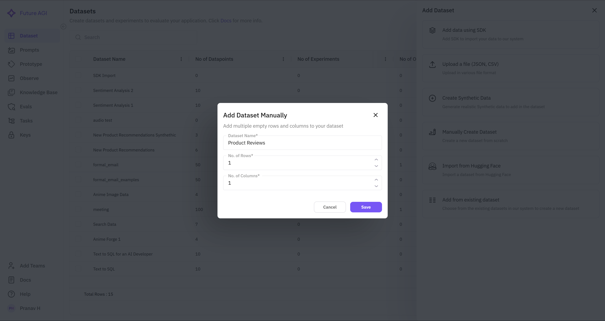

## Overview

The manual dataset creation feature allows users to define a dataset structure from scratch, adding rows and columns according to specific requirements. 

---

### **Steps to Manually Create a Dataset**

### **1. Access the Dataset Creation Panel**

- Navigate to the **Dataset** section.
- Click the **"Add Dataset"** button to open the dataset creation options.
- Select **"Add Datasets Manually"** from the list.

### **2. Define the Dataset Structure**

- A pop-up appears, prompting you to enter:
    - **Dataset Name** – Provide a name that describes the dataset purpose.
    - **Number of Rows** – Define the number of data entries to be created.
    - **Number of Columns** – Set up the data structure by specifying column count.

### **3. Add Columns to the Dataset**

Once the dataset structure is defined, the next step is to **add columns** to structure the data.

**Open the Column Editor**

- Navigate to the **Data** tab of the newly created dataset.
- Click the **"+" (Add Column)** button in the table to open the column editor.

**Select Column Types**

You can choose between:

- **Static Columns** for manually entered or fixed values.
- **Dynamic Columns** for **automated value generation**.

For a detailed explanation of **adding column,** refer [hyperlink to how to of adding column in build]

---