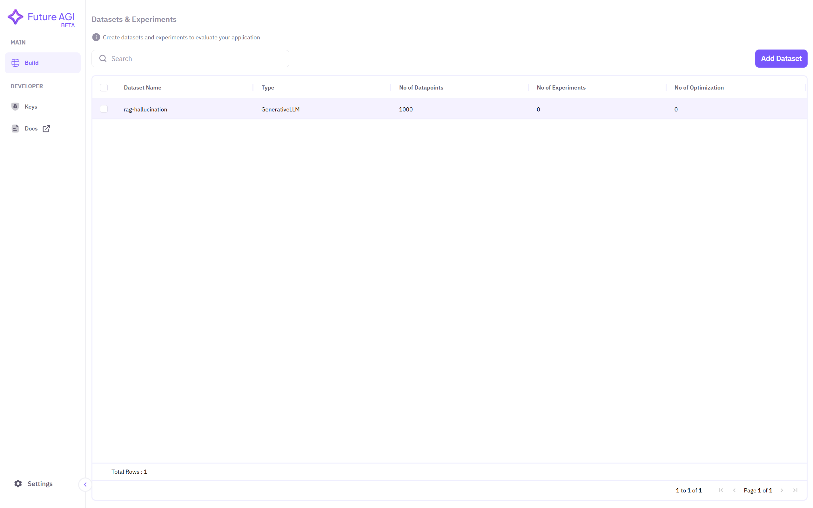
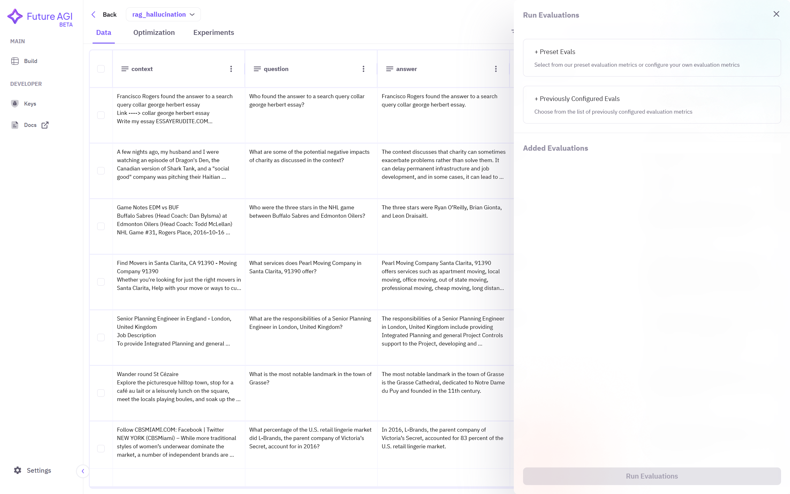
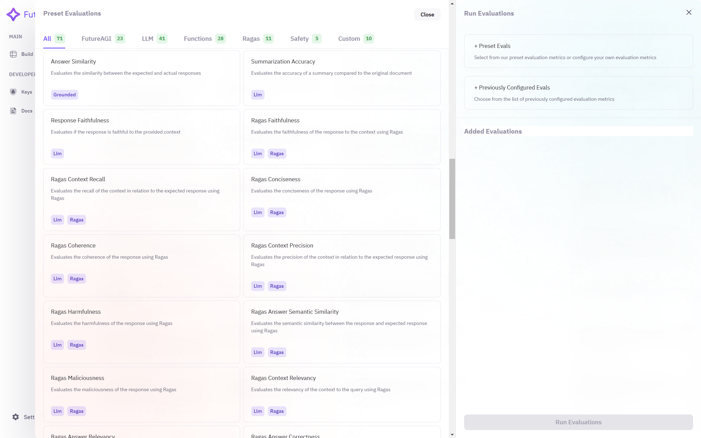
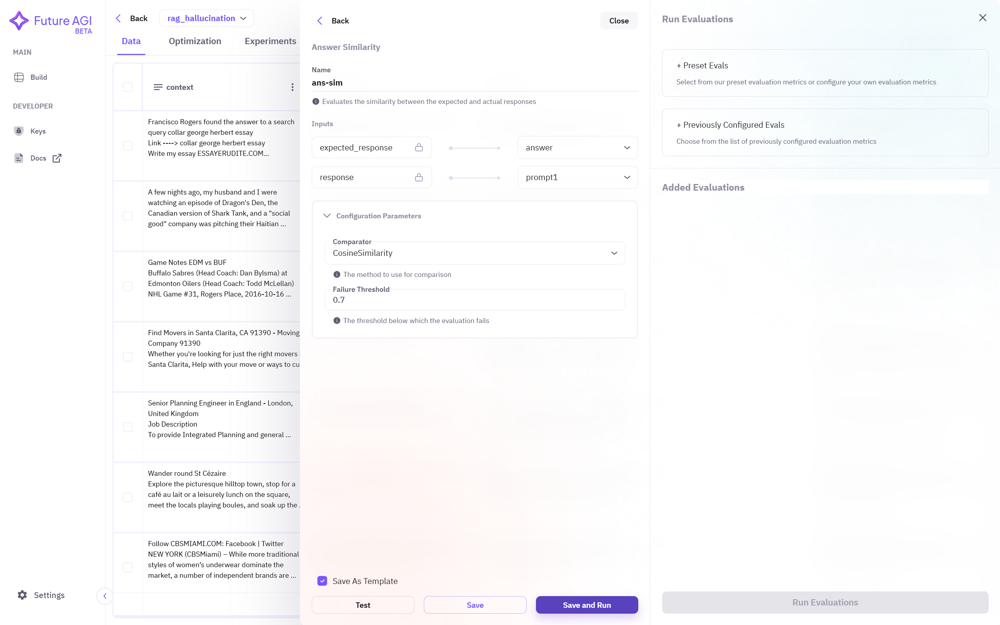
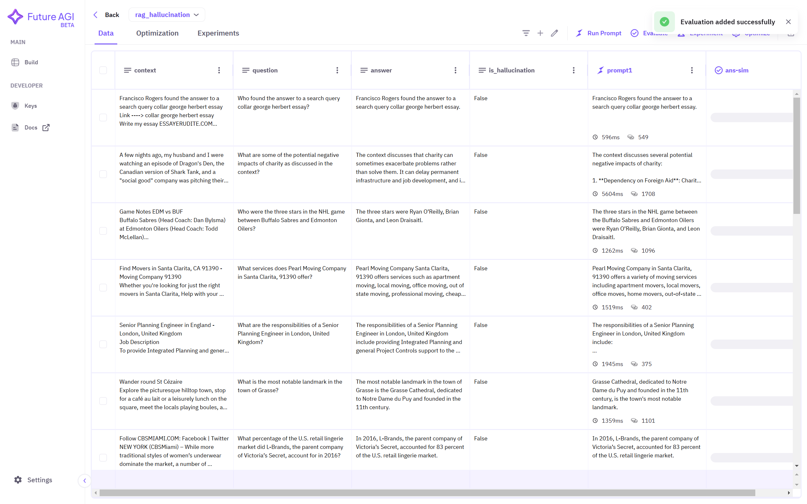

## Prerequisites
- A dataset added to the Future AGI platform
- Prompts created and run on your dataset

## Step-by-Step Guide

### 1. Select Dataset
Click on the dataset name you want to use to create prompts. If no dataset is showing in the dashboard, ensure you have followed the steps required to <a href="/future-agi/products/dataset/" style={{ textDecoration: "none", fontWeight: "bold" }}>Add Dataset</a> on the Future AGI platform.

### 2. Access Evaluate Section
Make sure you have created prompt by following the steps mentioned in <a href="/future-agi/products/prompt/" style={{ textDecoration: "none", fontWeight: "bold" }}>Run Prompt</a> section. Then, on the top right corner, select **Evaluate** option to perform evaluations.

### 3. Configure Evaluation Settings

#### Choose Evaluation Metrics
Depending on the use-case, you can choose different **evals** from **preset evaluation metrics**. 

#### Name Your Configuration
After choosing suitable metric, assign a **name** to this configured metric for future reference.

#### Select Input Columns
Provide column names to the **input** field in which you want to perform evaluation.

#### Set Configuration Parameters
Some evaluation metrics require further **configuration parameter** to perform properly. These parameters define how the metric is applied and ensure accurate and meaningful evaluation results.

**Save** the configuration when complete.

### 4. Run Evaluations
You can now see your configured evaluation under **Added Evaluation** section. Multiple evaluation metrics can be used simultaneously.

1. Select the metrics you want to use
2. Click on **run evaluations** below

### Results
The evaluation results will appear as newly created columns in your dataset. Each evaluation metric will save its results in a separate column.