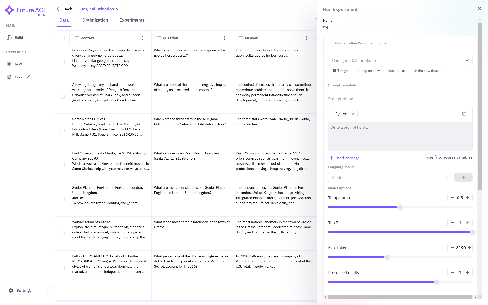
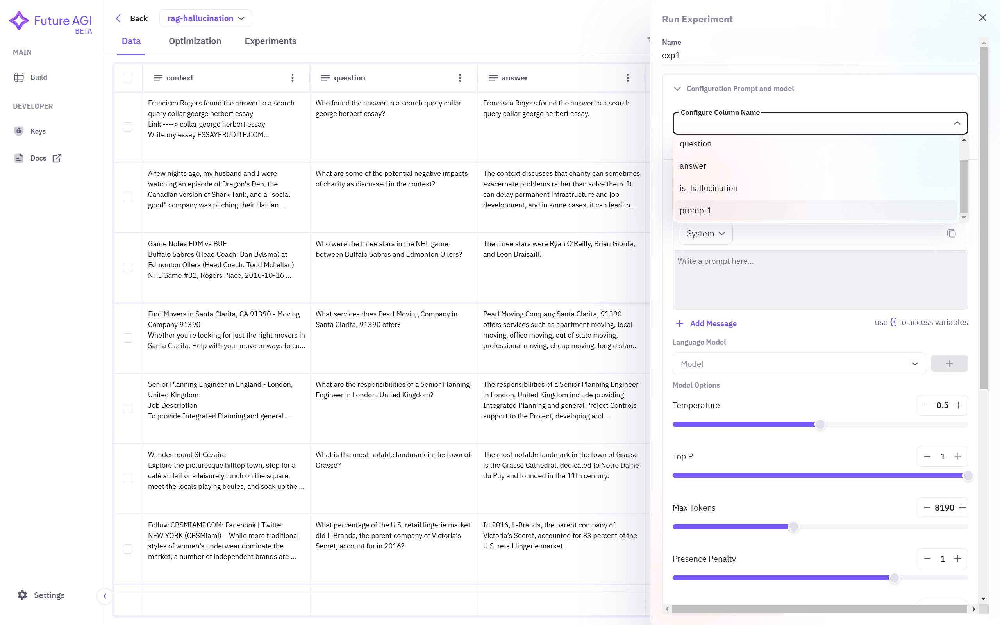
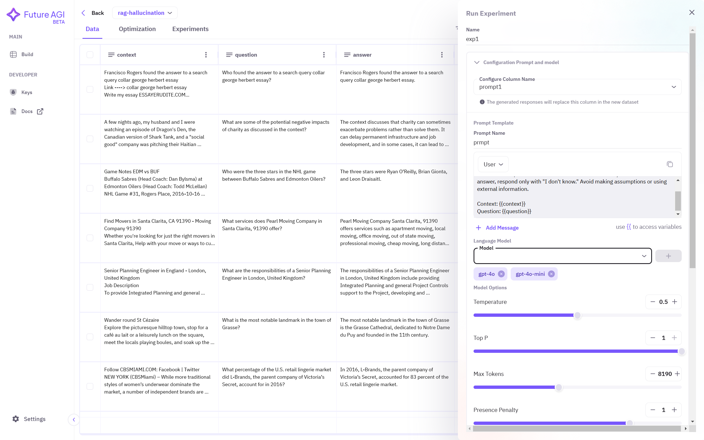
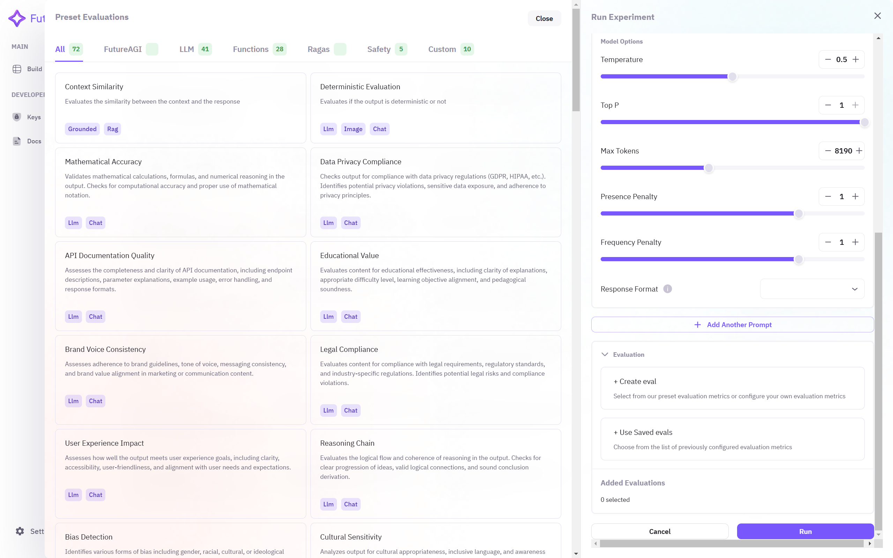
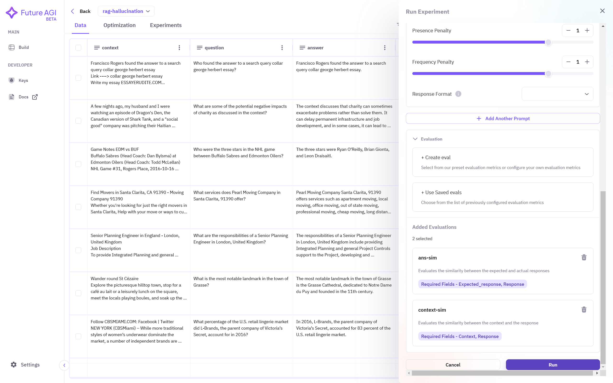
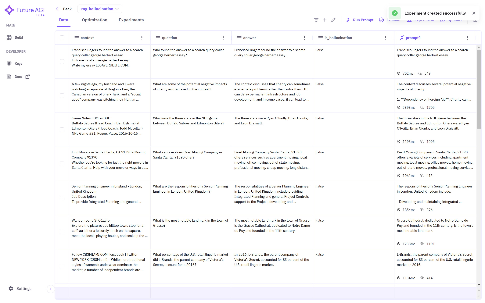
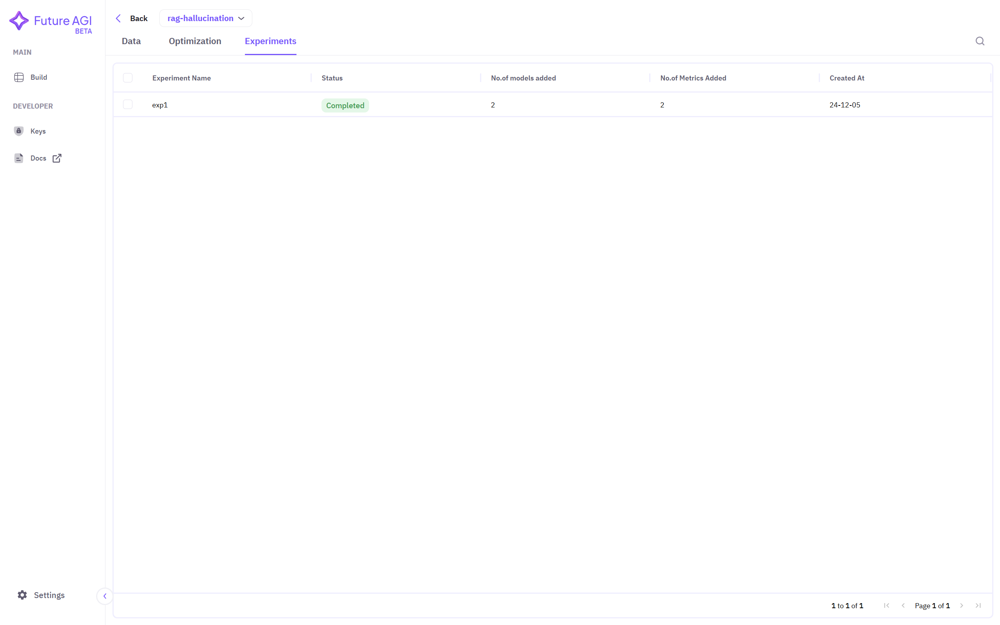
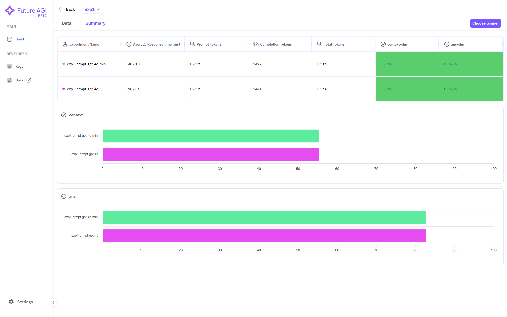

## Prerequisites
Before starting an experiment, ensure you have:
- Added a dataset to Future AGI
- Created and tested prompts
- Set up evaluation metrics (optional)

## Step-by-Step Guide

### 1. Dataset Selection
Click on your target dataset in the dashboard. If no datasets are visible, follow the [Add Dataset](/future-agi/products/dataset/) guide first.

### 2. Access Experiment Interface
1. Ensure you have created prompts following the [Run Prompt](/future-agi/products/prompt/) guide
2. Select **Experiment** from the top right corner

### 3. Configure Experiment

#### Basic Setup
1. Assign a descriptive **name** to track your experiment

2. Select the **column** containing prompt responses

3. Create your **prompt template** using double curly braces to reference dataset columns

#### Model Configuration
1. Choose your target model(s) from the dropdown menu
2. Enter the required API keys in the popup window

3. Click the **+** button to add each model to your experiment

#### Evaluation Setup
1. Select evaluation metrics from **Added Evaluations** if previously configured
2. To create new metrics:
   - Click **+ Create Eval**
   - Follow the [Choosing Evals](/future-agi/products/evaluate/evaluate#3-choosing-evals) guide
   

### 4. Track Results

#### Viewing Experiments
Access the **Experiments** dashboard from the top-left corner

The dashboard displays:
- Experiment names
- Status
- Number of models used
- Number of metrics used
- Creation date

#### Analyzing Results
1. Click on an experiment to view detailed results

2. Review evaluation scores per model and metric
3. Perform additional evaluations using the **Evaluate** button

#### Summary Dashboard
1. Click **Summary** to compare models and metrics

2. Select winning experiments:
   - Click **Choose winner**
   - Set selection criteria
   - Click **Save & Run**

Winners are marked with a **crown** symbol based on your criteria.

## Best Practices
- Use descriptive experiment names for easy tracking
- Test multiple models with varying parameters
- Include diverse evaluation metrics
- Document selection criteria for winning experiments
- Review results thoroughly before selecting winners
