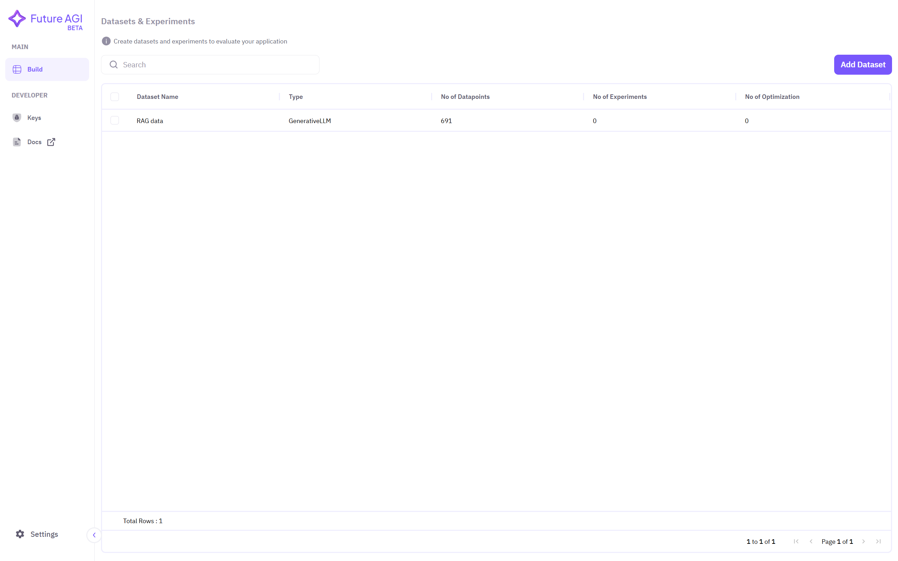
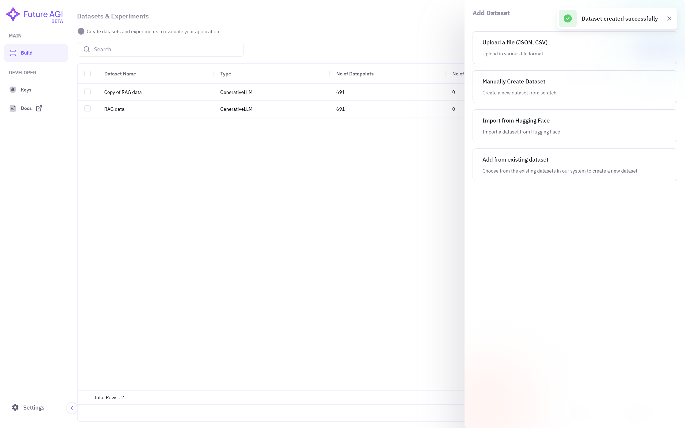

## 1. Add a Dataset
Ensure that a dataset already exists and is visible on your dashboard. In the screenshot below, a dataset named **RAG data** is already present, and we will use it to create a new dataset.

## 2. Select the Existing Dataset Option
Choose the **Add from existing dataset** option to create a new dataset from an existing one on the dashboard.

## 3. Choose Dataset and Model Type
Assign a **name** to the new dataset, then **select the source dataset**. After that, choose the **model type**.

## 4. Dataset is Ready for Experimentation
You can now see the copy of the dataset on your dashboard. If it is not visible, refresh the page.
