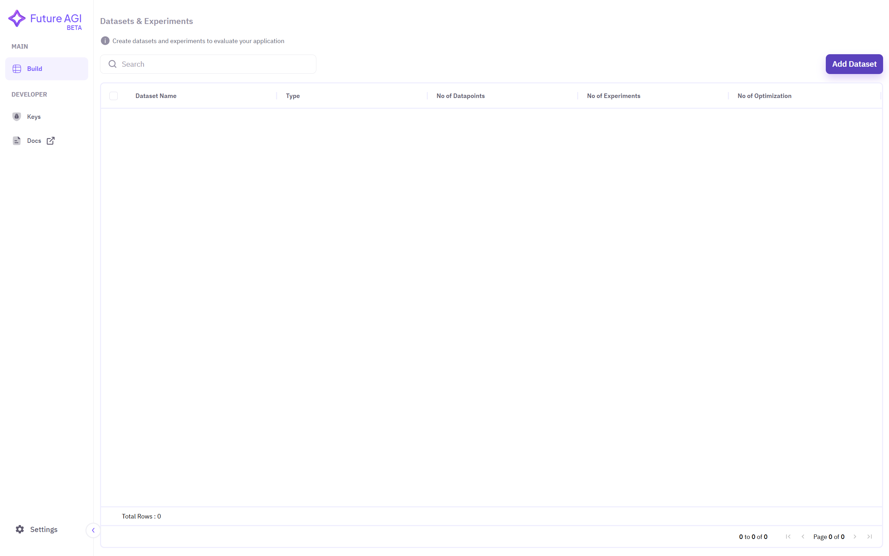
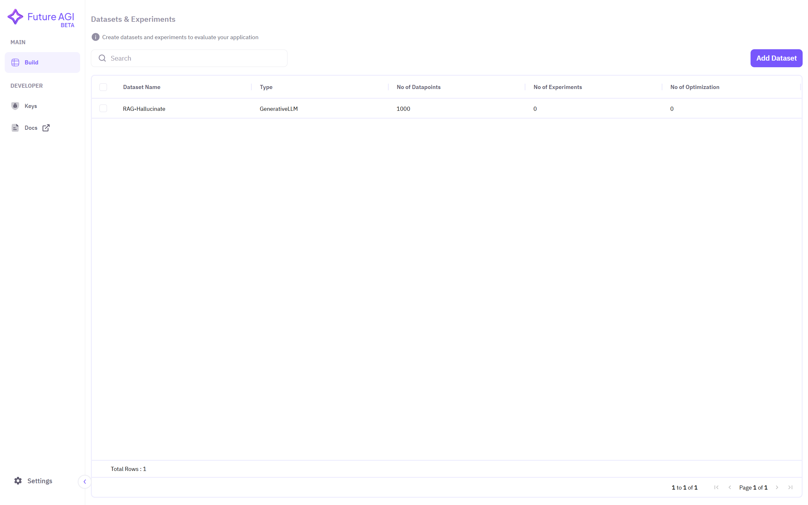

## 1. Adding a Dataset
Select **Build** from the top left corner under the **Main** section. Then click on **Add Dataset**.

## 2. Selecting the Hugging Face Option
Choose the **Import from Hugging Face** option to import a dataset directly from Hugging Face.

## 3. Providing the Hugging Face Dataset ID
Copy the dataset name from [Hugging Face Datasets](https://huggingface.co/datasets) that you want to use. Paste the dataset name and click on **Load Dataset**.

## 4. Providing Additional Dataset Details
Give a **name** to the imported dataset. Choose your **model type** from the dropdown menu, e.g., Generative LLM. Then select the **subset** and **split** of the dataset. (Refer to the dataset card on Hugging Face for more details). Click on **Start Experimenting**.

## 5. Dataset is Ready for Experimentation
You can now see the imported dataset on your dashboard. If it is not visible, refresh the page.
