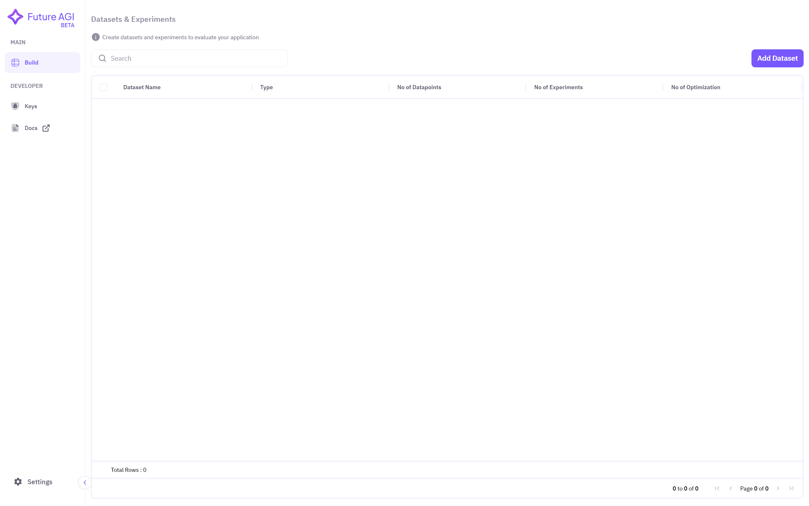
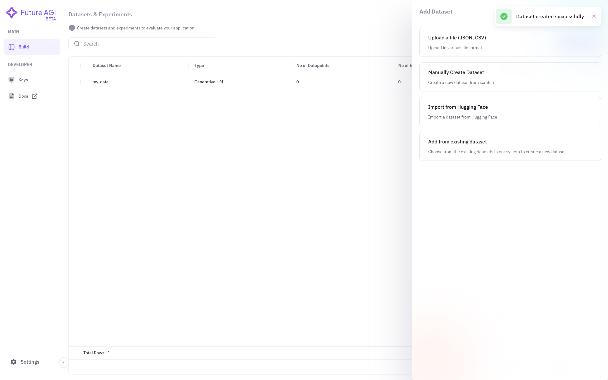

## 1. Adding Dataset
Click on **Add Dataset** option at top right corner.

## 2. Selecting Manually Create Dataset Option
Choose **Manually Create Dataset** option to manually create new dataset from scratch.

## 3. Choose Model Type
Assign **name** to this new dataset and then choose **model type**.

## 4. Dataset is Ready for Experimention
You can now see the newly created dataset on the dashboard.

