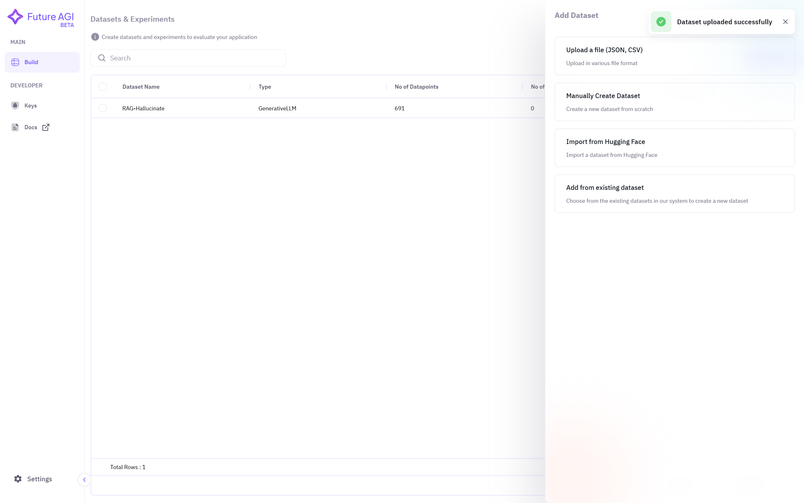

## 1. Adding Dataset
Select **Build** from top left corner under **Main** section. Then click on **Add Dataset**.

## 2. Selecting Upload File Option
Now choose **Upload a file** option to upload files like CSV, JSON from your local computer. 

## 3. Uploading File
Firstly, **name** your dataset and choose your **model type** from the drop down menu, e.g. Generative LLM. Then **browse** the file saved in your local computer you want to upload. After selecting file, click on **Done** and wait for it to upload.

## 4. Dataset is Ready for Experimention
You can now see the uploaded dataset on your dashboard. If not showing then refresh the page.

