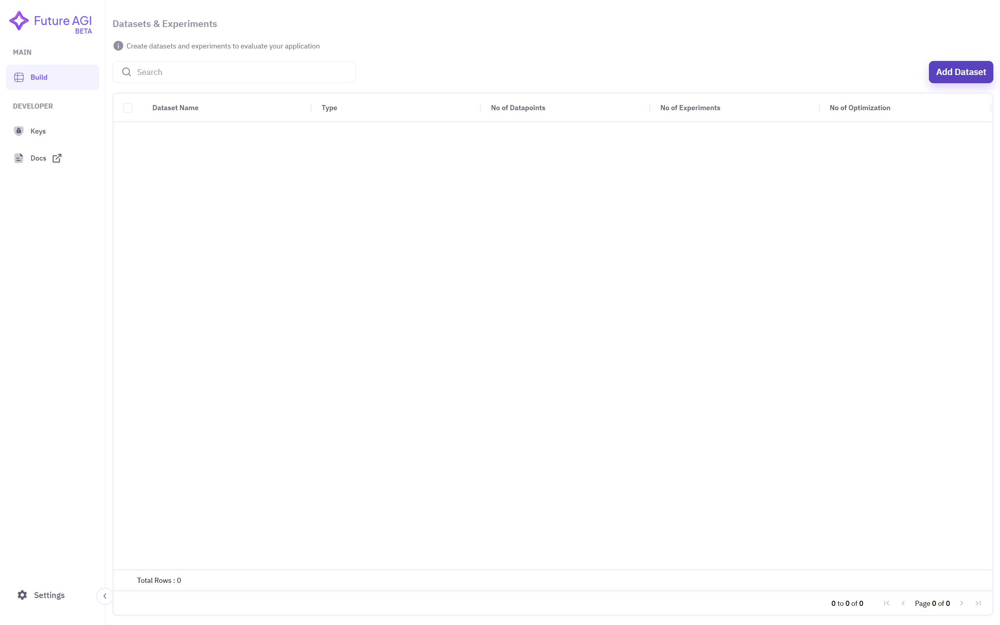
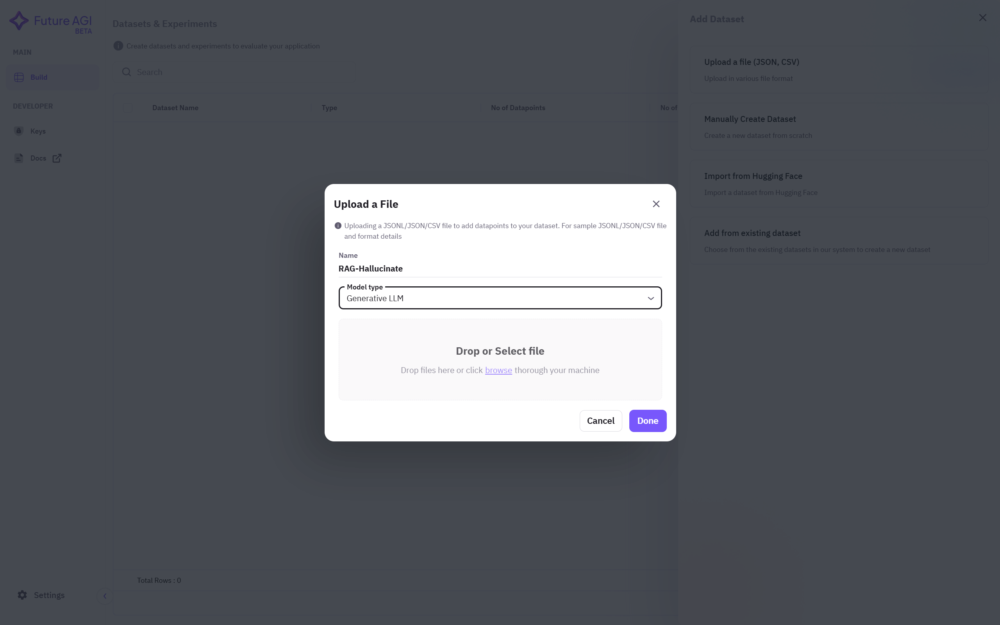
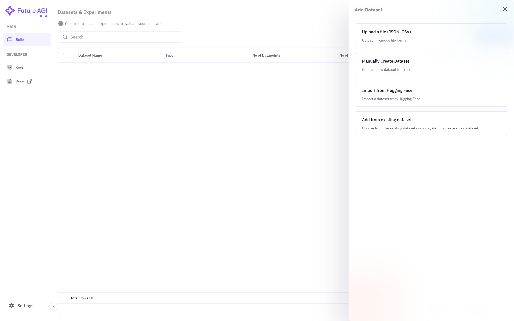
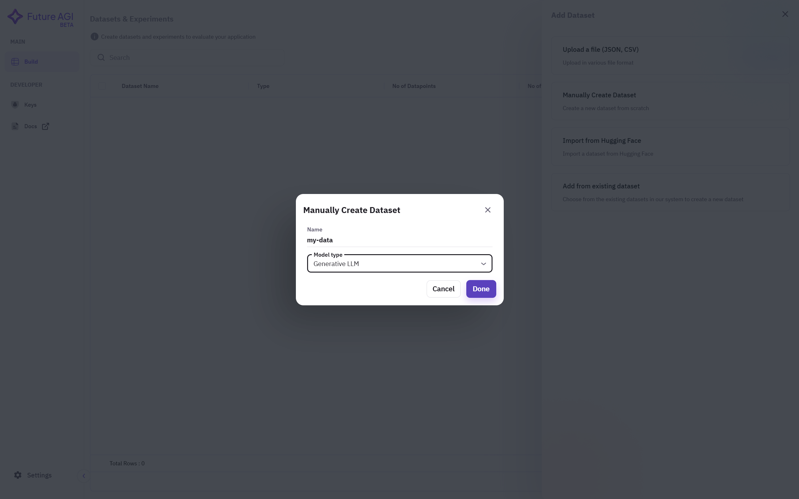
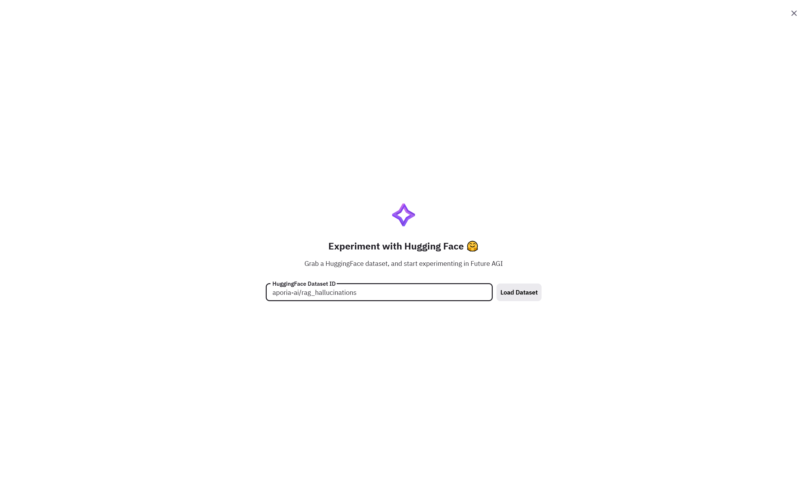
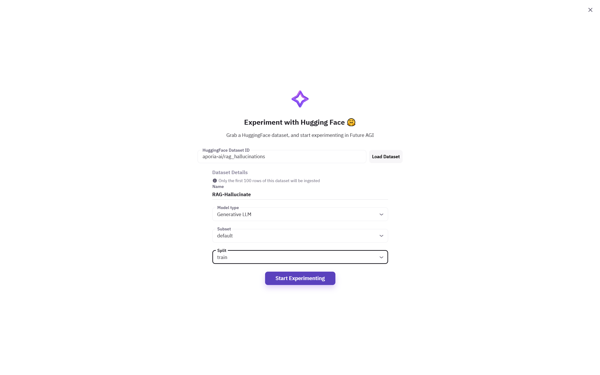
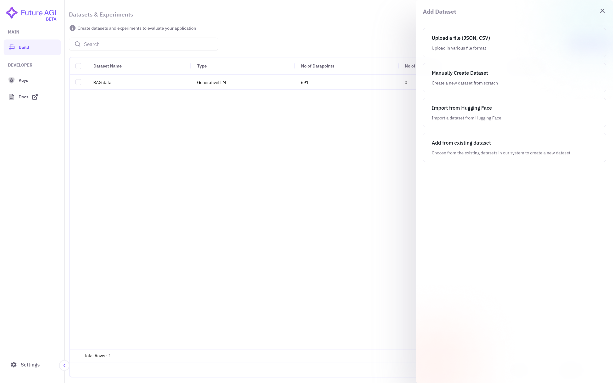
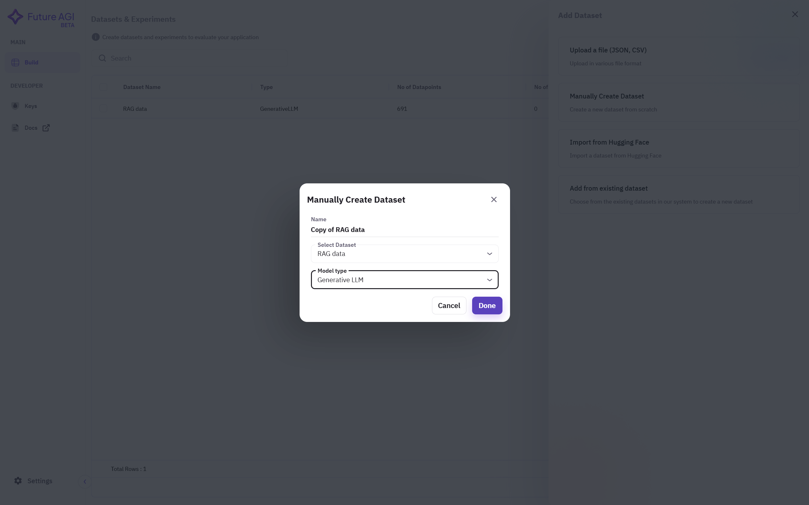

This guide covers all the methods available for adding datasets through the Future AGI platform interface.

## Prerequisites
Before adding a dataset, ensure you:
- Have access to the Future AGI platform
- Are logged into your account
- Have the necessary data or files ready

## Methods to Add Datasets

The Future AGI platform offers multiple ways to add datasets:

<CardGroup>
  <Card title="Upload Files" icon="file-arrow-up">
    Upload CSV or JSON files from your computer
  </Card>
  <Card title="Manual Creation" icon="pen">
    Create a new dataset from scratch
  </Card>
  <Card title="Import from Hugging Face" icon="cloud">
    Import datasets directly from Hugging Face
  </Card>
  <Card title="Use Existing Dataset" icon="copy">
    Create a new dataset based on existing ones
  </Card>
</CardGroup>

## Common First Step

For all methods, begin by:
1. Select **Build** from the top left corner under the **Main** section
2. Click on **Add Dataset**

## Method 1: Uploading Files (JSON, CSV)

### 1. Select Upload Option
Choose the **Upload a file** option to upload files from your local computer.

### 2. Configure and Upload
1. Enter a **name** for your dataset
2. Choose your **model type** from the drop-down menu
3. **Browse** for your file and select it
4. Click **Done** and wait for upload completion

## Method 2: Manual Dataset Creation

### 1. Select Manual Creation
Choose **Manually Create Dataset** from the options.

### 2. Configure Settings
1. Enter a descriptive **name**
2. Select appropriate **model type**
3. Click **Create**

## Method 3: Importing from Hugging Face

### 1. Select Hugging Face Option
Choose **Import from Hugging Face** option.

### 2. Provide Dataset Details
1. Copy dataset name from [Hugging Face Datasets](https://huggingface.co/datasets)
2. Paste the dataset name
3. Click **Load Dataset**

### 3. Configure Import
1. Give your dataset a **name**
2. Choose **model type**
3. Select dataset **subset** and **split**
4. Click **Start Experimenting**

## Method 4: Adding from Existing Dataset

### 1. Select Existing Dataset Option
Choose **Add from existing dataset** option.

### 2. Configure New Dataset
1. Assign a **name**
2. **Select source dataset**
3. Choose **model type**

## Verifying Dataset Creation

After using any method above:
1. Your new dataset should appear on the dashboard
2. If not visible, refresh the page
3. You can now begin experimenting with your dataset

## Next Steps

Once your dataset is added, you can:
- [Run prompts](/future-agi/products/dataset/adaptive-columns/prompt/run-prompt) on your dataset
- [Create experiments](/future-agi/products/dataset/experiment/experiment) to test different configurations
- [Evaluate results](/future-agi/products/dataset/evaluate/evaluate) using various metrics
