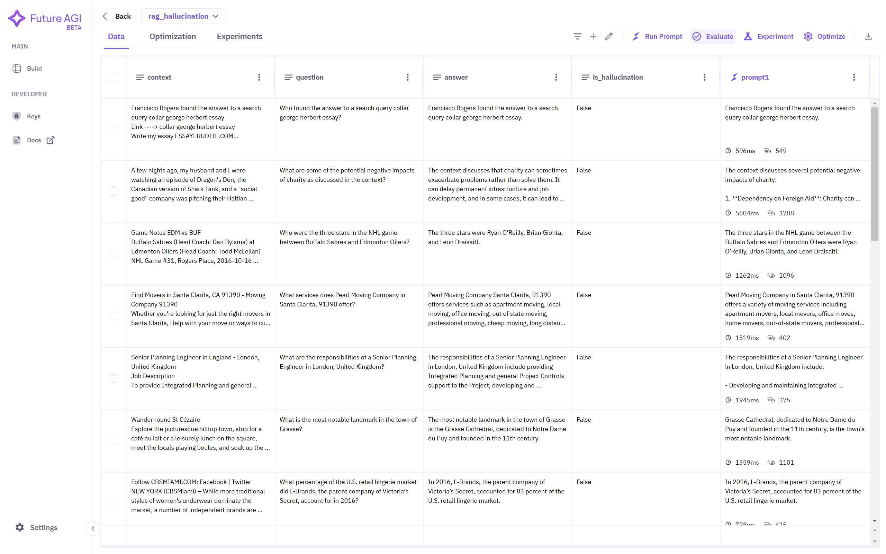
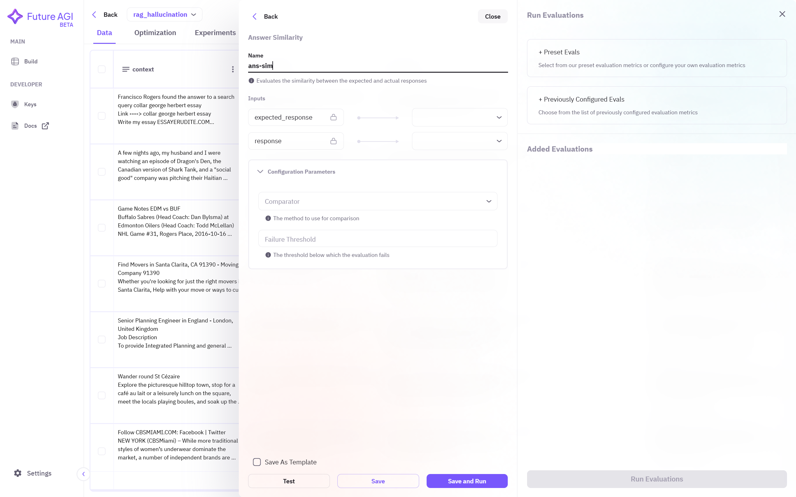
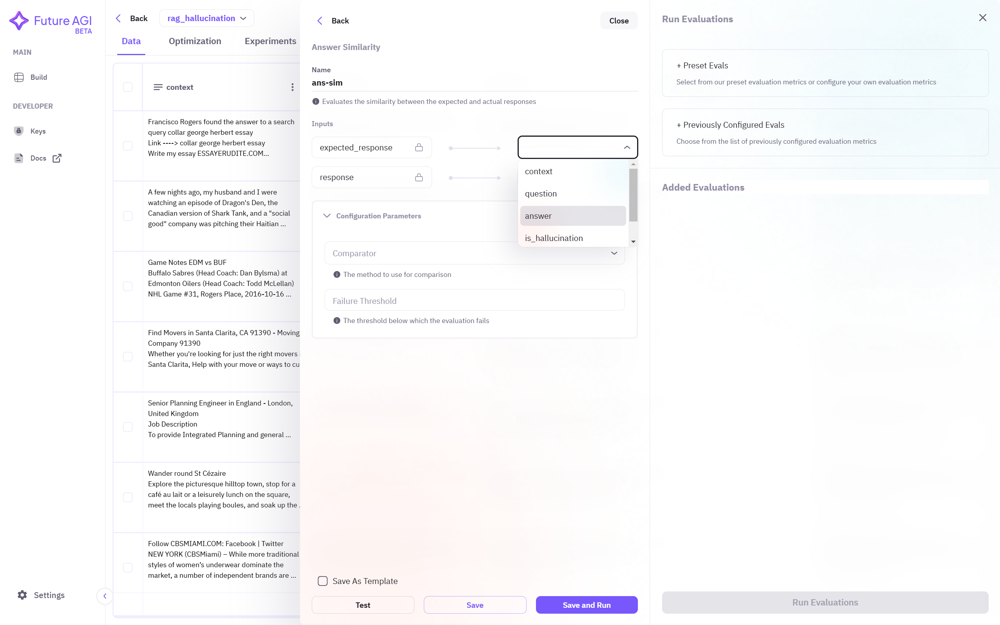
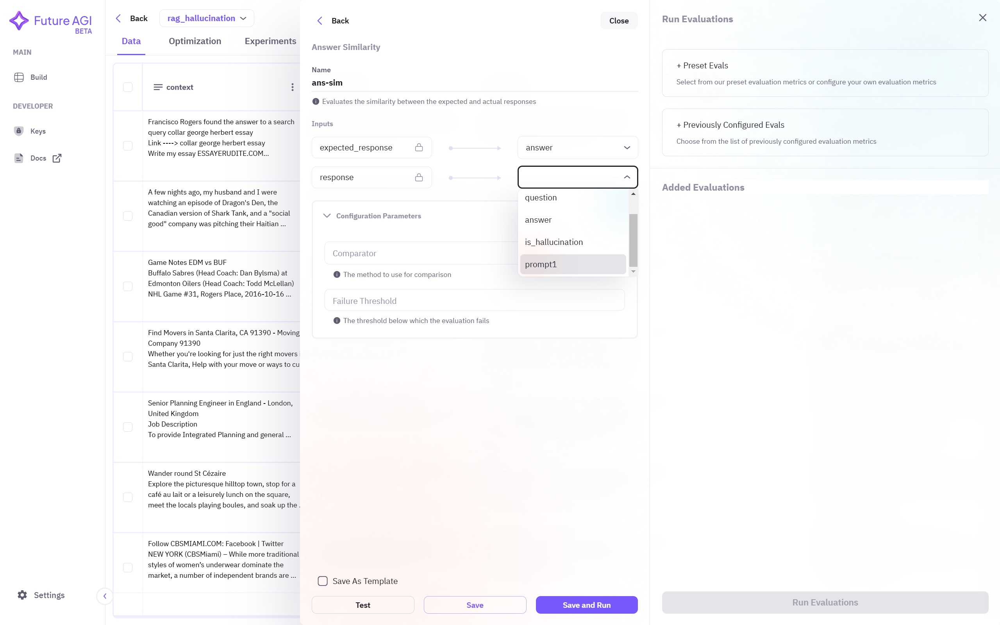
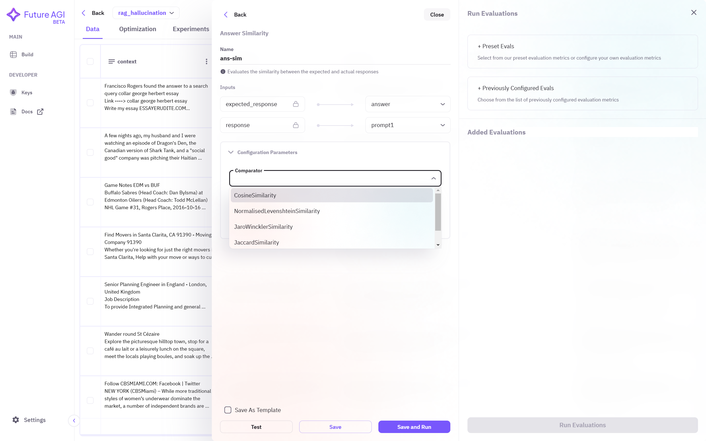
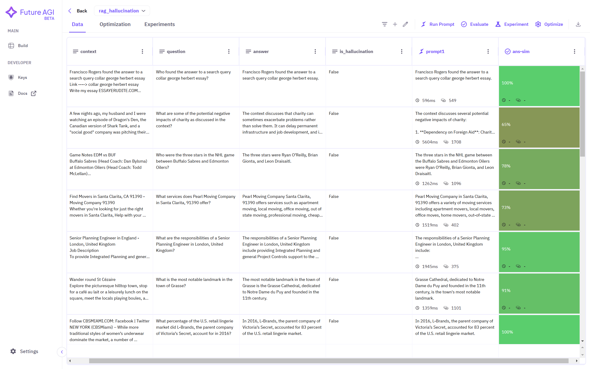

## 1. Select Dataset
Click on the dataset name you want to use to create prompts. If no dataset is showing in the dashboard, ensure you have followed the steps required to <a href="/future-agi/products/dataset/" style={{ textDecoration: "none", fontWeight: "bold" }}>Add Dataset</a> on the Future AGI platform.

## 2. Select Evaluate Section
Make sure you have created prompt by following the steps mentioned in <a href="/future-agi/products/prompt/" style={{ textDecoration: "none", fontWeight: "bold" }}>Run Prompt</a> section. Then, on the top right corner, select **Evaluate** option to perform evaluations.

## 3. Choosing Evals
Depending on the use-case, you can choose different **evals** from **preset evaluation metrics**. 

After choosing suitable metric, you can further configure it. Assign **name** to this configured metric so that you can refer later.  

Provide column names to the **input** field in which you want to perform evaluation.

Some evaluation metric requires further **configuration parameter** to perform properly. These parameters define how the metric is applied and ensure accurate and meaningful evaluation results. 

**Save** the configuration and **run** the evaluation.

## 4. Running Evaluation
You can now see your configured evaluation under **Added Evaluation** section. You can use multiple evaluation metric. Select the metric you want to use and then click on **run evaluations** below.

You can see the evaluation results as a newly created column.  If you have selected multiple evaluation metric then each metric will save in a separate column.