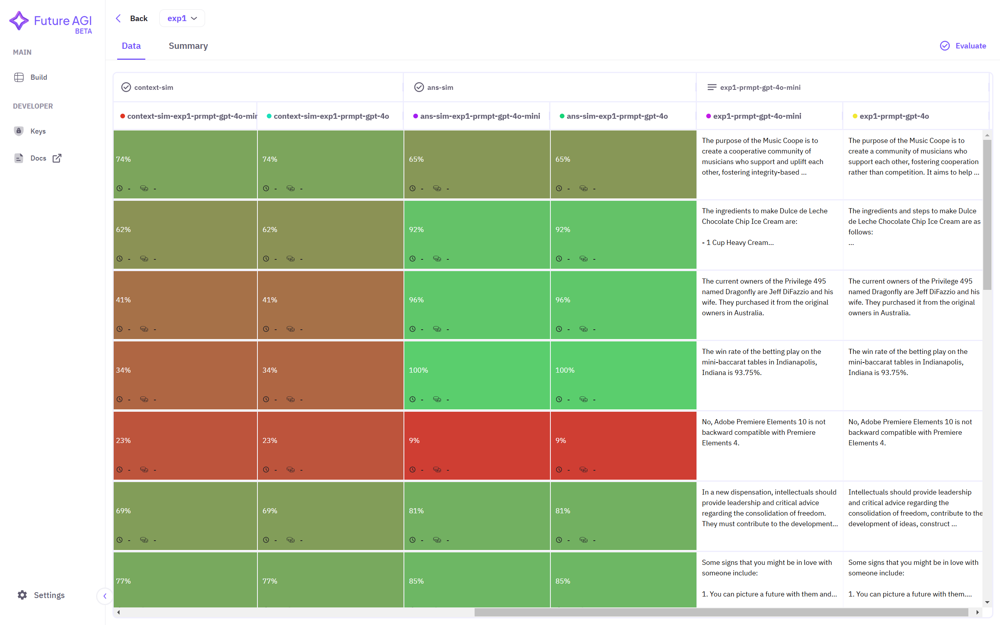
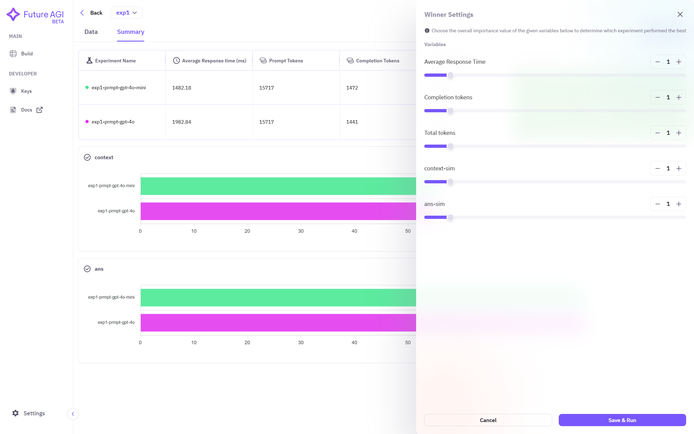
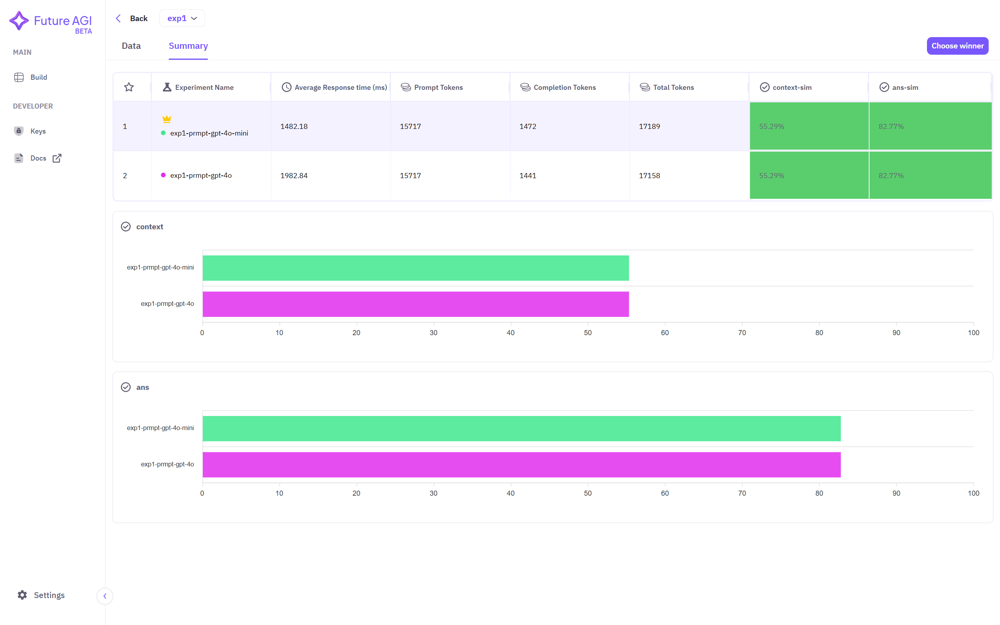

## 1. Select Dataset
Click on the dataset name you want to use to create prompts. If no dataset is showing in the dashboard, ensure you have followed the steps required to <a href="/future-agi/products/dataset/" style={{ textDecoration: "none", fontWeight: "bold" }}>Add Dataset</a> on the Future AGI platform.

## 2. Select Experiment Section
Make sure you have created prompt by following the steps mentioned in <a href="/future-agi/products/prompt/" style={{ textDecoration: "none", fontWeight: "bold" }}>Run Prompt</a> section. After that, on the top right corner, select **Experiment** option to perform the experimentation.

## 3. Setting Up Experimentation
Assign **name** to this experiment to track results of experimentation.

 Then select the **column** of prompt response from your dataset.

Create **prompt template**. You can use double open curly braces to access column names of your dataset.

Now you have to select which model you are going to be using for experimention. Select **model** from the dropdown menu and a pop-up window will open, where you can paste the API keys of the selected model.

After selecting the model, click on the **+** button to include the model in experimentation. You can also select multiple models.

You can now select what evaluation metrics you want to use. If you had already created and saved the evaluation configuration as mentioned in <a href="/future-agi/products/evaluate/" style={{ textDecoration: "none", fontWeight: "bold" }}>Evaluate</a> section, you will find them here under **Added Evaluations**. 

If no metrics is showing under it, then you need to create new evaluation. Click on **+ Create Eval** and follow the steps mentioned in <a href="/future-agi/products/evaluate/evaluate#3-choosing-evals" style={{ textDecoration: "none", fontWeight: "bold" }}>Choosing Evals</a> sub-section under <a href="/future-agi/products/evaluate/" style={{ textDecoration: "none", fontWeight: "bold" }}>Evaluate</a> section. 

Then select what evals you want to use and then click on **Run** to start your experimentation.

## 4. Tracking Experimentation
You can now track your experiment by going to the **Experiments** dashboard, which is located on top-left corner, below dataset name.

You can see your experiment name along with the status and other informations, such as number of models used and number of metrics used and experiment creation date.

Click on your experiment to see result and summary.

You can see the evaluation scores of each model per evaluation metric as a separate columns in your dataset. You can perform further evaluation by clicking on **Evaluate** at top right corner.

Click on **Summary** to get a dashboard for comparing models and evals in brief. Here you can select the best performing experiment by clicking on **Choose winner** situated at top right corner.

Select criterias in which you want to select the best performing experiment then click on **Save & Run**. 

You wil see a **crown** symbol on your best performing experiment as per the provided criteria.
