## 1. Select Dataset
Click on the dataset name you want to use to create prompts. If no dataset is showing in the dashboard, ensure you have followed the steps required to <a href="/future-agi/products/dataset/" style={{ textDecoration: "none", fontWeight: "bold" }}>Add Dataset</a> on the Future AGI platform.
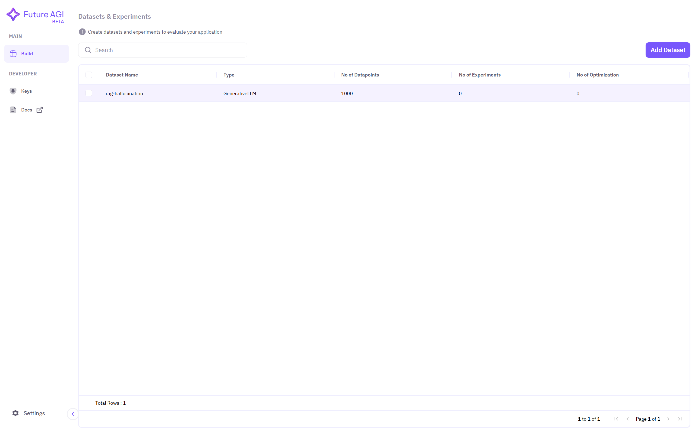

## 2. Select Experiment Section
Make sure you have created prompt by following the steps mentioned in <a href="/future-agi/products/prompt/" style={{ textDecoration: "none", fontWeight: "bold" }}>Run Prompt</a> section. If you had already created <a href="/future-agi/products/evaluate/" style={{ textDecoration: "none", fontWeight: "bold" }}>evaluation</a> then it would be quicker to setup experimentation. But it is not mandatory as you can create evaluation here also. 

On the top right corner, select **Experiment** option to perform experimentation.
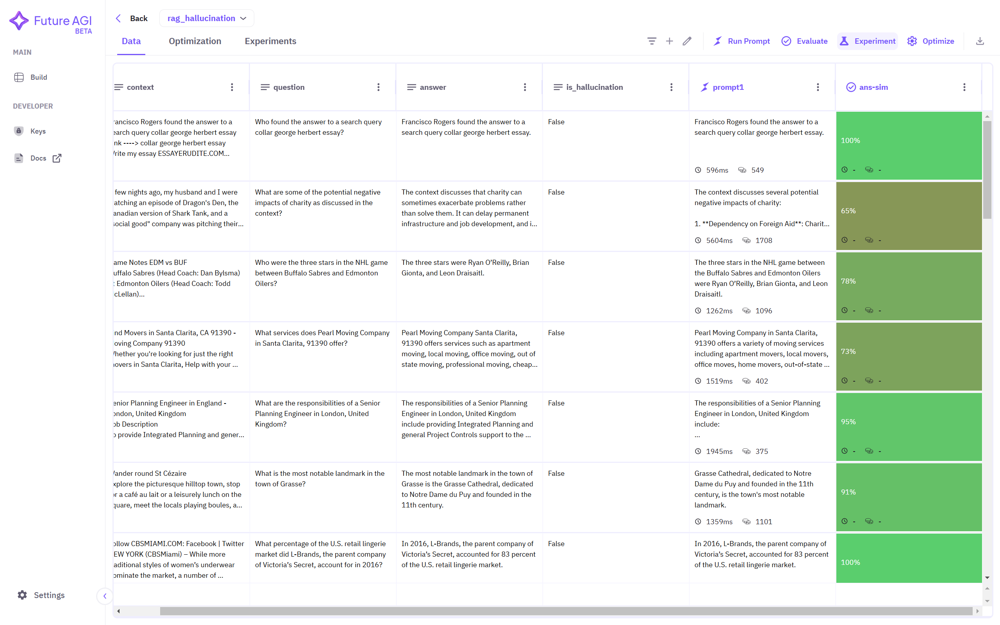

## 3. Setting Up Experimentation
Assign **name** to this experiment to track results of experimentation.

 Then select the **column** of prompt response from your dataset.
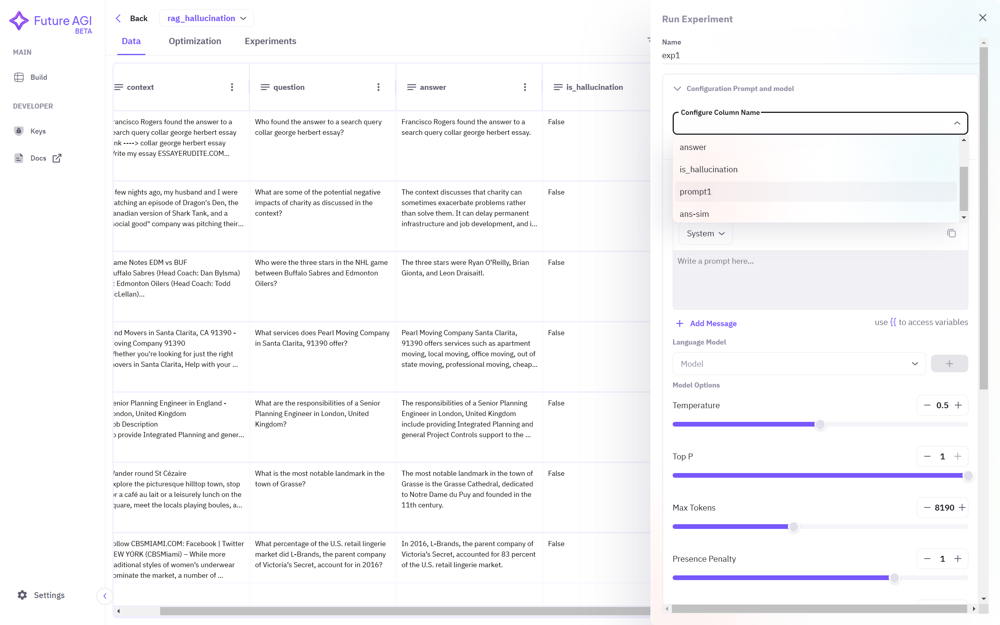

Create **prompt template**. You can use double open curly braces to access column names of your dataset.
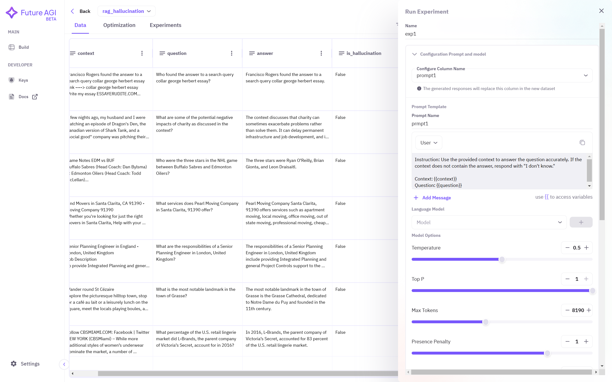

Now you have to select which model you are going to be using for experimention. Select **model** from the dropdown menu and a pop-up window will open, where you can paste the API keys of the selected model.
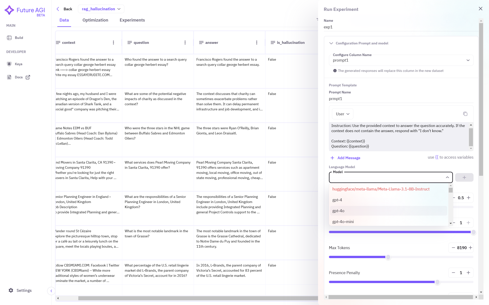
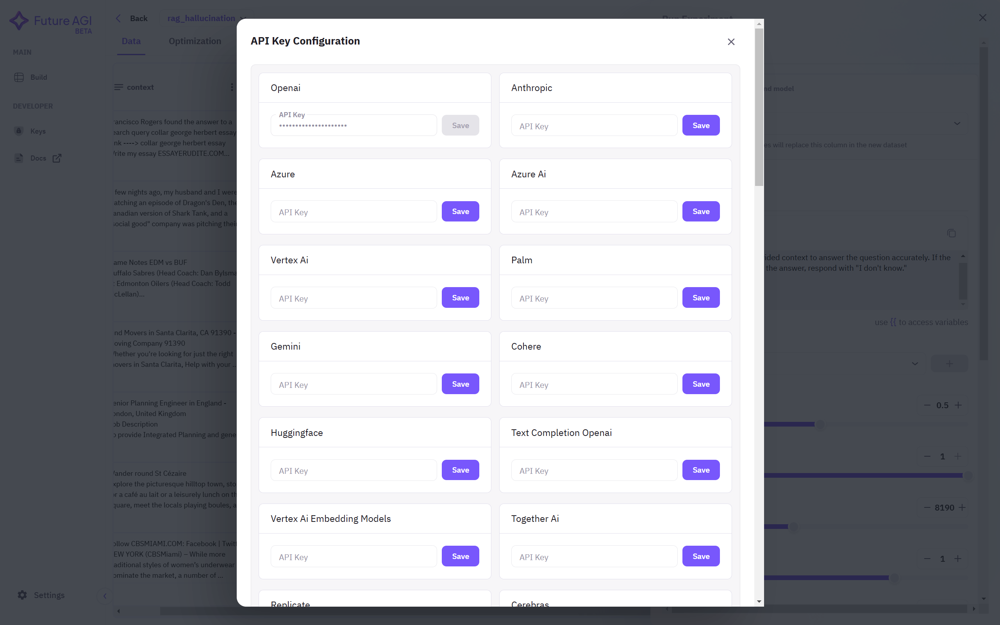

After selecting the model, click on the **+** button to include the model in experimentation. You can also select multiple models.

You can now select what evaluation metrics you want to use. If you had already created and saved the evaluation configuration, you can find here. Select what metrics you want to use and then click on **Run** to start your experimentation.
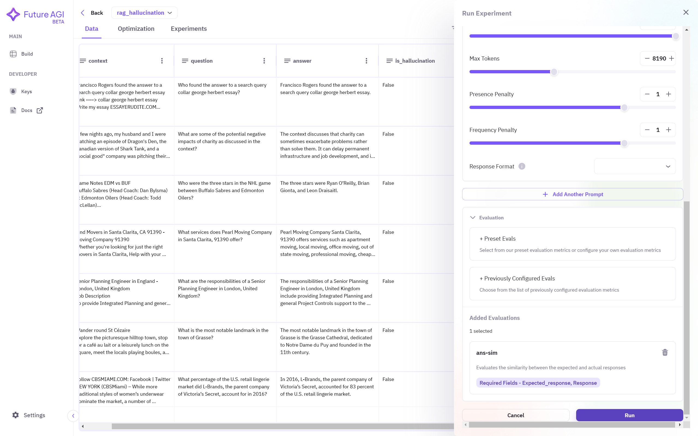

**Save** the configuration and **run** the evaluation.

## 4. Tracking Experimentation
You can track your experiment by going to the **Experiments** dashboard, which is located on top-left corner, below dataset name. Click on **Experimentations**.
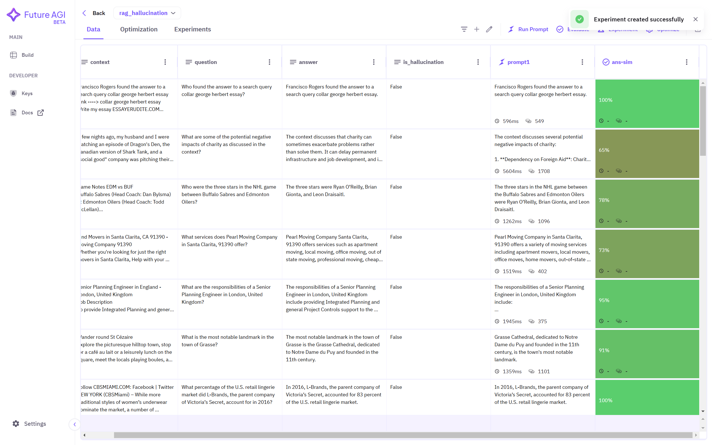

You can see your experiment name along with the status and other informations, such as number of models used and number of metrics used and experiment creation date.
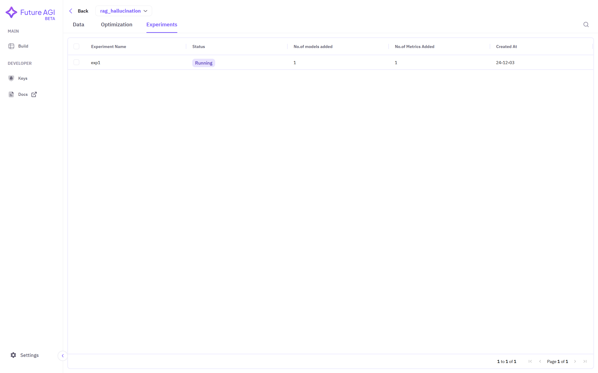

Click on your experiment to see result and summary.
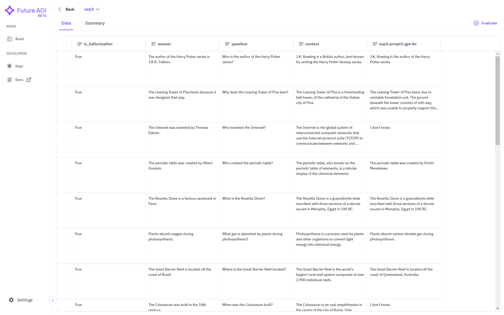
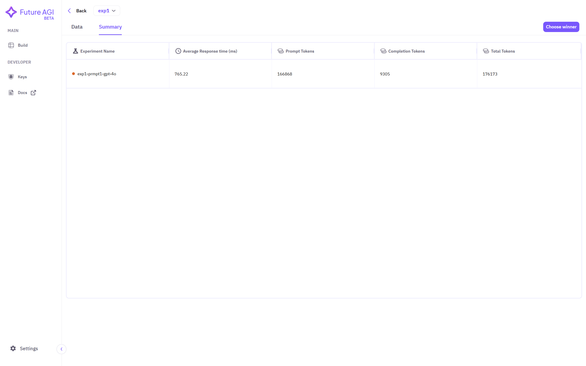

You can also run multiple experiments so that you can choose the best configuration for your use-case.