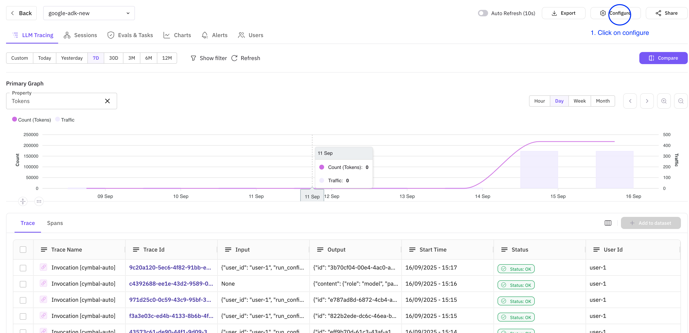
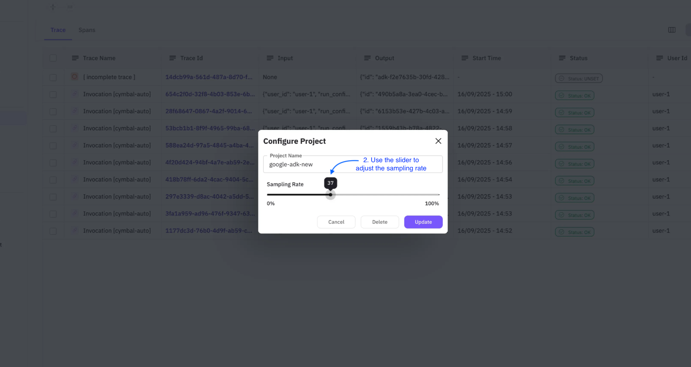
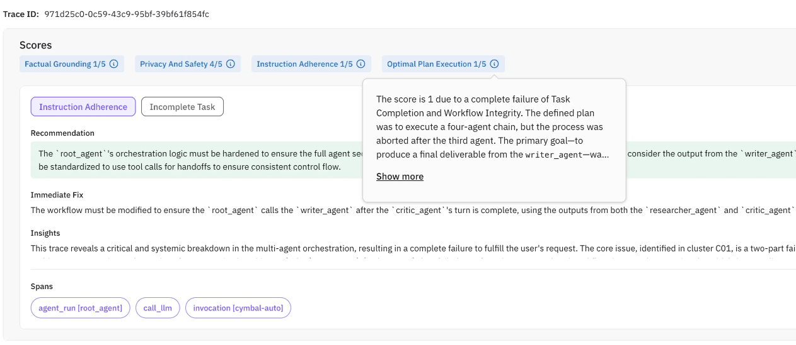
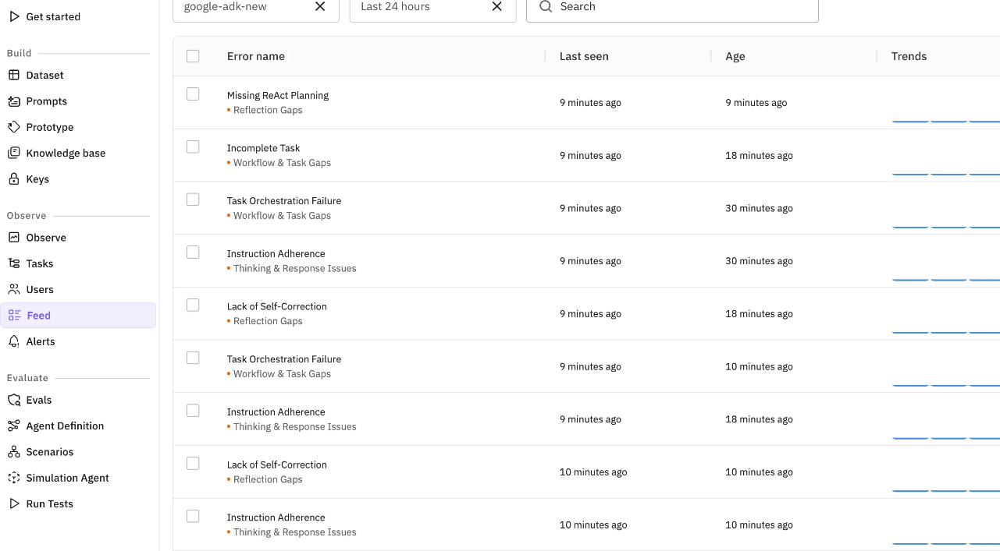

## Key concepts

Following are the key concepts to go through as you leverage Agent Compass. You will see these terms being used frequently

* **[Recommendation](#recommendation):** This is a suggestion from the perspective of implementing a long term and robust fix. The recommendation may not always be the same as an immediate fix. In most of the cases, proceeding with the recommendation would be the best course of action
* **[Immediate fix](#immediate-fix):** This suggests a minimal functional fix. This fix may or may not necessarily align with the recommendation
* **[Insights](#insights):** Insights are high level overview of the complete trace execution. They do not change with the currently active taxonomy metric and give a bird's eye view of what your agent did during execution
* **[Description](#description):** The description conveys what went wrong during the agentic exection. It also answers what happened in the error
* **[Evidence](#evidence):** Evidences are the supporting snippets from the LLM response that was generated during the agentic executions. They can help you uncover edge cases/unforeseen scenarios that might've been missed during the development phase
* **[Root Causes](#root-causes):** It answer the why of the problem
* **[Sampling Rate](#sampling-rate):** This is a user controlled parameter. It refers to how many percentage of traces should the compass run on. Based on the sampling rate, the compass picks up traces at random to generate insights. Sampling rate can be configured in two simple steps mentioned below  **Note:** The adjusted/updated sampling rate will be applicable for upcoming traces only and not on the currently present or previously added traces
    * **Step 1:** Click on configure button on the top right corner of the observe screen
    
    * **Step 2:** Use the slider to adjust the sampling rate according to your needs. Click on update to save
    

* **[Scores](#scores):** The agent performance evaluated on the following 4 metrics and given a score out of 5 to indicate their adherence to the metric. They are as follows

| Metric Name | Description |
|-------------|-------------|
| **Factual Grounding** | Measures how well agent responses are anchored in verifiable evidence from tools, context, or data sources, avoiding hallucinations and ensuring claims are properly supported. |
| **Privacy and Safety** | Assesses adherence to security practices and ethical guidelines, identifying risks like PII exposure, credential leaks, unsafe advice, bias, and insecure API usage patterns. |
| **Instruction Adherence** | Evaluates how well the agent follows user instructions, formatting requirements, tone specifications, and prompt guidelines while understanding core user intent correctly. |
| **Optimal Plan Execution** | Measures the agent's ability to structure multi-step workflows logically, maintaining goal coherence, proper step sequencing, and effective coordination of tools and actions. |

* **[Spans](#spans):** The list of affected spans. Each [taxonomy metric](/future-agi/products/observability/agent-compass/taxonomy) can have different spans associated with it. You can click on the span to spot it in the trace tree

All the errors identified by the compass are grouped together and can be viewed under the `Feed` tab of the platform. Following is the list of frequently used terms there:

* **[Cluster](#cluster):** Mulitple traces can have the same error. All those traces are grouped under a common cluster and shown in a tabular form
* **[Trends](#trend):** The number of times a particular error occured. The cycle of that is referred as trend (example: increasing, decreasing etc.)

