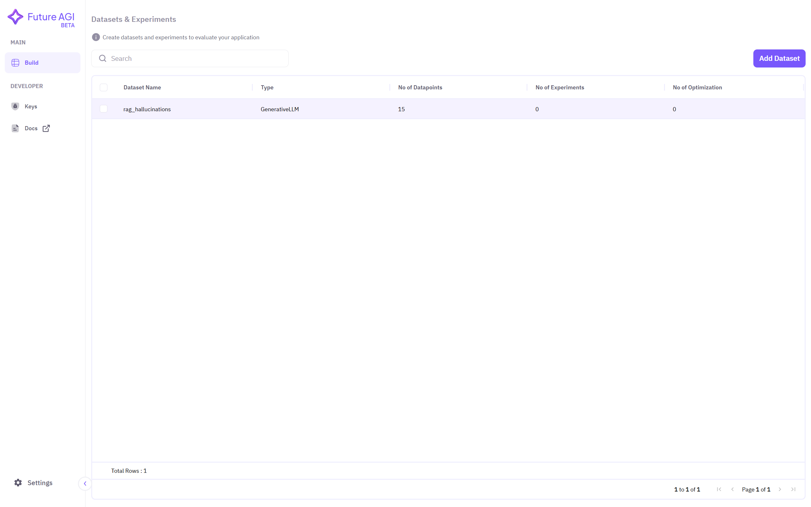
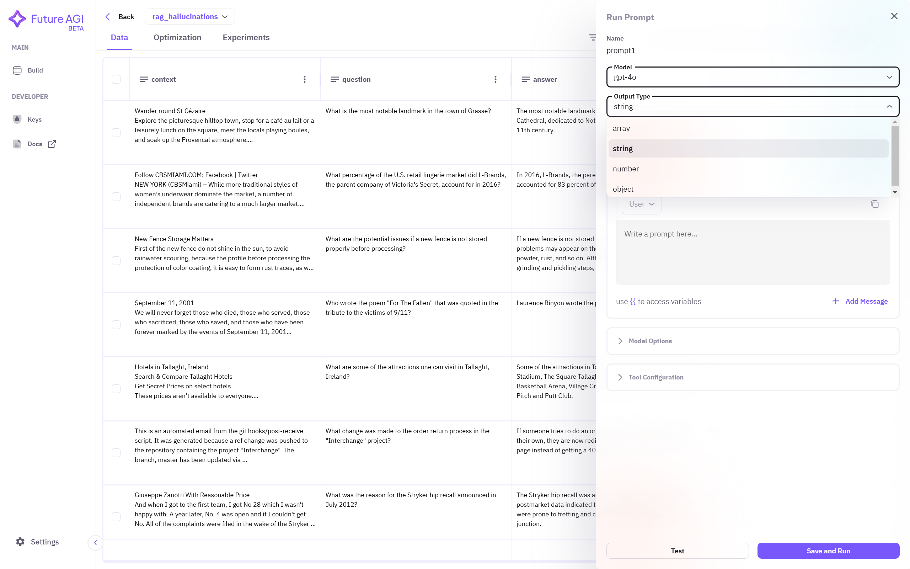
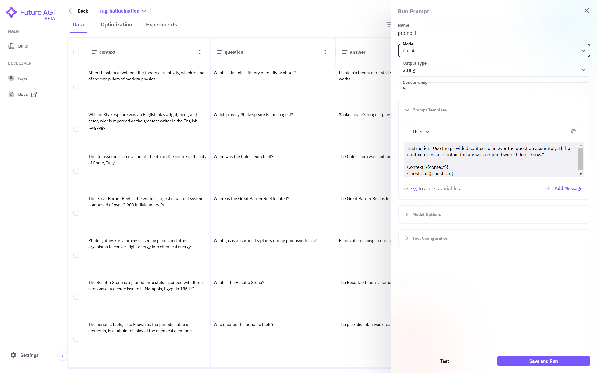
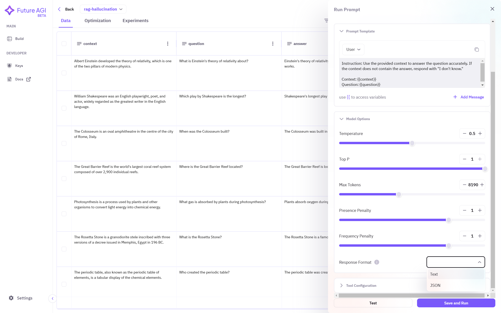
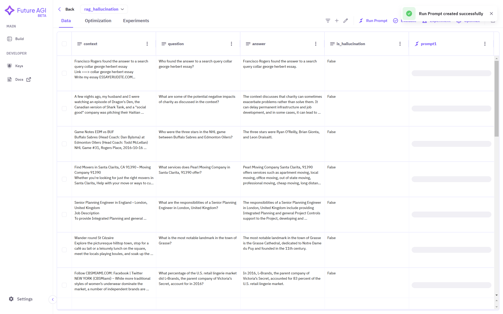
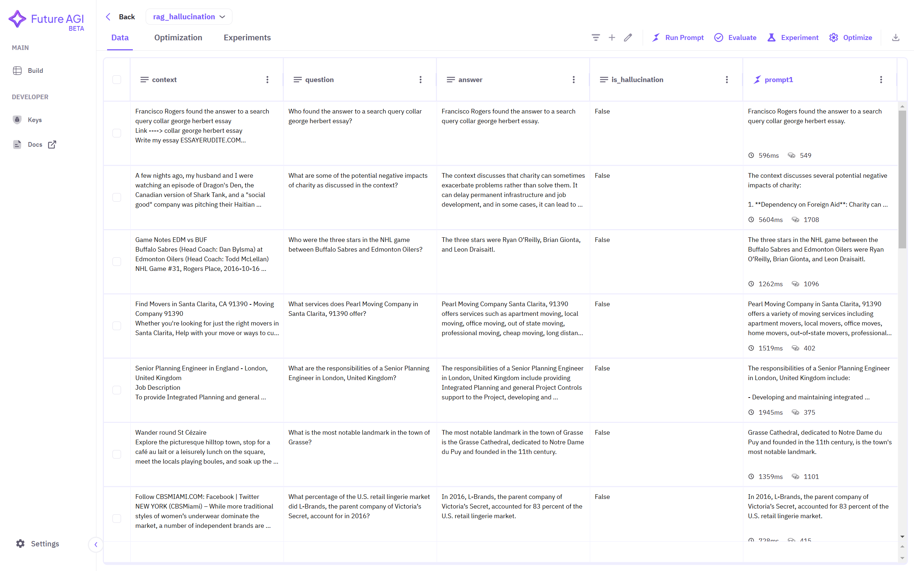

## 1. Select Dataset
Click on the dataset name you want to use to create prompts. If no dataset is showing in the dashboard, ensure you have followed the steps required to <a href="/future-agi/products/dataset/" style={{ textDecoration: "none", fontWeight: "bold" }}>Add Dataset</a> on the Future AGI platform.

## 2. Select Run Prompt Section
You can view your dataset in a spreadsheet like interface. On the top right corner, select **Run Prompt** option to create prompt.

## 3. Creating Prompt
Give **name** to the prompt so you can refer. Select **model** from the dropdown menu. 

After selecting the model, a pop-up will open, in which you have to paste and save appropriate API key to access the models you want to run prompts on. Here, we are choosing gpt-4o model.

Now select the **output type** of the prompt. For example, if the response is either 'correct' and 'incorrect', then choose **string**. Or if the response is of JSON type, then choose **object**.

You can access column names of your dataset in prompt by using double open curly braces. A dropdown menu will open in which you have to choose the column name as per the desired prompt. After choosing desired column, the braces will be closed automatically. 

## 4. Model Parameters
Apart from prompts, you can also select what model parameters to choose so that you can test what parameters works best for you. You can change following parameters in your prompt:

#### a. Concurrency
- It is the number of multiple prompts model processes.
- A higher number can speed up overall data processing time but may hit API rate limit.

#### b. Temperature
- Conrols randomness in model's response.
- Value closer to 0 gives repetitive and deterministic response but value closer to 1 gives creative but may give factually incorrect responses.

#### c. Top P
- Controls how the model chooses next word.
- A lower Top P value narrows the token choices, thus producing more controlled but predictable responses. And a higher Top P value expands the token choices, producing more creative response but factually incorrect responses.

#### d. Max Tokens
- Maximum number of tokens the model can generate in a response.
- Higher max tokens produces more detailed and longer responses but increases API usage.

#### e. Presence Penalty
- Discourages repeating the same topics in the response.
- Higher presence penalty value encourages more variety in response while a lower presence penalty value focuses more on the same topic.

#### f. Frequency Penalty
- Reduces repeated words or phrases
- Higher frequency penalty value avoids repetition in responses while a lower frequency penalty value allows repetition.

After setting the model parameters, choose response format of the model, such as text or JSON.

If your prompt requires interaction with some kind of tools and is supported by the model you are using, you can set your choice as either **required** and model make use of that tool or if you set it as **auto** then model decides whether the particular prompt requires interaction with tool or not. If your prompt does not need any tool to interact then set it as **None**.

## 5. Running Prompt
After creating prompt and choosing model parameters you can click on **Save and Run** and it will save this prompt configuration and will create prompts of each row and save it as a separate column with prompt name as the column name that can be seen in the data dashboard.

Prompts are now visible on this newly created column for further examination.