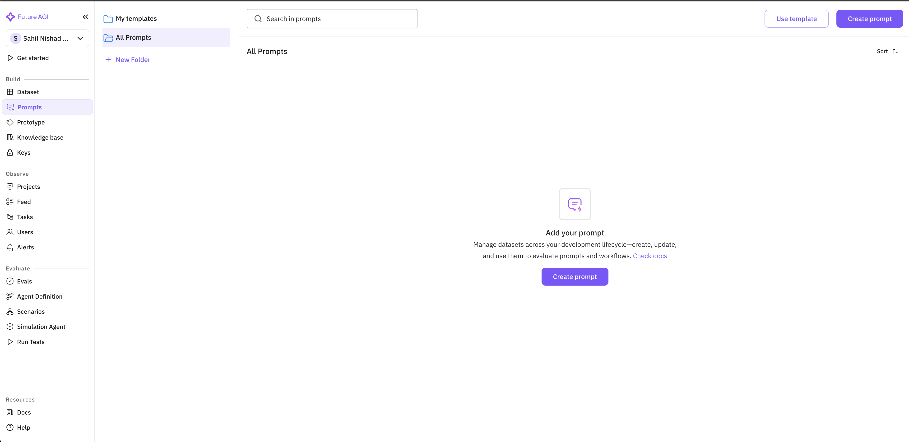
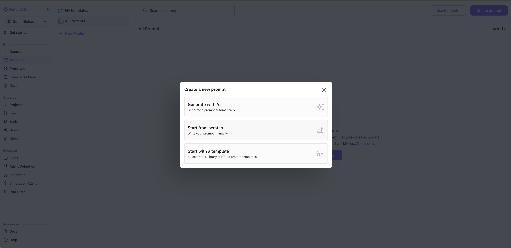
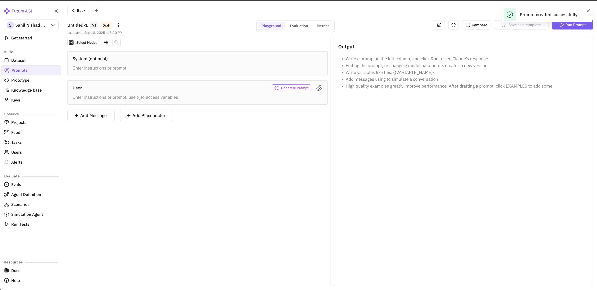
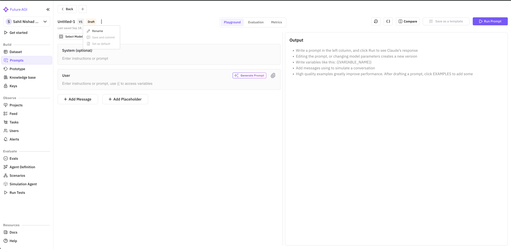
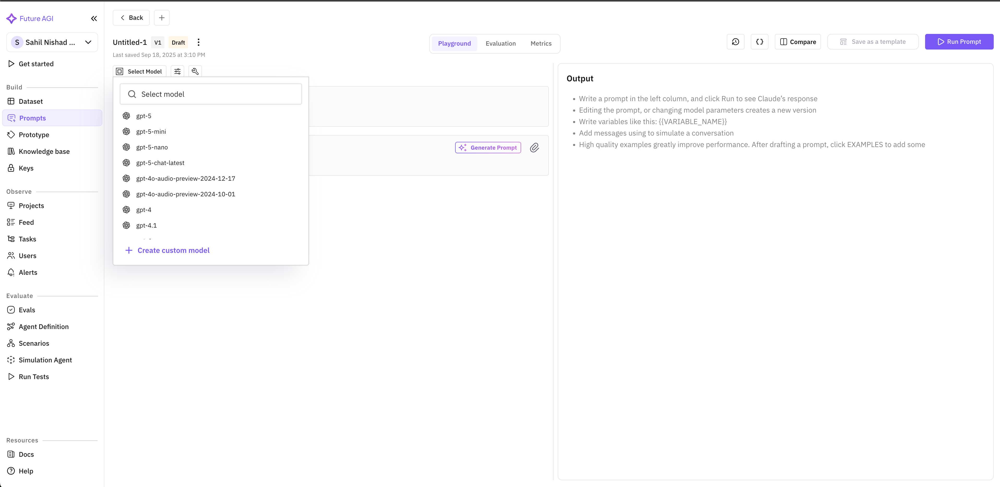
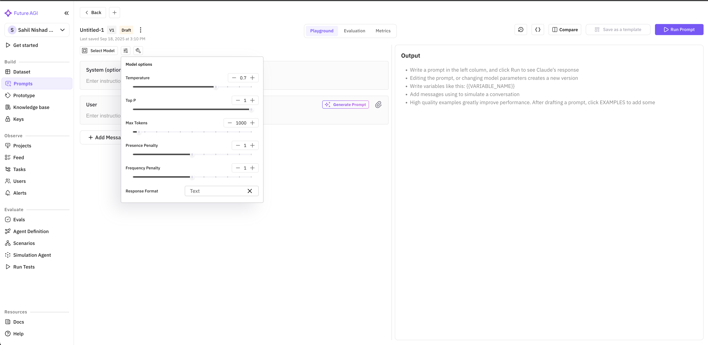
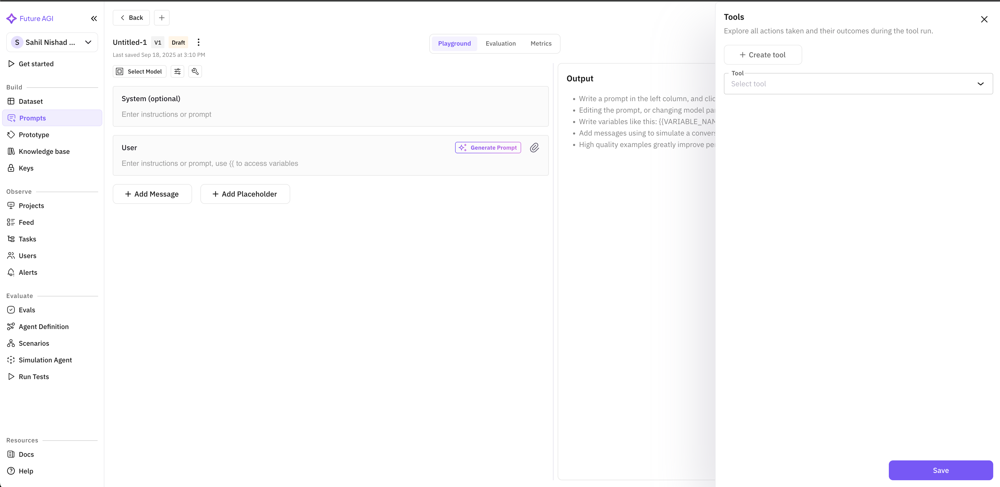
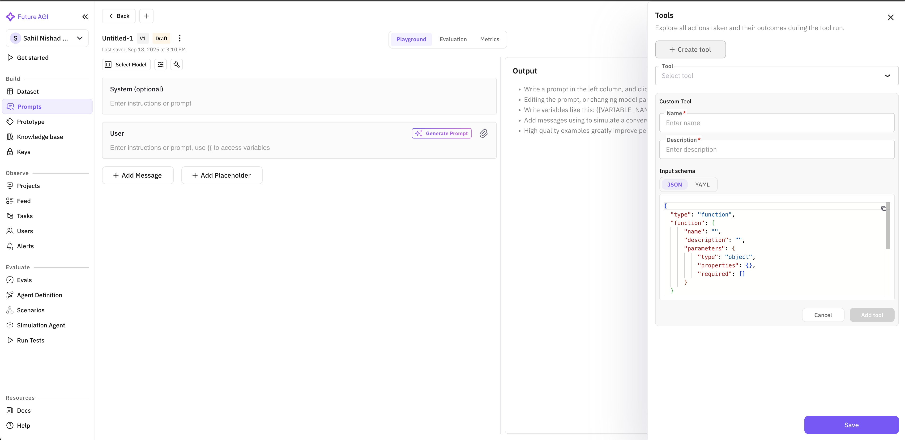
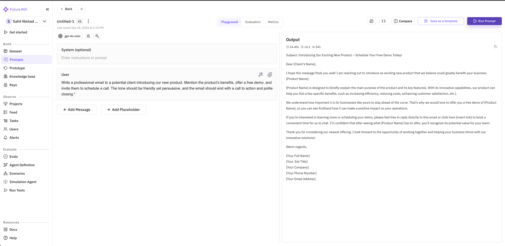

---
title: "Create Prompt from Scratch"
description: "This guide will walk you through the process of creating a new prompt in Future AGI, configuring its parameters, and running it."
--- 

<Steps>
  <Step title="Navigate to the Prompts Section">
    From the Future AGI dashboard, locate the navigation panel on the left side of the screen. Under the "Build" section, click on "Prompts" to access the prompts management interface.
    
    
  </Step>

  <Step title="Create a New Prompt">
    Once in the Prompts section, click on the "Create prompt" button located on the right side of the screen. This will open a modal dialog with prompt creation options.
    
    
    
    In the "Create a new prompt" modal, you have three options:
    - **Generate with AI**: Automatically generate a prompt using AI
    - **Start from scratch**: Create a prompt manually
    - **Start with a template**: Use a pre-made template
    
    For this guide, select "Start from scratch" to create your prompt manually.
    
    
  </Step>

  <Step title="Configure your prompt">
    Now you'll be taken to the prompt editor interface where you can configure various aspects of your prompt:
    
    - **Rename your prompt**: By default, your prompt will be named "Untitled-1". To rename it, click on the title and enter a more descriptive name that reflects the purpose of your prompt.
    
    
    
    - **Choose a model**: Click on "Select Model" to choose which AI model you want to use for your prompt. Future AGI offers various models with different capabilities.
    
    
    
    - **Configure model parameters:** After selecting a model, you can adjust its parameters to fine-tune the AI's behavior:
        - **Temperature**: Controls randomness (higher values = more creative, lower values = more deterministic)
        - **Top P**: Influences token selection diversity
        - **Max Tokens**: Sets the maximum length of the response
        - **Presence Penalty**: Reduces repetition by penalizing tokens based on their presence
        - **Frequency Penalty**: Reduces repetition by penalizing tokens based on their frequency
        - **Response Format**: Choose the output format (e.g., Text)
    
    Adjust these parameters to get the desired behavior from your AI model.
    
    
    
    - **Add tools (optional):** You can enhance your prompt by adding tools that give the AI additional capabilities. To add tools:
        - Click on the "Tools" tab in the right panel
        - Click "Create tool" to add a new tool
        - Configure the tool with a name, description, and input schema
    
    Tools allow your prompt to perform specific actions or access external data sources.
    
    
    
  </Step>

  <Step title="Write and run your prompt">
    In the prompt editor, you'll see two main text areas:
    
    - **System (optional)**: Here you can provide system-level instructions that guide the overall behavior of the AI
    - **User**: This is where you write the actual prompt that will be presented to the AI
    
    Write your prompt in the appropriate fields. Make it clear, specific, and include any necessary context or examples.
    
    When you're satisfied with your prompt, click the "Run Prompt" button in the top-right corner to execute it and see the AI's response.
    
    
  </Step>
</Steps>

## Next Steps

After creating your prompt, you can:
- Save it as a template for future use
- Iterate and refine it based on the responses you receive
- Create variations to compare different approaches