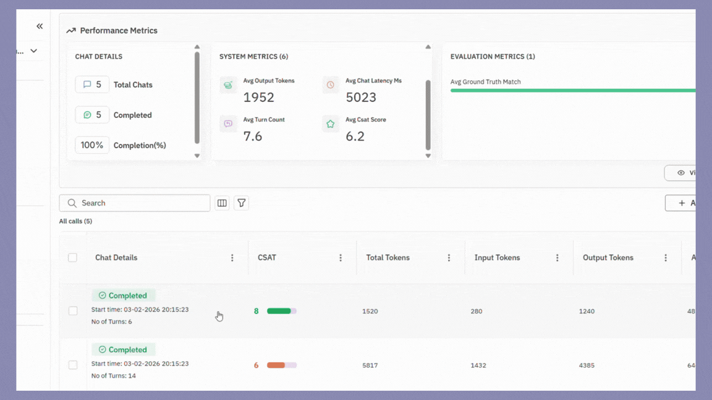

## What is Observe → Simulate?

**Observe → Simulate** lets you **replay real production conversations** captured via **Observe**, and rerun them safely in a **development environment** using **chat simulation**.

If something went wrong in production: a hallucination, tool failure, bad tone, or incorrect decision, you can:

1. Select the **exact trace or session** from Observe  
2. Click **Replay**  
3. Recreate the same user intent as a **simulation scenario**  
4. Re-run the full conversation end-to-end against your **dev agent**  
5. Modify your agent (prompt, logic, tools) and **replay again**

This closes the loop between **observability** and **iteration**.

---

## When is this important?

Use Observe → Simulate when you want to:

- Debug **real failures** instead of synthetic test cases
- Reproduce **edge cases** seen only in production
- Compare **before vs after** agent behavior
- Safely test fixes without impacting users
- Turn production issues into **repeatable regression tests**

> **If you can observe it, you should be able to replay it.**

---

## How it works

1. **Observe captures sessions**  
   Your production system sends sessions, messages, tools, and metadata to Future AGI via Observe.

2. **You select a session**  
   Choose a full session from the Observe UI.

3. **Replay generates scenarios**  
   Future AGI automatically creates **chat simulation scenarios** that recreate the original user intent and flow.

4. **Simulation runs in dev**  
   The replay is executed using **Chat Simulation**, calling your dev agent turn-by-turn.

5. **You iterate and re-run**  
   Update prompts, logic, tools, or models and replay again.

---

## Prerequisites

Before using Observe → Simulate, make sure you have:

- **Observe integrated** in your production architecture
- **Chat Simulation configured** in Future AGI
- A **chat agent callback** available in your dev environment
- `FI_API_KEY` and `FI_SECRET_KEY`

---

## Integration overview

Observe → Simulate does **not** require a new integration.

It builds directly on top of **Chat Simulation**.

### Required components

| Component | Purpose |
|--------|---------|
| Observe | Capture real production |
| Chat Agent Definition | Defines your chat agent |
| Scenarios (auto-generated) | Recreate user intent from production |
| Run Test (Chat) | Executes replayed sessions |
| Agent Callback | Your dev agent implementation |

---

## Step 1: Integrate Observe (Production)

Once Observe is integrated, **all sessions automatically appear** in the Future AGI platform.

No additional setup is required for replay.

---

## Step 2: Select a session to replay

From the **Observe UI**:

1. Open a **session** or **trace**
2. Click **Replay**
3. Choose:
   - Environment (e.g. `dev`)
   - Agent version
   - Optional overrides (prompt, model, tools)

Future AGI extracts:
- Conversation turns
- User intent
- Tool usage
- Metadata

and converts them into **chat simulation scenarios**.

---

## Step 3: Run replay using Chat Simulation

Follow the steps in chat simulation using SDK.

Once the replay completes, you'll see a **results dashboard** with a detailed breakdown of every replayed session:

### Understanding the replay results

The replay results view gives you a side-by-side comparison of all replayed sessions so you can quickly identify regressions, improvements, and patterns.

**Performance Metrics** at the top provide an aggregate summary:

- **Chat Details** — Total chats, completed count, and completion percentage.
- **System Metrics** — Avg output tokens, avg chat latency (ms), avg turn count, and avg CSAT score across all sessions.
- **Evaluation Metrics** — Aggregated evaluation scores such as **Ground Truth Match**, showing how closely your agent's responses align with the original production responses.

**Session Diff View** below lists each replayed session individually, allowing you to:

- Compare **CSAT scores** per session to spot which conversations improved or degraded.
- Review **token usage** (total, input, output) to understand cost and verbosity changes.
- Click into any session to see a **turn-by-turn diff** between the original production conversation and the replayed version, highlighting differences in agent responses, tool calls, and decision paths.

This diff view is key for identifying exactly where your agent's behavior changed after a prompt update, model swap, or logic fix.

---

## Step 4: Iterate and replay again

Update prompts, fix logic, change tools or models, and replay the same session again to verify improvements.

---

## Common workflows

### Debug a bad production response
Replay → Fix → Replay again

### Convert a failure into a regression test
Replay → Save scenario → Add to CI runs

### Compare agent versions
Replay the same session across multiple agents

---

## Key takeaway

**Observe → Simulate** turns production data into a development superpower.

> Every production failure becomes a reproducible test case.
