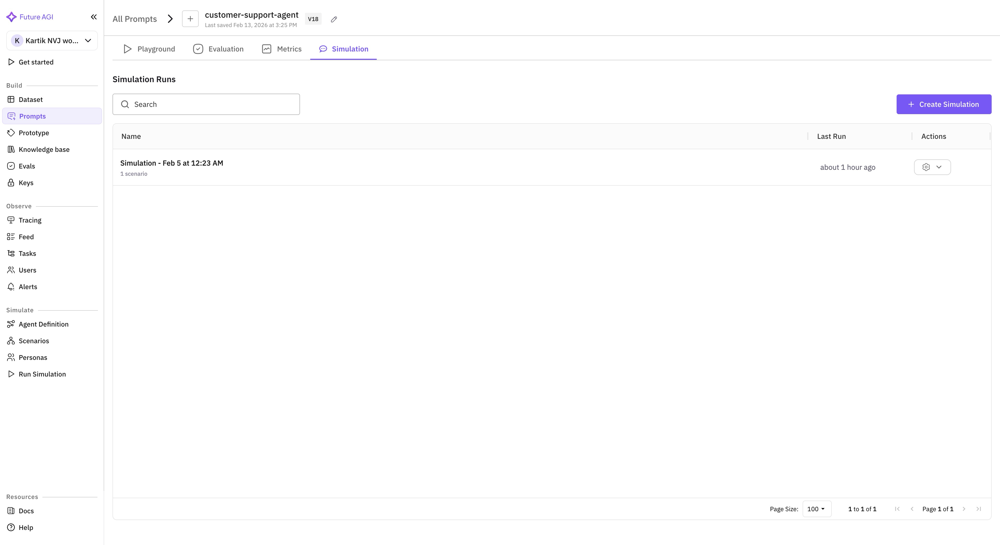
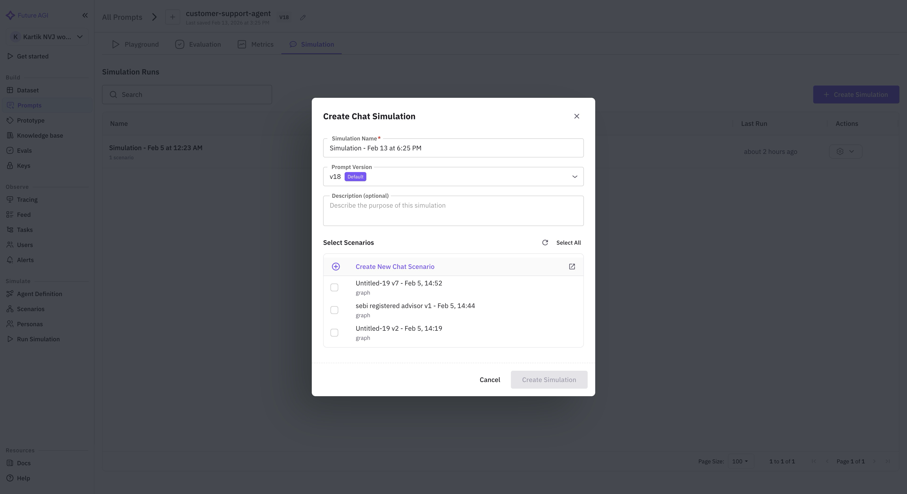
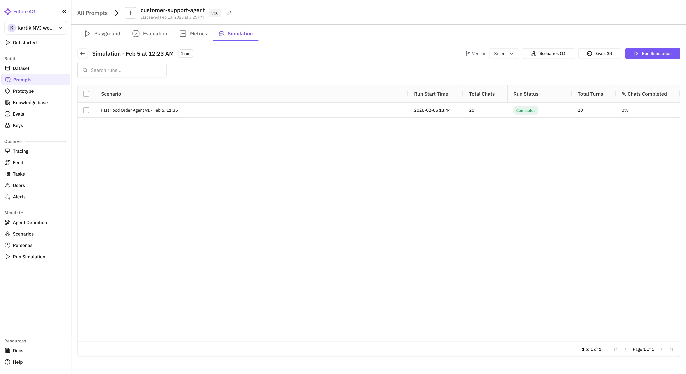
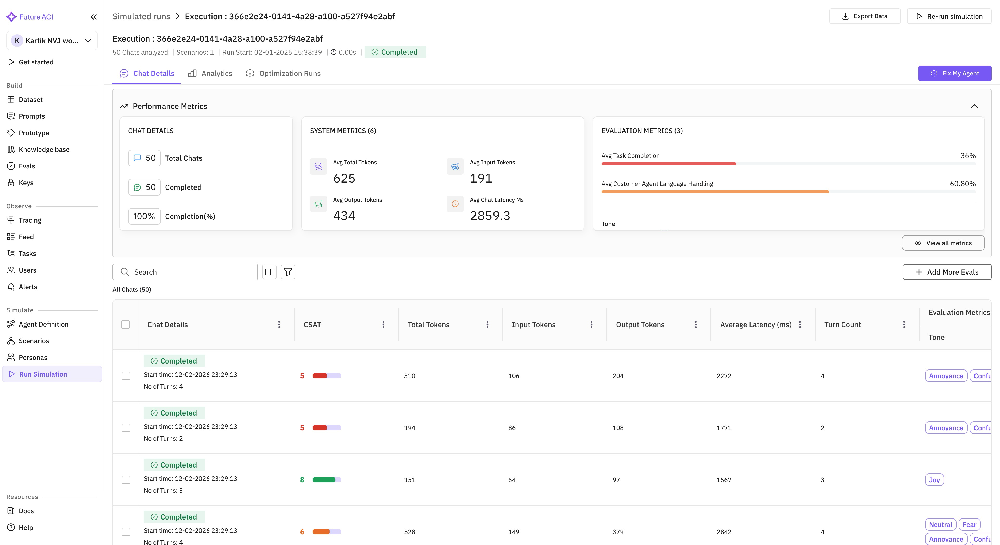

Run simulations directly from the **Prompt Workbench** to test how your prompts behave in multi-turn conversations with a simulated customer. The platform uses your prompt's system message, model, and parameters as the "agent" and runs it against scenarios you define.

## Prerequisites

Before you begin, make sure you have:

- A **prompt template** with at least one saved **prompt version** in the Prompt Workbench.
- At least one **scenario** (manual or dataset-backed) — either pre-configured under **Simulate > Scenarios** or created during setup.
<Tip>
If you haven't created scenarios yet, see [Scenarios](/product/simulation/scenarios) for a guide on creating them.
</Tip>

## Step 1: Open the Simulation Tab

Navigate to **Prompts** in the sidebar and open your prompt template. Click the **Simulation** tab at the top of the workbench (next to Playground, Evaluation, and Metrics).

## Step 2: Create a Simulation

<Steps>
  <Step title="Click Create Simulation">
    On the Simulation tab, click the **+ Create Simulation** button. A dialog opens.
  </Step>
  <Step title="Fill in details">
    - **Name** — a descriptive name (auto-generated as "Simulation - {Date} at {Time}").
    - **Prompt Version** — select which version of your prompt to test.
    - **Scenarios** — pick one or more scenarios that define the simulated customer behavior.
    - **Description** (optional) — notes about what you're testing.
  </Step>
  <Step title="Create">
    Click **Create**. You'll be taken to the simulation detail view.
  </Step>
</Steps>

### Version Selector

Use the **Version** dropdown to switch which prompt version is used for the next run. This makes it easy to compare how different prompt versions perform against the same scenarios.

### Scenarios

Click the **Scenarios** button to view or modify which scenarios are attached to this simulation. Each scenario defines:

- **Persona** — who the simulated customer is (e.g., "frustrated customer who wants a refund").
- **Situation** — context for the conversation (e.g., "ordered wrong item, wants exchange").
- **Dataset rows** (optional) — if the scenario is backed by a dataset, each row becomes a separate conversation with its own variable values.

### Evaluations

Click the **Evals** button to configure which evaluations run on each completed conversation (e.g., Task Completion, Tone, Customer Agent Language Handling).

## Step 3: Configure the Simulation

The simulation detail view shows your simulation name, run count, and controls in the header.

## Step 4: Run the Simulation

Click the **Run Simulation** button in the top-right corner. A success notification confirms execution has started.

The simulation creates one chat conversation per scenario row. Each conversation runs up to 10 turns between your prompt (acting as the agent) and the simulated customer.

## Step 5: View Results

Click any execution row to open the **Execution Detail** page.

The page has three tabs: **Chat Details**, **Analytics**, and **Optimization Runs**.

### Performance Metrics

A collapsible panel at the top shows three metric cards:

<CardGroup cols={3}>
  <Card title="Chat Details">
    - **Total Chats** — number of simulated conversations
    - **Completed** — how many finished successfully
    - **Completion(%)** — percentage completed
  </Card>
  <Card title="System Metrics">
    - **Avg Total Tokens** — average total tokens per conversation
    - **Avg Input Tokens** — average prompt/input tokens
    - **Avg Output Tokens** — average completion/output tokens
    - **Avg Chat Latency Ms** — average response latency in milliseconds
  </Card>
  <Card title="Evaluation Metrics">
    - Shows the average score for each configured evaluation (e.g., Task Completion, Customer Agent Language Handling, Tone)
    - Click **View all metrics** for the full breakdown
  </Card>
</CardGroup>

### All Chats Grid

Below the metrics, the grid lists every individual conversation:

| Column | Description |
|--------|-------------|
| **Chat Details** | Status badge (Completed/Failed), start time, and number of turns |
| **CSAT** | Customer satisfaction score with color indicator |
| **Total Tokens** | Total tokens used in the conversation |
| **Input Tokens** | Prompt tokens used |
| **Output Tokens** | Completion tokens used |
| **Average Latency (ms)** | Average response time per turn |
| **Turn Count** | Number of back-and-forth turns |
| **Evaluation Metrics** | Per-eval results displayed as colored tags (e.g., Tone: Joy, Annoyance, Neutral) |

Use the **Search** bar and **Filter** icon to narrow results.

### Actions

- **Export Data** — download the results as a file.
- **Re-run simulation** — execute the same simulation again (useful after prompt changes).
- **Fix My Agent** — get AI-powered suggestions to improve your prompt based on the results.
- **Add More Evals** — add additional evaluations to run on the completed conversations.

## Next Steps

- [Fix My Agent](/product/simulation/how-to/fix-my-agent) — use AI-powered suggestions to improve your prompt based on simulation results.
- [Scenarios](/product/simulation/scenarios) — learn how to create scenarios with datasets and personas.
- [Create Custom Evals](/future-agi/get-started/evaluation/create-custom-evals) — build evaluations tailored to your use case.
